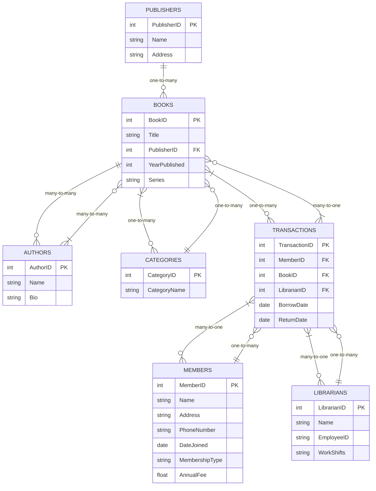

```txt
Client Request:
"Hi, I run a library, and I need a system to help manage our operations. We have books with details like title, author, publisher, year published, and series information. Each book can belong to a category (e.g., Fiction, Non-Fiction, Science), and I’d like to store the categories separately. Each book can be written by multiple authors, and published by one publisher.
We have members with details like name, address, phone number, and date joined. Some members are premium members who can borrow more books and have an annual fee. I need to track borrowings, including the borrow date, return date, and the librarian who facilitated the transaction. Oh, and I also need to manage librarians with details like name, employee ID, and work shifts. Can you make it easy to generate reports showing the most borrowed books, most active members, and transactions by a specific librarian?"

```

### **Client Request Analysis: Library Management System**

---

### **1. Introduction:**

The client operates a library and is seeking a system to manage various library operations. This includes managing books, members, librarians, borrowings, and generating reports. The system must track books, their categories, authors, publishers, and borrowing details. Additionally, the client requires functionality for managing members, particularly differentiating between regular and premium members, as well as tracking librarian activities and generating relevant reports.

---

### **2. Business Requirements:**

#### **2.1 Books Management:**

- **Book Details:** The system must store books with attributes such as:
  - Title
  - Author(s) (Multiple authors per book)
  - Publisher (One publisher per book)
  - Year Published
  - Series (If applicable)
- **Categories:** Books can belong to categories (e.g., Fiction, Non-Fiction, Science). These categories must be stored separately, indicating a **one-to-many** relationship between books and categories.

#### **2.2 Authors and Publishers:**

- **Authors:** Each book can be written by multiple authors. This suggests a **many-to-many** relationship between books and authors.
- **Publisher:** Each book can have one publisher. This is a **one-to-many** relationship, where one publisher can publish multiple books.

#### **2.3 Members Management:**

- **Member Details:** The system must store member details such as:
  - Name
  - Address
  - Phone Number
  - Date Joined
- **Premium Membership:** The system must differentiate between regular and premium members. Premium members:
  - Can borrow more books than regular members.
  - Have an associated annual fee.

#### **2.4 Borrowing System:**

- **Track Borrowings:** The system must track borrowings with the following details:
  - Borrow Date
  - Return Date
  - Librarian who facilitated the transaction
- **Borrowing Limits:** The system should handle different borrowing limits based on member type (regular vs. premium).

#### **2.5 Librarians Management:**

- **Librarian Details:** The system must store librarian details such as:
  - Name
  - Employee ID
  - Work Shifts (Shifts per day, week, etc.)
- **Transaction Management:** Each borrowing transaction must be associated with a specific librarian.

#### **2.6 Reporting Requirements:**

- **Reports Needed:**
  - **Most Borrowed Books:** A report to show the most borrowed books, potentially filtered by time period (e.g., weekly, monthly, annually).
  - **Most Active Members:** A report showing members who borrow the most books.
  - **Librarian Transactions:** A report showing transaction activity by a specific librarian, detailing the number of borrowings managed by them.

---

### **3. Functional Requirements:**

- **CRUD Operations:** The system must allow users (admins) to Create, Read, Update, and Delete books, authors, publishers, members, and librarians.
- **Member Management:** The system must allow adding, updating, and managing member data, including premium membership status and borrowing limits.
- **Transaction Management:** A system to log and manage borrowings and returns, ensuring each transaction is tied to a librarian.
- **Report Generation:** Automated report generation based on criteria such as most borrowed books, active members, and librarian performance.
- **User Roles:** The system should allow for multiple user roles, such as:
  - **Admin** (full access to manage the system)
  - **Librarian** (ability to process borrowings/returns)
  - **Member** (view borrowing history, account details)

---

### **4. Data Modeling (ERD):**

- **Books Table:** Includes title, publisher, year published, and series.
- **Authors Table:** Many-to-many relationship with books.
- **Categories Table:** One-to-many relationship with books.
- **Members Table:** Includes details for both regular and premium members.
- **Transactions Table:** Includes borrow date, return date, and librarian ID.
- **Librarians Table:** Includes name, employee ID, and work shift information.

---

### **5. Non-Functional Requirements:**

- **Performance:** The system should handle large volumes of data (e.g., books, members, transactions).
- **Security:** The system should have role-based access control to ensure data security and privacy.
- **Scalability:** The system should be scalable to accommodate future growth (e.g., new branches, more books, and members).
- **Usability:** The system must be user-friendly for both librarians and members, with intuitive interfaces for managing books and transactions.

---

### **6. User Stories and Use Cases:**

- **User Story 1:** As an **admin**, I want to add new books with multiple authors and categories, so that I can manage the library’s collection effectively.
- **User Story 2:** As a **member**, I want to borrow books based on my membership type, so that I can borrow more books if I am a premium member.
- **User Story 3:** As a **librarian**, I want to record the borrow date, return date, and the librarian facilitating the transaction, so that the borrowing process is tracked accurately.
- **User Story 4:** As a **library manager**, I want to generate a report showing the most borrowed books over the last month, so I can analyze popular items.
- **Use Case:** **Borrow Book:** A member selects a book, a librarian records the borrowing transaction, and the system updates the member’s borrowing history and available borrowing limit.

---

### **7. Risk Assessment:**

- **Data Integrity:** Ensuring the relationships between books, authors, categories, and transactions are maintained correctly.
- **Scalability:** Ensuring that the system can scale to accommodate an increasing number of books, members, and transactions.
- **Security:** Ensuring that sensitive member data (e.g., address, phone number) is securely stored and only accessible by authorized users.

---

### **8. Final Deliverables:**

- **Business Requirements Document (BRD)**: Detailed documentation of all business needs and system requirements.
- **Functional Specification Document (FSD)**: Clear specification of the system’s functionality, including reports, workflows, and interfaces.
- **Entity-Relationship Diagram (ERD)**: A visual representation of the data model and relationships.
- **Wireframes/UI Designs**: Initial designs for key user interfaces such as member dashboards, librarian transaction management, and admin report generation screens.
- **Test Cases:** To ensure that the system works as intended.

---

### ERD Design for Library Management System

**Entities and Attributes**:

1. **Books**

   - Attributes: `BookID` (PK), `Title`, `PublisherID` (FK), `YearPublished`, `Series`
   - Relationships:
     - **Categories** (One-to-many): Each book belongs to one category.
     - **Authors** (Many-to-many): Each book can have multiple authors.

2. **Authors**

   - Attributes: `AuthorID` (PK), `Name`, `Bio`
   - Relationships:
     - **Books** (Many-to-many): An author can write multiple books, and each book can have multiple authors.

3. **Publishers**

   - Attributes: `PublisherID` (PK), `Name`, `Address`
   - Relationships:
     - **Books** (One-to-many): Each publisher can publish multiple books.

4. **Categories**

   - Attributes: `CategoryID` (PK), `CategoryName`
   - Relationships:
     - **Books** (One-to-many): A book belongs to one category.

5. **Members**

   - Attributes: `MemberID` (PK), `Name`, `Address`, `PhoneNumber`, `DateJoined`, `MembershipType`, `AnnualFee`
   - Relationships:
     - **Transactions** (One-to-many): A member can have multiple borrowing transactions.
     - **MembershipType**: Premium vs. Regular, with varying borrowing limits (handled via a system of roles or through a “MembershipType” field in the member’s table).

6. **Transactions**

   - Attributes: `TransactionID` (PK), `MemberID` (FK), `BookID` (FK), `LibrarianID` (FK), `BorrowDate`, `ReturnDate`
   - Relationships:
     - **Books** (Many-to-one): Each transaction is for a specific book.
     - **Members** (Many-to-one): Each transaction is tied to a member.
     - **Librarians** (Many-to-one): A librarian facilitates the borrowing process.

7. **Librarians**
   - Attributes: `LibrarianID` (PK), `Name`, `EmployeeID`, `WorkShifts`
   - Relationships:
     - **Transactions** (One-to-many): A librarian can facilitate multiple borrowing transactions.

---

### Relationships and Cardinality:

1. **Books-Authors (Many-to-Many)**:

   - Use a junction table, e.g., `BookAuthors` with `BookID` and `AuthorID` to establish the relationship between books and authors.

2. **Books-Categories (One-to-Many)**:

   - A book belongs to one category, but each category can have many books. Thus, `CategoryID` is a foreign key in the `Books` table.

3. **Books-Publishers (One-to-Many)**:

   - A book can only have one publisher, but each publisher can have multiple books. Thus, `PublisherID` is a foreign key in the `Books` table.

4. **Members-Transactions (One-to-Many)**:

   - A member can borrow multiple books (transactions), but each transaction is linked to one member. Thus, `MemberID` is a foreign key in the `Transactions` table.

5. **Books-Transactions (One-to-Many)**:

   - Each transaction is for one book, but a book can be borrowed multiple times. Thus, `BookID` is a foreign key in the `Transactions` table.

6. **Librarians-Transactions (One-to-Many)**:
   - A librarian manages multiple borrowing transactions, but each transaction is managed by one librarian. Thus, `LibrarianID` is a foreign key in the `Transactions` table.

---

### Handling Corner Cases:

1. **Multiple Authors**:

   - The junction table `BookAuthors` handles multiple authors for a single book by linking `BookID` and `AuthorID`.

2. **Premium and Regular Members**:

   - The `Members` table contains a `MembershipType` field to differentiate between regular and premium members. Premium members may also have an `AnnualFee` field to track their fee. Premium members can have different borrowing limits, managed via business logic in the system.

3. **Borrowing Limits**:

   - Borrowing limits are handled in the system’s business logic by checking the member’s `MembershipType`. Regular members have a lower borrowing limit than premium members, which can be enforced when the borrowing transaction is recorded.

4. **Overdue Books**:

   - The `Transactions` table will store the `ReturnDate`, allowing the system to flag overdue books based on the current date and return date.

5. **Shifts for Librarians**:
   - The `Librarians` table includes a `WorkShifts` field to store shift information, which can be detailed by day, week, or other relevant units.

---

### Data Model Diagram:

The ERD will include the following tables and relationships:

- **Books**

  - `BookID` (PK), `Title`, `PublisherID` (FK), `YearPublished`, `Series`
  - Relationships: Many-to-many with `Authors`, One-to-many with `Categories`, One-to-many with `Transactions`.

- **Authors**

  - `AuthorID` (PK), `Name`, `Bio`
  - Relationship: Many-to-many with `Books`.

- **Publishers**

  - `PublisherID` (PK), `Name`, `Address`
  - Relationship: One-to-many with `Books`.

- **Categories**

  - `CategoryID` (PK), `CategoryName`
  - Relationship: One-to-many with `Books`.

- **Members**

  - `MemberID` (PK), `Name`, `Address`, `PhoneNumber`, `DateJoined`, `MembershipType`, `AnnualFee`
  - Relationship: One-to-many with `Transactions`.

- **Transactions**

  - `TransactionID` (PK), `MemberID` (FK), `BookID` (FK), `LibrarianID` (FK), `BorrowDate`, `ReturnDate`
  - Relationships: Many-to-one with `Books`, Many-to-one with `Members`, Many-to-one with `Librarians`.

- **Librarians**
  - `LibrarianID` (PK), `Name`, `EmployeeID`, `WorkShifts`
  - Relationship: One-to-many with `Transactions`.

---



---

### SQL Queries for the Library Management System

Based on the provided ERD design, here are the SQL queries needed to create the tables and establish the necessary relationships. I will break it down into several sections.

---

### 1. **Table Creation Queries:**

#### Books Table

```sql
CREATE TABLE Books (
    BookID INT PRIMARY KEY,
    Title VARCHAR(255),
    PublisherID INT,
    YearPublished INT,
    Series VARCHAR(255),
    CategoryID INT,
    FOREIGN KEY (PublisherID) REFERENCES Publishers(PublisherID),
    FOREIGN KEY (CategoryID) REFERENCES Categories(CategoryID)
);
```

#### Authors Table

```sql
CREATE TABLE Authors (
    AuthorID INT PRIMARY KEY,
    Name VARCHAR(255),
    Bio TEXT
);
```

#### Publishers Table

```sql
CREATE TABLE Publishers (
    PublisherID INT PRIMARY KEY,
    Name VARCHAR(255),
    Address TEXT
);
```

#### Categories Table

```sql
CREATE TABLE Categories (
    CategoryID INT PRIMARY KEY,
    CategoryName VARCHAR(255)
);
```

#### Members Table

```sql
CREATE TABLE Members (
    MemberID INT PRIMARY KEY,
    Name VARCHAR(255),
    Address TEXT,
    PhoneNumber VARCHAR(20),
    DateJoined DATE,
    MembershipType ENUM('Regular', 'Premium'),
    AnnualFee DECIMAL(10, 2)
);
```

#### Transactions Table

```sql
CREATE TABLE Transactions (
    TransactionID INT PRIMARY KEY,
    MemberID INT,
    BookID INT,
    LibrarianID INT,
    BorrowDate DATE,
    ReturnDate DATE,
    FOREIGN KEY (MemberID) REFERENCES Members(MemberID),
    FOREIGN KEY (BookID) REFERENCES Books(BookID),
    FOREIGN KEY (LibrarianID) REFERENCES Librarians(LibrarianID)
);
```

#### Librarians Table

```sql
CREATE TABLE Librarians (
    LibrarianID INT PRIMARY KEY,
    Name VARCHAR(255),
    EmployeeID VARCHAR(50),
    WorkShifts TEXT
);
```

#### Junction Table for Books-Authors (Many-to-Many Relationship)

```sql
CREATE TABLE BookAuthors (
    BookID INT,
    AuthorID INT,
    PRIMARY KEY (BookID, AuthorID),
    FOREIGN KEY (BookID) REFERENCES Books(BookID),
    FOREIGN KEY (AuthorID) REFERENCES Authors(AuthorID)
);
```

---

### 2. **Queries to Insert Data:**

#### Inserting a New Publisher

```sql
INSERT INTO Publishers (PublisherID, Name, Address)
VALUES (1, 'Pearson', '123 Publishing St, City, Country');
```

#### Inserting a New Author

```sql
INSERT INTO Authors (AuthorID, Name, Bio)
VALUES (1, 'John Doe', 'John Doe is a renowned author specializing in modern literature.');
```

#### Inserting a New Book

```sql
INSERT INTO Books (BookID, Title, PublisherID, YearPublished, Series, CategoryID)
VALUES (1, 'Introduction to SQL', 1, 2024, 'SQL for Beginners', 1);
```

#### Inserting a New Member

```sql
INSERT INTO Members (MemberID, Name, Address, PhoneNumber, DateJoined, MembershipType, AnnualFee)
VALUES (1, 'Alice Smith', '456 Library Lane, City, Country', '123-456-7890', '2024-01-01', 'Premium', 50.00);
```

#### Inserting a Transaction (Book Borrowing)

```sql
INSERT INTO Transactions (TransactionID, MemberID, BookID, LibrarianID, BorrowDate, ReturnDate)
VALUES (1, 1, 1, 1, '2024-10-01', '2024-10-15');
```

#### Inserting a New Librarian

```sql
INSERT INTO Librarians (LibrarianID, Name, EmployeeID, WorkShifts)
VALUES (1, 'Mark Johnson', 'L123', 'Mon-Fri 9am-5pm');
```

---

### 3. **Queries for Relationship Management:**

#### Assigning Authors to a Book (Many-to-Many Relationship)

```sql
INSERT INTO BookAuthors (BookID, AuthorID)
VALUES (1, 1);  -- Book 1 is written by Author 1
```

#### Retrieving All Books by an Author

```sql
SELECT b.Title
FROM Books b
JOIN BookAuthors ba ON b.BookID = ba.BookID
WHERE ba.AuthorID = 1;  -- Find all books written by Author 1
```

#### Retrieving All Authors for a Specific Book

```sql
SELECT a.Name
FROM Authors a
JOIN BookAuthors ba ON a.AuthorID = ba.AuthorID
WHERE ba.BookID = 1;  -- Find all authors of Book 1
```

#### Retrieving All Books Borrowed by a Member

```sql
SELECT b.Title, t.BorrowDate, t.ReturnDate
FROM Books b
JOIN Transactions t ON b.BookID = t.BookID
WHERE t.MemberID = 1;  -- Find all books borrowed by Member 1
```

#### Retrieving All Members Who Borrowed a Specific Book

```sql
SELECT m.Name, t.BorrowDate, t.ReturnDate
FROM Members m
JOIN Transactions t ON m.MemberID = t.MemberID
WHERE t.BookID = 1;  -- Find all members who borrowed Book 1
```

#### Retrieving Overdue Books (Books not returned)

```sql
SELECT b.Title, t.MemberID, t.ReturnDate
FROM Books b
JOIN Transactions t ON b.BookID = t.BookID
WHERE t.ReturnDate < CURDATE() AND t.ReturnDate IS NOT NULL;
```

#### Counting the Number of Transactions for a Member

```sql
SELECT COUNT(*) AS TransactionCount
FROM Transactions
WHERE MemberID = 1;  -- Count how many books Member 1 has borrowed
```

---

### 4. **Queries for Business Logic (Borrowing Limits):**

#### Checking Borrowing Limit Based on Membership Type (Assuming the system logic is implemented to limit transactions based on membership type)

```sql
SELECT
    CASE
        WHEN m.MembershipType = 'Premium' THEN 'Unlimited'
        WHEN m.MembershipType = 'Regular' THEN '5 Books'
    END AS BorrowingLimit
FROM Members m
WHERE m.MemberID = 1;  -- Check borrowing limit for Member 1
```

#### Retrieving Borrowed Books for a Regular Member to Enforce Borrowing Limit (Ensure they don't exceed the limit)

```sql
SELECT COUNT(*) AS BooksBorrowed
FROM Transactions
WHERE MemberID = 1 AND ReturnDate IS NULL;  -- Books currently borrowed by Member 1 (Not returned yet)
```

---

### 5. **Indexes for Performance Optimization:**

#### Creating Indexes on Foreign Keys (Improves JOIN performance)

```sql
CREATE INDEX idx_books_publisher_id ON Books(PublisherID);
CREATE INDEX idx_books_category_id ON Books(CategoryID);
CREATE INDEX idx_transactions_member_id ON Transactions(MemberID);
CREATE INDEX idx_transactions_book_id ON Transactions(BookID);
CREATE INDEX idx_transactions_librarian_id ON Transactions(LibrarianID);
```

#### Creating Index for Many-to-Many Relationship (Books-Authors)

```sql
CREATE INDEX idx_bookauthors_book_id ON BookAuthors(BookID);
CREATE INDEX idx_bookauthors_author_id ON BookAuthors(AuthorID);
```

---
