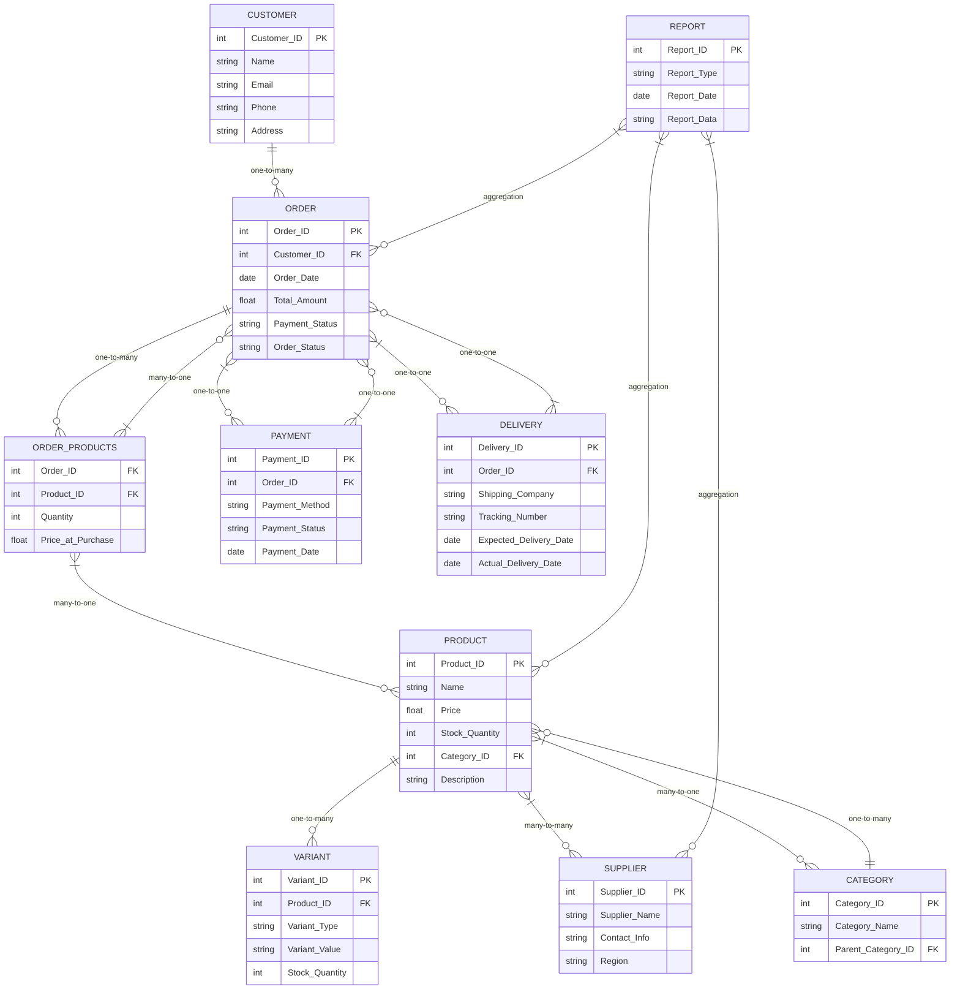

```txt
Client Request:
"I’m starting an online store, and I need a system to manage it. Here’s what I need: I’ll have products with details like name, price, stock quantity, and category. There are some main categories and each category can have sub-categories. Each product will have suppliers, and I need to track their details like name, contact information, and region. Some products might have variants (e.g., size, color), so I need to store those as well.
Then, there are customers who place orders, and I need their information—name, email, phone number, and delivery address. Orders will have multiple products with quantities, and I’d also like to track payment details like method and status. For deliveries, I want to manage shipping companies, tracking numbers, and delivery dates. Can you also help me generate reports on top-selling products, pending orders, and supplier performance?"

```

### **Client Request Analysis: Online Store Management System**

---

### **1. Introduction:**

The client is starting an online store and requires a system to manage the entire process from product listing, customer management, and order tracking, to supplier and shipping management. The system must handle product details, suppliers, customers, orders, payments, and deliveries. Additionally, the client needs functionality to generate reports on sales and order statuses for business analysis.

---

### **2. Business Requirements:**

#### **2.1 Product Management:**

- **Product Details:** The system must store product information including:
  - Name
  - Price
  - Stock Quantity
  - Category
- **Categories:** Products can belong to main categories and sub-categories. This indicates a **one-to-many** relationship between categories (main categories and sub-categories).
- **Variants:** Products can have variants (e.g., size, color). The system must allow tracking of these variants separately for each product.

#### **2.2 Supplier Management:**

- **Supplier Details:** Each product is linked to one or more suppliers. The system must store supplier information such as:
  - Name
  - Contact Information
  - Region
- **Supplier Relationship:** The system should support a **many-to-many** relationship between products and suppliers, allowing products to have multiple suppliers and vice versa.

#### **2.3 Customer Management:**

- **Customer Information:** The system must store customer details such as:
  - Name
  - Email
  - Phone Number
  - Delivery Address
- **Order Tracking:** Each customer will place one or more orders, which must be tracked in the system with product details.

#### **2.4 Order Management:**

- **Order Details:** Each order will include:
  - Customer Information (Linked to customer data)
  - Products and Quantities (Linked to the products ordered)
  - Payment Method (Credit card, PayPal, etc.)
  - Payment Status (Paid, Pending, Failed)
- **Order Status:** The system should track the status of orders, such as “Pending,” “Shipped,” and “Delivered.”

#### **2.5 Payment Management:**

- **Payment Details:** The system should store and manage:
  - Payment Method (e.g., Credit card, PayPal)
  - Payment Status (Paid, Pending, Failed)

#### **2.6 Delivery Management:**

- **Shipping Information:** The system must handle delivery details including:
  - Shipping Company (Linked to the shipping service used)
  - Tracking Numbers (For monitoring shipment progress)
  - Delivery Dates (To track expected and actual delivery times)

#### **2.7 Reporting:**

- **Reports Needed:**
  - **Top-Selling Products:** A report showing the best-performing products based on sales volume or revenue.
  - **Pending Orders:** A report displaying orders that are pending or yet to be shipped.
  - **Supplier Performance:** A report evaluating supplier reliability, based on order fulfillment times, product quality, and delivery times.

---

### **3. Functional Requirements:**

- **CRUD Operations:** The system must allow users to Create, Read, Update, and Delete:
  - Products, including variants and categories
  - Suppliers and their details
  - Customers and their order history
  - Orders and payment information
  - Shipping details and delivery tracking
- **Order Tracking:** The system should allow for tracking the current status of orders and updating order statuses as they move through various stages.
- **Payment Integration:** Integration with payment gateways to update payment status automatically based on transaction success or failure.
- **Shipping Management:** The system should enable tracking of deliveries with real-time updates (via tracking numbers) and facilitate shipping company management.
- **Report Generation:** Automated generation of the requested reports on sales, pending orders, and supplier performance, with filters and date range options.

---

### **4. Data Modeling (ERD):**

- **Products Table:** Includes product name, price, stock quantity, and category.
- **Categories Table:** Represents main categories and sub-categories, linked to products.
- **Suppliers Table:** Includes supplier name, contact details, and region, linked to products via a many-to-many relationship.
- **Customers Table:** Stores customer information.
- **Orders Table:** Includes order details such as order date, products ordered, payment method, and status.
- **Payments Table:** Stores payment method, payment status, and associated order ID.
- **Deliveries Table:** Stores shipping company, tracking number, and delivery dates.
- **Reports Table:** Will be generated from transaction, product, and supplier data.

---

### **5. Non-Functional Requirements:**

- **Performance:** The system must be able to handle large volumes of products, orders, and customer data efficiently.
- **Security:** Ensure data security for sensitive customer information (e.g., address, payment details).
- **Scalability:** The system must be scalable as the business grows, accommodating more products, suppliers, and orders.
- **Usability:** The user interface should be intuitive for both administrators and customers.

---

### **6. User Stories and Use Cases:**

- **User Story 1:** As an **admin**, I want to add new products with categories, variants, and suppliers, so that I can manage the store inventory effectively.
- **User Story 2:** As a **customer**, I want to place an order with multiple products, choose a payment method, and track the delivery status.
- **User Story 3:** As a **manager**, I want to generate reports showing top-selling products, pending orders, and supplier performance, so that I can analyze business performance.
- **Use Case:** **Place Order:** A customer browses products, adds them to the cart, provides payment details, and completes the order. The system records the order, updates inventory, and processes payment.

---

### **7. Risk Assessment:**

- **Data Integrity:** Ensuring the relationships between products, suppliers, customers, and orders are correctly maintained.
- **Payment Processing:** Integration with third-party payment gateways may face issues with payment failures or delays.
- **Scalability:** The system must be designed to handle a growing number of products and orders without performance degradation.
- **Security:** Safeguarding sensitive customer data, especially payment information, is a key concern that requires strong encryption and secure access controls.

---

### **8. Final Deliverables:**

- **Business Requirements Document (BRD):** Detailed documentation of all business needs and system requirements.
- **Functional Specification Document (FSD):** A comprehensive guide to the system’s functionality, including product management, orders, payments, and reporting features.
- **Entity-Relationship Diagram (ERD):** A visual model of the database structure and relationships.
- **Wireframes/UI Designs:** Visual mockups for the user interface, focusing on product management, order tracking, and report generation.
- **Test Cases:** To ensure the system functions as intended across all modules, including payments, orders, and shipping.

---

### ERD for Online Store Management System

#### 1. **Entities and Attributes:**

1. **Product**

   - _Attributes:_
     - Product_ID (PK)
     - Name
     - Price
     - Stock_Quantity
     - Category_ID (FK to Category)
     - Description
   - _Relationships:_
     - Has many _Variants_ (One-to-Many)
     - Has many _Suppliers_ (Many-to-Many)

2. **Variant**

   - _Attributes:_
     - Variant_ID (PK)
     - Product_ID (FK to Product)
     - Variant_Type (Size, Color, etc.)
     - Variant_Value (e.g., Small, Blue, etc.)
     - Stock_Quantity
   - _Relationships:_
     - Belongs to _Product_ (Many-to-One)

3. **Category**

   - _Attributes:_
     - Category_ID (PK)
     - Category_Name
     - Parent_Category_ID (Self-referencing FK for sub-categories)
   - _Relationships:_
     - Can have many _Products_ (One-to-Many)

4. **Supplier**

   - _Attributes:_
     - Supplier_ID (PK)
     - Supplier_Name
     - Contact_Info
     - Region
   - _Relationships:_
     - Supplies many _Products_ (Many-to-Many)

5. **Customer**

   - _Attributes:_
     - Customer_ID (PK)
     - Name
     - Email
     - Phone
     - Address
   - _Relationships:_
     - Has many _Orders_ (One-to-Many)

6. **Order**

   - _Attributes:_
     - Order_ID (PK)
     - Customer_ID (FK to Customer)
     - Order_Date
     - Total_Amount
     - Payment_Status (Paid, Pending, Failed)
     - Order_Status (Pending, Shipped, Delivered)
   - _Relationships:_
     - Belongs to _Customer_ (Many-to-One)
     - Has many _Order_Products_ (One-to-Many)
     - Linked to _Payment_ (One-to-One)
     - Linked to _Delivery_ (One-to-One)

7. **Order_Products** (Junction Table for many-to-many between Orders and Products)

   - _Attributes:_
     - Order_ID (FK to Order)
     - Product_ID (FK to Product)
     - Quantity
     - Price_at_Purchase
   - _Relationships:_
     - Belongs to _Order_ (Many-to-One)
     - Belongs to _Product_ (Many-to-One)

8. **Payment**

   - _Attributes:_
     - Payment_ID (PK)
     - Order_ID (FK to Order)
     - Payment_Method (Credit Card, PayPal, etc.)
     - Payment_Status (Paid, Pending, Failed)
     - Payment_Date
   - _Relationships:_
     - Linked to _Order_ (One-to-One)

9. **Delivery**

   - _Attributes:_
     - Delivery_ID (PK)
     - Order_ID (FK to Order)
     - Shipping_Company
     - Tracking_Number
     - Expected_Delivery_Date
     - Actual_Delivery_Date
   - _Relationships:_
     - Linked to _Order_ (One-to-One)

10. **Report**
    - _Attributes:_
      - Report_ID (PK)
      - Report_Type (Top-Selling, Pending Orders, Supplier Performance)
      - Report_Date
      - Report_Data (JSON or Text for report details)
    - _Relationships:_
      - Generated from _Order_, _Product_, _Supplier_ data (Aggregation, not a direct relationship)

---

#### 2. **Relationships:**

1. **Product-Category**:

   - Many Products belong to one Category.
   - Each Category can have sub-categories (self-referencing many-to-one).

2. **Product-Variant**:

   - A product can have multiple variants, tracked separately.

3. **Product-Supplier**:

   - Many-to-many relationship: A product can have multiple suppliers, and a supplier can provide multiple products. This requires a junction table between _Products_ and _Suppliers_.

4. **Customer-Order**:

   - A customer can place multiple orders. Each order belongs to a single customer.

5. **Order-Product**:

   - Many-to-many relationship: Each order can have multiple products, and each product can appear in multiple orders (managed through _Order_Products_ junction table).

6. **Order-Payment**:

   - One-to-one relationship: Each order has one corresponding payment record.

7. **Order-Delivery**:

   - One-to-one relationship: Each order has one delivery record that tracks shipping information.

8. **Report**:
   - Reports are generated from transaction data (orders, products, suppliers).

---

#### 3. **Corner Cases:**

1. **Product with no variants**: The system should allow products to be created without variants and still manage their stock.

2. **Category Hierarchy**: A product can belong to a sub-category, but in some cases, products may only be assigned to a main category with no sub-category. The system should handle this case gracefully.

3. **Product-Supplier Relationship**: In case a supplier goes out of business, the system should allow for easy removal or replacement of suppliers associated with products.

4. **Payment Status**: A failed payment should still allow the order to be created but flagged as "Pending" until resolved.

5. **Order without payment**: An order could be created with a "Pending" payment status until the payment is successfully processed. It should be flagged as "Pending" until payment is made.

6. **Order Delivery without Shipping Info**: The system should allow for orders to be created without shipping information, with the delivery details updated later.

7. **Stock Management**: When products are ordered, the system should automatically update stock quantities for each product and variant, with checks in place for low stock.

8. **Report Data Integrity**: Ensure reports like "Top-Selling Products" or "Pending Orders" reflect real-time data, with accurate aggregations and timely generation.

---



---

### SQL Queries for the Online Store Management System

Below are the SQL queries necessary for creating the tables, establishing the relationships, and handling specific use cases outlined in the ERD. I've included queries for table creation, inserting data, managing relationships, and corner case scenarios.

---

### 1. **Table Creation Queries:**

#### Product Table

```sql
CREATE TABLE Product (
    Product_ID INT PRIMARY KEY,
    Name VARCHAR(255),
    Price DECIMAL(10, 2),
    Stock_Quantity INT,
    Category_ID INT,
    Description TEXT,
    FOREIGN KEY (Category_ID) REFERENCES Category(Category_ID)
);
```

#### Variant Table

```sql
CREATE TABLE Variant (
    Variant_ID INT PRIMARY KEY,
    Product_ID INT,
    Variant_Type VARCHAR(255),  -- Example: Size, Color
    Variant_Value VARCHAR(255),  -- Example: Small, Blue
    Stock_Quantity INT,
    FOREIGN KEY (Product_ID) REFERENCES Product(Product_ID)
);
```

#### Category Table

```sql
CREATE TABLE Category (
    Category_ID INT PRIMARY KEY,
    Category_Name VARCHAR(255),
    Parent_Category_ID INT,
    FOREIGN KEY (Parent_Category_ID) REFERENCES Category(Category_ID)
);
```

#### Supplier Table

```sql
CREATE TABLE Supplier (
    Supplier_ID INT PRIMARY KEY,
    Supplier_Name VARCHAR(255),
    Contact_Info TEXT,
    Region VARCHAR(255)
);
```

#### Product-Supplier Junction Table (Many-to-Many Relationship)

```sql
CREATE TABLE Product_Supplier (
    Product_ID INT,
    Supplier_ID INT,
    PRIMARY KEY (Product_ID, Supplier_ID),
    FOREIGN KEY (Product_ID) REFERENCES Product(Product_ID),
    FOREIGN KEY (Supplier_ID) REFERENCES Supplier(Supplier_ID)
);
```

#### Customer Table

```sql
CREATE TABLE Customer (
    Customer_ID INT PRIMARY KEY,
    Name VARCHAR(255),
    Email VARCHAR(255),
    Phone VARCHAR(20),
    Address TEXT
);
```

#### Order Table

```sql
CREATE TABLE `Order` (
    Order_ID INT PRIMARY KEY,
    Customer_ID INT,
    Order_Date DATE,
    Total_Amount DECIMAL(10, 2),
    Payment_Status ENUM('Paid', 'Pending', 'Failed'),
    Order_Status ENUM('Pending', 'Shipped', 'Delivered'),
    FOREIGN KEY (Customer_ID) REFERENCES Customer(Customer_ID)
);
```

#### Order_Products Junction Table (Many-to-Many Relationship)

```sql
CREATE TABLE Order_Products (
    Order_ID INT,
    Product_ID INT,
    Quantity INT,
    Price_at_Purchase DECIMAL(10, 2),
    PRIMARY KEY (Order_ID, Product_ID),
    FOREIGN KEY (Order_ID) REFERENCES `Order`(Order_ID),
    FOREIGN KEY (Product_ID) REFERENCES Product(Product_ID)
);
```

#### Payment Table

```sql
CREATE TABLE Payment (
    Payment_ID INT PRIMARY KEY,
    Order_ID INT,
    Payment_Method ENUM('Credit Card', 'PayPal', 'Other'),
    Payment_Status ENUM('Paid', 'Pending', 'Failed'),
    Payment_Date DATE,
    FOREIGN KEY (Order_ID) REFERENCES `Order`(Order_ID)
);
```

#### Delivery Table

```sql
CREATE TABLE Delivery (
    Delivery_ID INT PRIMARY KEY,
    Order_ID INT,
    Shipping_Company VARCHAR(255),
    Tracking_Number VARCHAR(255),
    Expected_Delivery_Date DATE,
    Actual_Delivery_Date DATE,
    FOREIGN KEY (Order_ID) REFERENCES `Order`(Order_ID)
);
```

#### Report Table

```sql
CREATE TABLE Report (
    Report_ID INT PRIMARY KEY,
    Report_Type ENUM('Top-Selling', 'Pending Orders', 'Supplier Performance'),
    Report_Date DATE,
    Report_Data TEXT
);
```

---

### 2. **Queries to Insert Data:**

#### Inserting a New Category

```sql
INSERT INTO Category (Category_ID, Category_Name, Parent_Category_ID)
VALUES (1, 'Electronics', NULL);  -- No parent category for main category
```

#### Inserting a New Product

```sql
INSERT INTO Product (Product_ID, Name, Price, Stock_Quantity, Category_ID, Description)
VALUES (1, 'Smartphone', 699.99, 50, 1, 'A high-end smartphone with 128GB storage');
```

#### Inserting a New Variant for a Product

```sql
INSERT INTO Variant (Variant_ID, Product_ID, Variant_Type, Variant_Value, Stock_Quantity)
VALUES (1, 1, 'Color', 'Black', 30);  -- Black color variant for Smartphone
```

#### Inserting a New Supplier

```sql
INSERT INTO Supplier (Supplier_ID, Supplier_Name, Contact_Info, Region)
VALUES (1, 'ABC Electronics', 'contact@abcelectronics.com', 'North America');
```

#### Linking a Product with a Supplier (Many-to-Many)

```sql
INSERT INTO Product_Supplier (Product_ID, Supplier_ID)
VALUES (1, 1);  -- Product 1 is supplied by Supplier 1
```

#### Inserting a New Customer

```sql
INSERT INTO Customer (Customer_ID, Name, Email, Phone, Address)
VALUES (1, 'John Doe', 'johndoe@example.com', '555-1234', '123 Main St, City, Country');
```

#### Inserting a New Order

```sql
INSERT INTO `Order` (Order_ID, Customer_ID, Order_Date, Total_Amount, Payment_Status, Order_Status)
VALUES (1, 1, '2024-10-01', 1399.97, 'Pending', 'Pending');
```

#### Linking Products to an Order (Order-Product)

```sql
INSERT INTO Order_Products (Order_ID, Product_ID, Quantity, Price_at_Purchase)
VALUES (1, 1, 1, 699.99);  -- Order 1 contains 1 Smartphone
```

#### Inserting a Payment Record

```sql
INSERT INTO Payment (Payment_ID, Order_ID, Payment_Method, Payment_Status, Payment_Date)
VALUES (1, 1, 'Credit Card', 'Pending', '2024-10-01');
```

#### Inserting Delivery Information

```sql
INSERT INTO Delivery (Delivery_ID, Order_ID, Shipping_Company, Tracking_Number, Expected_Delivery_Date, Actual_Delivery_Date)
VALUES (1, 1, 'FedEx', '123456789', '2024-10-05', NULL);
```

---

### 3. **Queries for Relationship Management:**

#### Retrieving All Products in a Category

```sql
SELECT p.Name
FROM Product p
JOIN Category c ON p.Category_ID = c.Category_ID
WHERE c.Category_Name = 'Electronics';  -- Find all products in the 'Electronics' category
```

#### Retrieving All Variants for a Product

```sql
SELECT v.Variant_Type, v.Variant_Value
FROM Variant v
WHERE v.Product_ID = 1;  -- Find all variants for Product 1
```

#### Retrieving All Suppliers for a Product

```sql
SELECT s.Supplier_Name
FROM Supplier s
JOIN Product_Supplier ps ON s.Supplier_ID = ps.Supplier_ID
WHERE ps.Product_ID = 1;  -- Find all suppliers for Product 1
```

#### Retrieving All Orders by a Customer

```sql
SELECT o.Order_ID, o.Order_Date, o.Total_Amount, o.Payment_Status, o.Order_Status
FROM `Order` o
WHERE o.Customer_ID = 1;  -- Find all orders placed by Customer 1
```

#### Retrieving Payment Status for an Order

```sql
SELECT p.Payment_Status
FROM Payment p
WHERE p.Order_ID = 1;  -- Find payment status for Order 1
```

#### Retrieving Delivery Information for an Order

```sql
SELECT d.Shipping_Company, d.Tracking_Number, d.Expected_Delivery_Date, d.Actual_Delivery_Date
FROM Delivery d
WHERE d.Order_ID = 1;  -- Find delivery info for Order 1
```

---

### 4. **Handling Corner Cases:**

#### Creating a Product Without Variants

The system should allow you to insert a product even if there are no variants associated with it. This can be done by simply skipping the variant insertion.

#### Removing a Supplier from Products

In case a supplier goes out of business, you can delete the supplier and their product relationships.

```sql
DELETE FROM Product_Supplier WHERE Supplier_ID = 1;  -- Remove supplier-product relationships
DELETE FROM Supplier WHERE Supplier_ID = 1;  -- Delete the supplier
```

#### Updating Stock Quantity After Order

The stock quantity should be updated after an order is placed. For example, when Product 1 is ordered, reduce its stock:

```sql
UPDATE Product
SET Stock_Quantity = Stock_Quantity - 1
WHERE Product_ID = 1;  -- Reduce stock for Product 1
```

---

## OOP Rpresentation:

---

## 1. Data Models

### 1.1 Categories

Each category can be a main category or a sub-category. In this simplified model, we’ll track a possible parent category to represent sub-categories. In a more advanced system, you might store subcategories in a separate table or use a different hierarchy approach.

```csharp
public class Category
{
    public int Id { get; set; }
    public string Name { get; set; }

    // If this category is a sub-category, this will reference the parent (main) category
    public Category ParentCategory { get; set; }

    public Category(int id, string name, Category parentCategory = null)
    {
        Id = id;
        Name = name;
        ParentCategory = parentCategory;
    }

    public override string ToString()
    {
        return ParentCategory == null
            ? $"{Name} (Main Category)"
            : $"{Name} (Sub-Category of {ParentCategory.Name})";
    }
}
```

### 1.2 Product Variants

A product can have multiple variants (e.g., size, color). We’ll store them in a separate `Variant` class:

```csharp
public class Variant
{
    public int Id { get; set; }
    public string Name { get; set; }     // e.g., "Size: Large", "Color: Blue"
    public int StockQuantity { get; set; }

    public Variant(int id, string name, int stockQuantity)
    {
        Id = id;
        Name = name;
        StockQuantity = stockQuantity;
    }

    public override string ToString() => $"{Name}, Stock: {StockQuantity}";
}
```

### 1.3 Suppliers

Products and suppliers have a **many-to-many** relationship:

- Each product can have multiple suppliers.
- Each supplier can supply multiple products.

```csharp
public class Supplier
{
    public int Id { get; set; }
    public string Name { get; set; }
    public string ContactInfo { get; set; }  // e.g., phone or email
    public string Region { get; set; }

    public Supplier(int id, string name, string contactInfo, string region)
    {
        Id = id;
        Name = name;
        ContactInfo = contactInfo;
        Region = region;
    }

    public override string ToString() => $"{Name} (Region: {Region})";
}
```

### 1.4 Products

- **One-to-Many** relationship with `Category` (though we allow a sub-category by referencing a `ParentCategory`).
- **Many-to-Many** relationship with `Supplier` (modeled here via a `List<Supplier>` for simplicity).
- Multiple `Variant` objects to track different stock levels if needed.

```csharp
public class Product
{
    public int Id { get; set; }
    public string Name { get; set; }
    public decimal Price { get; set; }

    // Overall stock for the product (sum of variant stocks, or a separate metric)
    public int StockQuantity { get; set; }

    public Category Category { get; set; }

    // Many-to-Many: A product can have multiple suppliers
    public List<Supplier> Suppliers { get; set; } = new List<Supplier>();

    // Variants for different sizes, colors, etc.
    public List<Variant> Variants { get; set; } = new List<Variant>();

    public Product(int id, string name, decimal price, int stockQuantity, Category category)
    {
        Id = id;
        Name = name;
        Price = price;
        StockQuantity = stockQuantity;
        Category = category;
    }

    public override string ToString()
    {
        return $"{Name} (Price: {Price:C}, Stock: {StockQuantity})";
    }
}
```

### 1.5 Customers

```csharp
public class Customer
{
    public int Id { get; set; }
    public string Name { get; set; }
    public string Email { get; set; }
    public string PhoneNumber { get; set; }
    public string DeliveryAddress { get; set; }

    public Customer(int id, string name, string email, string phoneNumber, string deliveryAddress)
    {
        Id = id;
        Name = name;
        Email = email;
        PhoneNumber = phoneNumber;
        DeliveryAddress = deliveryAddress;
    }

    public override string ToString()
    {
        return $"{Name} (ID: {Id}), Email: {Email}";
    }
}
```

### 1.6 Payment

Track payment method and status. Each payment is associated with an `Order` (one-to-one or one-to-many, depending on your design).

```csharp
public enum PaymentMethod
{
    CreditCard,
    PayPal,
    BankTransfer
}

public enum PaymentStatus
{
    Paid,
    Pending,
    Failed
}

public class Payment
{
    public int Id { get; set; }
    public PaymentMethod Method { get; set; }
    public PaymentStatus Status { get; set; }

    public Payment(int id, PaymentMethod method, PaymentStatus status)
    {
        Id = id;
        Method = method;
        Status = status;
    }

    public override string ToString()
    {
        return $"Payment #{Id}: {Method}, Status = {Status}";
    }
}
```

### 1.7 Delivery

Track shipping details, including which shipping company is used, tracking number, and delivery dates.

```csharp
public enum OrderStatus
{
    Pending,
    Shipped,
    Delivered
}

public class Delivery
{
    public int Id { get; set; }
    public string ShippingCompany { get; set; }
    public string TrackingNumber { get; set; }
    public DateTime? ShippedDate { get; set; }
    public DateTime? DeliveredDate { get; set; }

    public Delivery(int id, string shippingCompany, string trackingNumber)
    {
        Id = id;
        ShippingCompany = shippingCompany;
        TrackingNumber = trackingNumber;
    }

    public override string ToString()
    {
        return $"Delivery #{Id}: Company = {ShippingCompany}, Tracking = {TrackingNumber}";
    }
}
```

### 1.8 Order

An order has:

- A reference to the `Customer`.
- A collection of `(Product, Quantity)` pairs in the `OrderItems`.
- A `Payment` object to record how it was paid (or if it’s pending).
- A `Delivery` object to manage shipping details.
- A field for the current `OrderStatus`.

```csharp
public class Order
{
    public int Id { get; set; }
    public Customer Customer { get; set; }
    public DateTime OrderDate { get; set; }

    // Each order item: product + quantity
    public List<(Product Product, int Quantity)> OrderItems { get; set; }
        = new List<(Product, int)>();

    public Payment Payment { get; set; }
    public Delivery Delivery { get; set; }
    public OrderStatus Status { get; set; }

    public Order(int id, Customer customer)
    {
        Id = id;
        Customer = customer;
        OrderDate = DateTime.Now;
        Status = OrderStatus.Pending;
    }

    public decimal GetTotalPrice()
    {
        return OrderItems.Sum(item => item.Product.Price * item.Quantity);
    }

    public override string ToString()
    {
        return $"Order #{Id} for {Customer.Name}, Status = {Status}, Total = {GetTotalPrice():C}";
    }
}
```

---

## 2. Repositories (In-Memory)

We’ll define a generic `IRepository<T>` interface and concrete repositories for each entity. In a production system, these would likely be backed by a database (Entity Framework, Dapper, etc.).

```csharp
public interface IRepository<T>
{
    void Add(T entity);
    T GetById(int id);
    IEnumerable<T> GetAll();
    void Update(T entity);
    void Delete(int id);
}
```

### 2.1 ProductRepository

```csharp
public class ProductRepository : IRepository<Product>
{
    private readonly List<Product> _products = new List<Product>();

    public void Add(Product entity)
    {
        _products.Add(entity);
    }

    public Product GetById(int id)
    {
        return _products.FirstOrDefault(x => x.Id == id);
    }

    public IEnumerable<Product> GetAll()
    {
        return _products;
    }

    public void Update(Product entity)
    {
        var existing = GetById(entity.Id);
        if (existing != null)
        {
            existing.Name = entity.Name;
            existing.Price = entity.Price;
            existing.StockQuantity = entity.StockQuantity;
            existing.Category = entity.Category;
            existing.Suppliers = entity.Suppliers;
            existing.Variants = entity.Variants;
        }
    }

    public void Delete(int id)
    {
        var product = GetById(id);
        if (product != null) _products.Remove(product);
    }
}
```

### 2.2 SupplierRepository

```csharp
public class SupplierRepository : IRepository<Supplier>
{
    private readonly List<Supplier> _suppliers = new List<Supplier>();

    public void Add(Supplier entity)
    {
        _suppliers.Add(entity);
    }

    public Supplier GetById(int id)
    {
        return _suppliers.FirstOrDefault(x => x.Id == id);
    }

    public IEnumerable<Supplier> GetAll()
    {
        return _suppliers;
    }

    public void Update(Supplier entity)
    {
        var existing = GetById(entity.Id);
        if (existing != null)
        {
            existing.Name = entity.Name;
            existing.ContactInfo = entity.ContactInfo;
            existing.Region = entity.Region;
        }
    }

    public void Delete(int id)
    {
        var supplier = GetById(id);
        if (supplier != null) _suppliers.Remove(supplier);
    }
}
```

### 2.3 CategoryRepository

```csharp
public class CategoryRepository : IRepository<Category>
{
    private readonly List<Category> _categories = new List<Category>();

    public void Add(Category entity)
    {
        _categories.Add(entity);
    }

    public Category GetById(int id)
    {
        return _categories.FirstOrDefault(x => x.Id == id);
    }

    public IEnumerable<Category> GetAll()
    {
        return _categories;
    }

    public void Update(Category entity)
    {
        var existing = GetById(entity.Id);
        if (existing != null)
        {
            existing.Name = entity.Name;
            existing.ParentCategory = entity.ParentCategory;
        }
    }

    public void Delete(int id)
    {
        var category = GetById(id);
        if (category != null) _categories.Remove(category);
    }
}
```

### 2.4 CustomerRepository

```csharp
public class CustomerRepository : IRepository<Customer>
{
    private readonly List<Customer> _customers = new List<Customer>();

    public void Add(Customer entity)
    {
        _customers.Add(entity);
    }

    public Customer GetById(int id)
    {
        return _customers.FirstOrDefault(x => x.Id == id);
    }

    public IEnumerable<Customer> GetAll()
    {
        return _customers;
    }

    public void Update(Customer entity)
    {
        var existing = GetById(entity.Id);
        if (existing != null)
        {
            existing.Name = entity.Name;
            existing.Email = entity.Email;
            existing.PhoneNumber = entity.PhoneNumber;
            existing.DeliveryAddress = entity.DeliveryAddress;
        }
    }

    public void Delete(int id)
    {
        var customer = GetById(id);
        if (customer != null) _customers.Remove(customer);
    }
}
```

### 2.5 OrderRepository

```csharp
public class OrderRepository : IRepository<Order>
{
    private readonly List<Order> _orders = new List<Order>();

    public void Add(Order entity)
    {
        _orders.Add(entity);
    }

    public Order GetById(int id)
    {
        return _orders.FirstOrDefault(x => x.Id == id);
    }

    public IEnumerable<Order> GetAll()
    {
        return _orders;
    }

    public void Update(Order entity)
    {
        var existing = GetById(entity.Id);
        if (existing != null)
        {
            existing.Customer = entity.Customer;
            existing.OrderItems = entity.OrderItems;
            existing.Payment = entity.Payment;
            existing.Delivery = entity.Delivery;
            existing.Status = entity.Status;
        }
    }

    public void Delete(int id)
    {
        var order = GetById(id);
        if (order != null) _orders.Remove(order);
    }
}
```

---

## 3. Core Service for the Online Store

A single `StoreService` class orchestrates higher-level operations (e.g., placing orders, updating payments, shipping orders, generating reports). In reality, you might split these into multiple services.

```csharp
public class StoreService
{
    private readonly IRepository<Product> _productRepo;
    private readonly IRepository<Supplier> _supplierRepo;
    private readonly IRepository<Category> _categoryRepo;
    private readonly IRepository<Customer> _customerRepo;
    private readonly IRepository<Order> _orderRepo;

    // In a real system, payment processing might be an external call
    public StoreService(
        IRepository<Product> productRepo,
        IRepository<Supplier> supplierRepo,
        IRepository<Category> categoryRepo,
        IRepository<Customer> customerRepo,
        IRepository<Order> orderRepo)
    {
        _productRepo = productRepo;
        _supplierRepo = supplierRepo;
        _categoryRepo = categoryRepo;
        _customerRepo = customerRepo;
        _orderRepo = orderRepo;
    }

    /// <summary>
    /// Places an order for a given customer with a set of (productId, quantity) pairs.
    /// </summary>
    public Order PlaceOrder(int customerId, List<(int productId, int quantity)> cartItems, PaymentMethod paymentMethod)
    {
        var customer = _customerRepo.GetById(customerId);
        if (customer == null) throw new Exception("Customer does not exist.");

        // Create a new order
        var newOrderId = GenerateOrderId();
        var order = new Order(newOrderId, customer);

        // For each item in the cart, link it to the actual product
        foreach (var item in cartItems)
        {
            var product = _productRepo.GetById(item.productId);
            if (product == null)
                throw new Exception($"Product with ID {item.productId} does not exist.");

            if (product.StockQuantity < item.quantity)
                throw new Exception($"Insufficient stock for product {product.Name}.");

            // Decrease stock
            product.StockQuantity -= item.quantity;
            _productRepo.Update(product);

            order.OrderItems.Add((product, item.quantity));
        }

        // Create a payment record (initially Pending)
        var payment = new Payment(GeneratePaymentId(), paymentMethod, PaymentStatus.Pending);
        order.Payment = payment;

        // Save order
        _orderRepo.Add(order);

        Console.WriteLine($"Order #{order.Id} placed by {customer.Name}. Total = {order.GetTotalPrice():C} (Payment = {payment.Method}, {payment.Status}).");
        return order;
    }

    /// <summary>
    /// Processes a payment for a specific order, updating payment status.
    /// </summary>
    public void ProcessPayment(int orderId, bool isPaymentSuccessful)
    {
        var order = _orderRepo.GetById(orderId);
        if (order == null) throw new Exception("Order does not exist.");

        if (order.Payment == null) throw new Exception("No payment record for this order.");

        order.Payment.Status = isPaymentSuccessful ? PaymentStatus.Paid : PaymentStatus.Failed;
        _orderRepo.Update(order);

        Console.WriteLine(isPaymentSuccessful
            ? $"Payment for order #{order.Id} successful."
            : $"Payment for order #{order.Id} failed.");
    }

    /// <summary>
    /// Initiates shipping for a paid order, creating a Delivery record, updating order status.
    /// </summary>
    public void ShipOrder(int orderId, string shippingCompany, string trackingNumber)
    {
        var order = _orderRepo.GetById(orderId);
        if (order == null) throw new Exception("Order does not exist.");

        if (order.Payment == null || order.Payment.Status != PaymentStatus.Paid)
            throw new Exception("Cannot ship an unpaid order.");

        var deliveryId = GenerateDeliveryId();
        var delivery = new Delivery(deliveryId, shippingCompany, trackingNumber)
        {
            ShippedDate = DateTime.Now
        };
        order.Delivery = delivery;
        order.Status = OrderStatus.Shipped;

        _orderRepo.Update(order);

        Console.WriteLine($"Order #{order.Id} shipped via {shippingCompany}. Tracking: {trackingNumber}");
    }

    /// <summary>
    /// Marks an order as delivered, updating the delivery and order status.
    /// </summary>
    public void MarkOrderAsDelivered(int orderId)
    {
        var order = _orderRepo.GetById(orderId);
        if (order == null) throw new Exception("Order does not exist.");

        if (order.Status != OrderStatus.Shipped)
            throw new Exception("Order is not in 'Shipped' status.");

        if (order.Delivery == null)
            throw new Exception("No delivery record found to mark as delivered.");

        order.Delivery.DeliveredDate = DateTime.Now;
        order.Status = OrderStatus.Delivered;
        _orderRepo.Update(order);

        Console.WriteLine($"Order #{order.Id} delivered on {order.Delivery.DeliveredDate.Value.ToShortDateString()}");
    }

    // ---------------------------------
    // Reporting / Analysis
    // ---------------------------------

    /// <summary>
    /// Report: Top-selling products by total quantity sold.
    /// </summary>
    public List<(Product product, int totalSold)> GetTopSellingProducts(int top = 5)
    {
        var allOrders = _orderRepo.GetAll();
        var productSales = new Dictionary<Product, int>();

        // Tally up quantities
        foreach (var order in allOrders)
        {
            foreach (var (product, quantity) in order.OrderItems)
            {
                if (!productSales.ContainsKey(product))
                {
                    productSales[product] = 0;
                }
                productSales[product] += quantity;
            }
        }

        // Sort and take top
        return productSales
            .OrderByDescending(ps => ps.Value)
            .Take(top)
            .Select(ps => (ps.Key, ps.Value))
            .ToList();
    }

    /// <summary>
    /// Report: All orders that are not yet delivered.
    /// </summary>
    public List<Order> GetPendingOrders()
    {
        return _orderRepo.GetAll()
            .Where(o => o.Status == OrderStatus.Pending || o.Status == OrderStatus.Shipped)
            .ToList();
    }

    /// <summary>
    /// Report: Supplier performance (stub for demonstration).
    /// In real scenario, you'd gather data about order fulfillment times, returned items, etc.
    /// </summary>
    public void GetSupplierPerformance()
    {
        var suppliers = _supplierRepo.GetAll();
        Console.WriteLine("---- Supplier Performance (Stub) ----");
        foreach (var s in suppliers)
        {
            // For demonstration, just show supplier info
            Console.WriteLine($"{s.Name} - Region: {s.Region}");
        }
    }

    // ----------------------------------
    // Helper ID Generators (In-Memory)
    // ----------------------------------

    private int GenerateOrderId()
    {
        var allOrders = _orderRepo.GetAll();
        return allOrders.Any() ? allOrders.Max(o => o.Id) + 1 : 1;
    }

    private int GeneratePaymentId()
    {
        // In a real system, Payment might have its own repository or DB identity.
        return new Random().Next(10000, 99999);
    }

    private int GenerateDeliveryId()
    {
        // In a real system, Delivery might have its own repository or DB identity.
        return new Random().Next(10000, 99999);
    }
}
```

---

## 4. Demonstration / Usage

```csharp
public class Program
{
    public static void Main()
    {
        // Create repositories
        var productRepo = new ProductRepository();
        var supplierRepo = new SupplierRepository();
        var categoryRepo = new CategoryRepository();
        var customerRepo = new CustomerRepository();
        var orderRepo = new OrderRepository();

        // Create the store service
        var storeService = new StoreService(
            productRepo,
            supplierRepo,
            categoryRepo,
            customerRepo,
            orderRepo
        );

        // Seed initial data
        SeedData(productRepo, supplierRepo, categoryRepo, customerRepo);

        // 1) Customer places an order
        var cartItems = new List<(int productId, int quantity)>
        {
            (1, 2),  // 2 units of Product #1
            (2, 1)   // 1 unit of Product #2
        };

        var order = storeService.PlaceOrder(customerId: 101, cartItems, PaymentMethod.CreditCard);

        // 2) Process Payment (simulating success)
        storeService.ProcessPayment(order.Id, isPaymentSuccessful: true);

        // 3) Ship Order
        storeService.ShipOrder(order.Id, shippingCompany: "FastShip", trackingNumber: "TRACK1234");

        // 4) Mark as Delivered
        storeService.MarkOrderAsDelivered(order.Id);

        // Reporting:

        // a) Top-Selling Products
        var topProducts = storeService.GetTopSellingProducts();
        Console.WriteLine("\n--- Top Selling Products ---");
        foreach (var (product, sold) in topProducts)
        {
            Console.WriteLine($"{product.Name} - {sold} unit(s) sold");
        }

        // b) Pending Orders
        var pendingOrders = storeService.GetPendingOrders();
        Console.WriteLine("\n--- Pending Orders ---");
        if (!pendingOrders.Any())
        {
            Console.WriteLine("No pending orders at the moment.");
        }
        else
        {
            foreach (var o in pendingOrders)
            {
                Console.WriteLine(o);
            }
        }

        // c) Supplier Performance (Stub)
        Console.WriteLine("\n--- Supplier Performance Report ---");
        storeService.GetSupplierPerformance();
    }

    private static void SeedData(
        IRepository<Product> productRepo,
        IRepository<Supplier> supplierRepo,
        IRepository<Category> categoryRepo,
        IRepository<Customer> customerRepo)
    {
        // Create some categories
        var catElectronics = new Category(1, "Electronics");
        var catClothing = new Category(2, "Clothing");
        var catMensClothing = new Category(3, "Men's Clothing", catClothing); // sub-category

        categoryRepo.Add(catElectronics);
        categoryRepo.Add(catClothing);
        categoryRepo.Add(catMensClothing);

        // Suppliers
        var supplier1 = new Supplier(1, "GlobalSupplies Inc.", "contact@globalsupplies.com", "USA");
        var supplier2 = new Supplier(2, "SuperTech Co.", "info@supertech.co", "China");

        supplierRepo.Add(supplier1);
        supplierRepo.Add(supplier2);

        // Products
        var product1 = new Product(1, "Smartphone X", 699.99m, 50, catElectronics);
        var product2 = new Product(2, "T-Shirt (Large)", 19.99m, 100, catMensClothing);

        // Add suppliers to products (many-to-many)
        product1.Suppliers.Add(supplier1);
        product1.Suppliers.Add(supplier2);
        product2.Suppliers.Add(supplier1);

        // Add variants to products
        var variantBlack = new Variant(1, "Color: Black", 30);
        var variantWhite = new Variant(2, "Color: White", 20);
        product1.Variants.Add(variantBlack);
        product1.Variants.Add(variantWhite);

        productRepo.Add(product1);
        productRepo.Add(product2);

        // Customer
        var customer = new Customer(101, "Alice Johnson", "alice@domain.com", "555-1234", "123 Main Street");
        customerRepo.Add(customer);
    }
}
```

### What Happens in `Main()`?

1. We **seed** the repositories with some initial data: categories, suppliers, products (with variants), and a customer.
2. We create a **cart** with a couple of items and **place an order** for the customer.
3. We **process the payment** (simulating it as successful).
4. We **ship** the order, then **mark it as delivered**.
5. We **generate and display reports**: top-selling products, pending orders, and a stub for supplier performance.

---

## Final Thoughts

- **Relationships**:
  - **Category**: one-to-many (main/sub) and assigned to products.
  - **Product**: many-to-many with suppliers, one-to-many with variants.
  - **Order**: has a list of `(Product, Quantity)` pairs.
- **Domain Logic**:
  - `StoreService` handles core operations (placing orders, stock updates, payment flow, shipping).
- **CRUD**:
  - Each entity has a repository that implements `IRepository<T>`.
- **Reporting**:
  - Basic queries in `StoreService` (top-selling products, pending orders, supplier performance).

---
