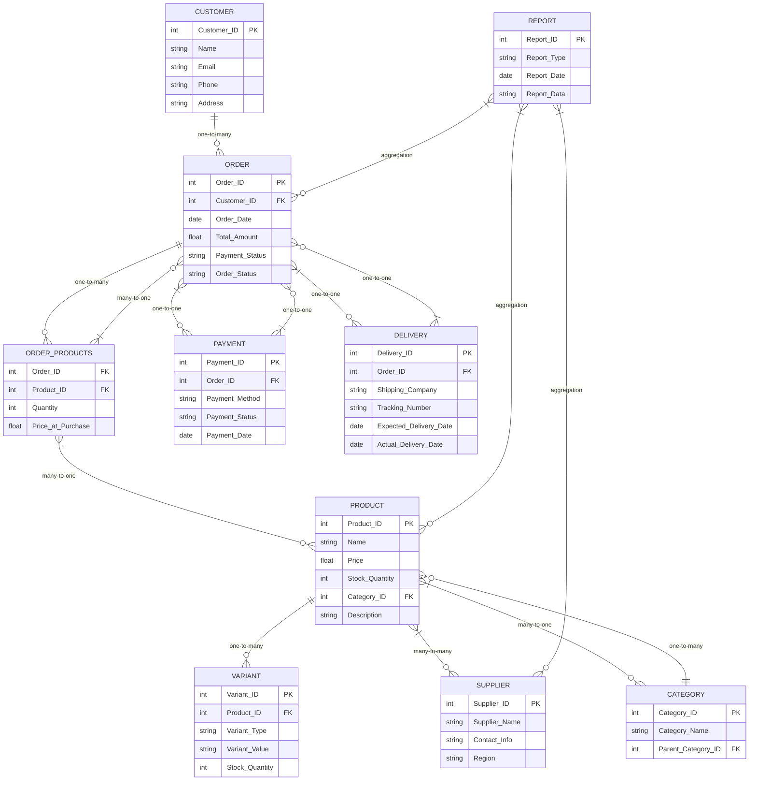

```txt
Client Request:
"I’m starting an online store, and I need a system to manage it. Here’s what I need: I’ll have products with details like name, price, stock quantity, and category. There are some main categories and each category can have sub-categories. Each product will have suppliers, and I need to track their details like name, contact information, and region. Some products might have variants (e.g., size, color), so I need to store those as well.
Then, there are customers who place orders, and I need their information—name, email, phone number, and delivery address. Orders will have multiple products with quantities, and I’d also like to track payment details like method and status. For deliveries, I want to manage shipping companies, tracking numbers, and delivery dates. Can you also help me generate reports on top-selling products, pending orders, and supplier performance?"

```

### **Client Request Analysis: Online Store Management System**

---

### **1. Introduction:**

The client is starting an online store and requires a system to manage the entire process from product listing, customer management, and order tracking, to supplier and shipping management. The system must handle product details, suppliers, customers, orders, payments, and deliveries. Additionally, the client needs functionality to generate reports on sales and order statuses for business analysis.

---

### **2. Business Requirements:**

#### **2.1 Product Management:**

- **Product Details:** The system must store product information including:
  - Name
  - Price
  - Stock Quantity
  - Category
- **Categories:** Products can belong to main categories and sub-categories. This indicates a **one-to-many** relationship between categories (main categories and sub-categories).
- **Variants:** Products can have variants (e.g., size, color). The system must allow tracking of these variants separately for each product.

#### **2.2 Supplier Management:**

- **Supplier Details:** Each product is linked to one or more suppliers. The system must store supplier information such as:
  - Name
  - Contact Information
  - Region
- **Supplier Relationship:** The system should support a **many-to-many** relationship between products and suppliers, allowing products to have multiple suppliers and vice versa.

#### **2.3 Customer Management:**

- **Customer Information:** The system must store customer details such as:
  - Name
  - Email
  - Phone Number
  - Delivery Address
- **Order Tracking:** Each customer will place one or more orders, which must be tracked in the system with product details.

#### **2.4 Order Management:**

- **Order Details:** Each order will include:
  - Customer Information (Linked to customer data)
  - Products and Quantities (Linked to the products ordered)
  - Payment Method (Credit card, PayPal, etc.)
  - Payment Status (Paid, Pending, Failed)
- **Order Status:** The system should track the status of orders, such as “Pending,” “Shipped,” and “Delivered.”

#### **2.5 Payment Management:**

- **Payment Details:** The system should store and manage:
  - Payment Method (e.g., Credit card, PayPal)
  - Payment Status (Paid, Pending, Failed)

#### **2.6 Delivery Management:**

- **Shipping Information:** The system must handle delivery details including:
  - Shipping Company (Linked to the shipping service used)
  - Tracking Numbers (For monitoring shipment progress)
  - Delivery Dates (To track expected and actual delivery times)

#### **2.7 Reporting:**

- **Reports Needed:**
  - **Top-Selling Products:** A report showing the best-performing products based on sales volume or revenue.
  - **Pending Orders:** A report displaying orders that are pending or yet to be shipped.
  - **Supplier Performance:** A report evaluating supplier reliability, based on order fulfillment times, product quality, and delivery times.

---

### **3. Functional Requirements:**

- **CRUD Operations:** The system must allow users to Create, Read, Update, and Delete:
  - Products, including variants and categories
  - Suppliers and their details
  - Customers and their order history
  - Orders and payment information
  - Shipping details and delivery tracking
- **Order Tracking:** The system should allow for tracking the current status of orders and updating order statuses as they move through various stages.
- **Payment Integration:** Integration with payment gateways to update payment status automatically based on transaction success or failure.
- **Shipping Management:** The system should enable tracking of deliveries with real-time updates (via tracking numbers) and facilitate shipping company management.
- **Report Generation:** Automated generation of the requested reports on sales, pending orders, and supplier performance, with filters and date range options.

---

### **4. Data Modeling (ERD):**

- **Products Table:** Includes product name, price, stock quantity, and category.
- **Categories Table:** Represents main categories and sub-categories, linked to products.
- **Suppliers Table:** Includes supplier name, contact details, and region, linked to products via a many-to-many relationship.
- **Customers Table:** Stores customer information.
- **Orders Table:** Includes order details such as order date, products ordered, payment method, and status.
- **Payments Table:** Stores payment method, payment status, and associated order ID.
- **Deliveries Table:** Stores shipping company, tracking number, and delivery dates.
- **Reports Table:** Will be generated from transaction, product, and supplier data.

---

### **5. Non-Functional Requirements:**

- **Performance:** The system must be able to handle large volumes of products, orders, and customer data efficiently.
- **Security:** Ensure data security for sensitive customer information (e.g., address, payment details).
- **Scalability:** The system must be scalable as the business grows, accommodating more products, suppliers, and orders.
- **Usability:** The user interface should be intuitive for both administrators and customers.

---

### **6. User Stories and Use Cases:**

- **User Story 1:** As an **admin**, I want to add new products with categories, variants, and suppliers, so that I can manage the store inventory effectively.
- **User Story 2:** As a **customer**, I want to place an order with multiple products, choose a payment method, and track the delivery status.
- **User Story 3:** As a **manager**, I want to generate reports showing top-selling products, pending orders, and supplier performance, so that I can analyze business performance.
- **Use Case:** **Place Order:** A customer browses products, adds them to the cart, provides payment details, and completes the order. The system records the order, updates inventory, and processes payment.

---

### **7. Risk Assessment:**

- **Data Integrity:** Ensuring the relationships between products, suppliers, customers, and orders are correctly maintained.
- **Payment Processing:** Integration with third-party payment gateways may face issues with payment failures or delays.
- **Scalability:** The system must be designed to handle a growing number of products and orders without performance degradation.
- **Security:** Safeguarding sensitive customer data, especially payment information, is a key concern that requires strong encryption and secure access controls.

---

### **8. Final Deliverables:**

- **Business Requirements Document (BRD):** Detailed documentation of all business needs and system requirements.
- **Functional Specification Document (FSD):** A comprehensive guide to the system’s functionality, including product management, orders, payments, and reporting features.
- **Entity-Relationship Diagram (ERD):** A visual model of the database structure and relationships.
- **Wireframes/UI Designs:** Visual mockups for the user interface, focusing on product management, order tracking, and report generation.
- **Test Cases:** To ensure the system functions as intended across all modules, including payments, orders, and shipping.

---

### ERD for Online Store Management System

#### 1. **Entities and Attributes:**

1. **Product**

   - _Attributes:_
     - Product_ID (PK)
     - Name
     - Price
     - Stock_Quantity
     - Category_ID (FK to Category)
     - Description
   - _Relationships:_
     - Has many _Variants_ (One-to-Many)
     - Has many _Suppliers_ (Many-to-Many)

2. **Variant**

   - _Attributes:_
     - Variant_ID (PK)
     - Product_ID (FK to Product)
     - Variant_Type (Size, Color, etc.)
     - Variant_Value (e.g., Small, Blue, etc.)
     - Stock_Quantity
   - _Relationships:_
     - Belongs to _Product_ (Many-to-One)

3. **Category**

   - _Attributes:_
     - Category_ID (PK)
     - Category_Name
     - Parent_Category_ID (Self-referencing FK for sub-categories)
   - _Relationships:_
     - Can have many _Products_ (One-to-Many)

4. **Supplier**

   - _Attributes:_
     - Supplier_ID (PK)
     - Supplier_Name
     - Contact_Info
     - Region
   - _Relationships:_
     - Supplies many _Products_ (Many-to-Many)

5. **Customer**

   - _Attributes:_
     - Customer_ID (PK)
     - Name
     - Email
     - Phone
     - Address
   - _Relationships:_
     - Has many _Orders_ (One-to-Many)

6. **Order**

   - _Attributes:_
     - Order_ID (PK)
     - Customer_ID (FK to Customer)
     - Order_Date
     - Total_Amount
     - Payment_Status (Paid, Pending, Failed)
     - Order_Status (Pending, Shipped, Delivered)
   - _Relationships:_
     - Belongs to _Customer_ (Many-to-One)
     - Has many _Order_Products_ (One-to-Many)
     - Linked to _Payment_ (One-to-One)
     - Linked to _Delivery_ (One-to-One)

7. **Order_Products** (Junction Table for many-to-many between Orders and Products)

   - _Attributes:_
     - Order_ID (FK to Order)
     - Product_ID (FK to Product)
     - Quantity
     - Price_at_Purchase
   - _Relationships:_
     - Belongs to _Order_ (Many-to-One)
     - Belongs to _Product_ (Many-to-One)

8. **Payment**

   - _Attributes:_
     - Payment_ID (PK)
     - Order_ID (FK to Order)
     - Payment_Method (Credit Card, PayPal, etc.)
     - Payment_Status (Paid, Pending, Failed)
     - Payment_Date
   - _Relationships:_
     - Linked to _Order_ (One-to-One)

9. **Delivery**

   - _Attributes:_
     - Delivery_ID (PK)
     - Order_ID (FK to Order)
     - Shipping_Company
     - Tracking_Number
     - Expected_Delivery_Date
     - Actual_Delivery_Date
   - _Relationships:_
     - Linked to _Order_ (One-to-One)

10. **Report**
    - _Attributes:_
      - Report_ID (PK)
      - Report_Type (Top-Selling, Pending Orders, Supplier Performance)
      - Report_Date
      - Report_Data (JSON or Text for report details)
    - _Relationships:_
      - Generated from _Order_, _Product_, _Supplier_ data (Aggregation, not a direct relationship)

---

#### 2. **Relationships:**

1. **Product-Category**:

   - Many Products belong to one Category.
   - Each Category can have sub-categories (self-referencing many-to-one).

2. **Product-Variant**:

   - A product can have multiple variants, tracked separately.

3. **Product-Supplier**:

   - Many-to-many relationship: A product can have multiple suppliers, and a supplier can provide multiple products. This requires a junction table between _Products_ and _Suppliers_.

4. **Customer-Order**:

   - A customer can place multiple orders. Each order belongs to a single customer.

5. **Order-Product**:

   - Many-to-many relationship: Each order can have multiple products, and each product can appear in multiple orders (managed through _Order_Products_ junction table).

6. **Order-Payment**:

   - One-to-one relationship: Each order has one corresponding payment record.

7. **Order-Delivery**:

   - One-to-one relationship: Each order has one delivery record that tracks shipping information.

8. **Report**:
   - Reports are generated from transaction data (orders, products, suppliers).

---

#### 3. **Corner Cases:**

1. **Product with no variants**: The system should allow products to be created without variants and still manage their stock.

2. **Category Hierarchy**: A product can belong to a sub-category, but in some cases, products may only be assigned to a main category with no sub-category. The system should handle this case gracefully.

3. **Product-Supplier Relationship**: In case a supplier goes out of business, the system should allow for easy removal or replacement of suppliers associated with products.

4. **Payment Status**: A failed payment should still allow the order to be created but flagged as "Pending" until resolved.

5. **Order without payment**: An order could be created with a "Pending" payment status until the payment is successfully processed. It should be flagged as "Pending" until payment is made.

6. **Order Delivery without Shipping Info**: The system should allow for orders to be created without shipping information, with the delivery details updated later.

7. **Stock Management**: When products are ordered, the system should automatically update stock quantities for each product and variant, with checks in place for low stock.

8. **Report Data Integrity**: Ensure reports like "Top-Selling Products" or "Pending Orders" reflect real-time data, with accurate aggregations and timely generation.

---


