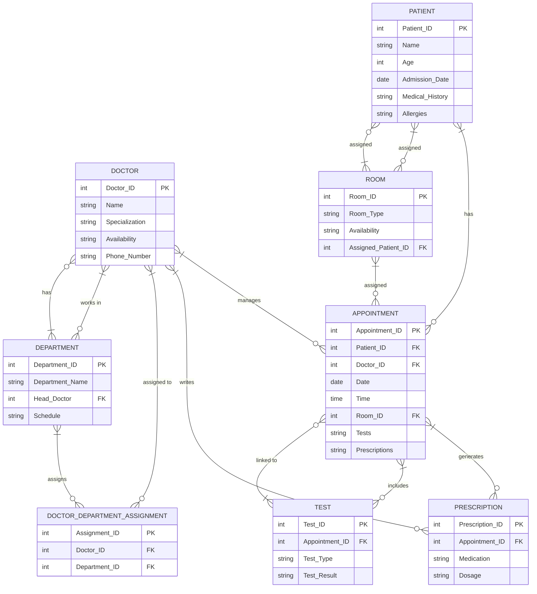

```txt
Client Request:
"I manage a hospital, and I need a system to organize our operations. We have patients with details like name, age, admission date, medical history, and allergies. We also have doctors with details like name, specialization, availability, and phone number. Each doctor is assigned to one or more departments (e.g., Cardiology, Pediatrics), and each department has its own schedule and head doctor.
Patients book appointments with doctors, and I need to track which patient is seeing which doctor, the date, time, and any tests or prescriptions given. We also need to manage rooms in the hospital, including their type (e.g., ICU, General), availability, and assigned patients. Lastly, I’d like a report feature to show department performance, doctor schedules, and room occupancy rates."

```

### **Client Request Analysis: Hospital Management System**

---

### **1. Introduction:**

The client, a hospital manager, requires a system to efficiently organize hospital operations, including managing patient information, doctor schedules, departmental details, and room assignments. The system should support appointment booking, patient records, doctor availability, and tracking room occupancy. Additionally, reporting on department performance, doctor schedules, and room occupancy rates will be essential for operational oversight.

---

### **2. Business Requirements:**

#### **2.1 Patient Management:**

- **Patient Details:** The system should store patient information, including:
  - **Name**
  - **Age**
  - **Admission Date**
  - **Medical History** (including previous conditions, surgeries, etc.)
  - **Allergies**
- **Appointments:** The system must allow patients to book appointments with doctors. Appointment details include:
  - **Doctor Assigned**
  - **Date and Time**
  - **Tests and Prescriptions** (if any)

#### **2.2 Doctor Management:**

- **Doctor Profiles:** Doctors should have the following details:
  - **Name**
  - **Specialization** (e.g., Cardiology, Pediatrics)
  - **Availability** (working hours and days)
  - **Phone Number**
- **Doctor Assignments:** Doctors can be assigned to multiple departments (e.g., a cardiologist may be assigned to both the Cardiology and ICU departments).

#### **2.3 Department Management:**

- **Department Details:** The system should store:
  - **Department Name** (e.g., Cardiology, Pediatrics)
  - **Head Doctor** (a doctor assigned as the department head)
  - **Schedule** (working hours for the department)
  - **Doctors Assigned** (doctors who work in the department)
- **Doctor Scheduling:** The system needs to manage doctor availability within each department to avoid scheduling conflicts.

#### **2.4 Room Management:**

- **Room Details:** The system should manage rooms in the hospital, including:
  - **Room Type** (e.g., ICU, General)
  - **Availability** (whether the room is free or occupied)
  - **Assigned Patients** (tracking which patients are occupying which rooms)

#### **2.5 Appointment and Treatment Management:**

- **Appointment Tracking:** The system should track which patient has an appointment with which doctor, including:
  - **Date and Time**
  - **Treatment** (tests or prescriptions given during the appointment)
- **Doctor-Patient Interaction:** The system should allow doctors to update treatment details during patient visits, including prescriptions and any tests requested.

---

### **3. Functional Requirements:**

- **CRUD Operations:** The system must allow users to Create, Read, Update, and Delete:
  - Patient records (name, age, medical history, allergies)
  - Doctor profiles (name, specialization, availability)
  - Department details (name, head doctor, schedule)
  - Room details (type, availability, assigned patient)
  - Appointment details (doctor, patient, date, tests, prescriptions)
- **Appointment Booking:** Patients should be able to book appointments with available doctors. The system should prevent double-booking for doctors and rooms.
- **Room Assignment:** The system should allow for the assignment of rooms to patients based on availability.
- **Doctor Availability Management:** Doctors’ schedules should be managed to avoid conflicts and ensure proper patient care.
- **Reporting:** The system should be able to generate reports such as:
  - **Department Performance Report:** This report shows the performance of each department (number of patients treated, treatment success, etc.).
  - **Doctor Schedule Report:** A summary of each doctor’s schedule, showing their appointments and available time slots.
  - **Room Occupancy Report:** A report on the availability and occupancy rate of hospital rooms.

---

### **4. Data Modeling (ERD):**

- **Patients Table:** Stores patient details, including ID, name, age, admission date, medical history, and allergies.
- **Doctors Table:** Stores doctor information, including ID, name, specialization, availability, and phone number.
- **Departments Table:** Stores department details, including name, head doctor, and schedule.
- **Rooms Table:** Stores room details, including room type (ICU, General), availability, and assigned patient ID.
- **Appointments Table:** Tracks patient appointments with doctors, including date, time, and treatment details (tests, prescriptions).
- **Prescriptions Table:** Stores prescription details given by doctors during patient appointments.
- **Tests Table:** Stores test details prescribed by doctors.
- **Doctor-Department Assignment Table:** Links doctors to the departments they are assigned to.

---

### **5. Non-Functional Requirements:**

- **Performance:** The system must handle a large volume of patient data, doctor schedules, and room management without compromising performance.
- **Security:** Patient data must be kept confidential, following health data protection regulations (e.g., HIPAA). Access to the system should be restricted based on user roles (hospital administrators, doctors, nurses).
- **Scalability:** The system should be designed to scale with hospital growth, supporting the addition of new patients, doctors, and departments over time.
- **Usability:** The system should be easy to use for hospital staff, including administrators, doctors, and nurses, with clear interfaces for scheduling and managing patients.

---

### **6. User Stories and Use Cases:**

- **User Story 1:** As a **patient**, I want to book an appointment with a doctor based on their availability, so I can receive medical care at a convenient time.
- **User Story 2:** As a **doctor**, I want to see my schedule for the day, so I can manage my appointments and treatment plans.
- **User Story 3:** As a **hospital administrator**, I want to view reports on room occupancy, doctor schedules, and department performance to manage hospital resources efficiently.
- **User Story 4:** As a **nurse**, I want to view the room assignments for each patient so I can assist with patient care and room management.

- **Use Case:** **Appointment Booking:** A patient books an appointment with an available doctor. The system checks doctor availability, prevents conflicts, and confirms the appointment with the doctor’s schedule and room assignment.

---

### **7. Risk Assessment:**

- **Data Security:** Sensitive patient data must be protected from unauthorized access, especially medical history, prescriptions, and personal information.
- **System Downtime:** Any system downtime can disrupt hospital operations, so high availability and backup solutions should be considered.
- **User Training:** Hospital staff will need proper training to efficiently use the system, especially for managing doctor schedules, room assignments, and patient care.

---

### **8. Final Deliverables:**

- **Business Requirements Document (BRD):** Detailed documentation of system requirements for managing patients, doctors, appointments, and hospital resources.
- **Functional Specification Document (FSD):** Description of system features, including appointment booking, doctor scheduling, room management, and reporting.
- **Entity-Relationship Diagram (ERD):** Visual representation of the database schema, illustrating how patients, doctors, appointments, and rooms are interconnected.
- **User Interface Designs:** Wireframes or mockups of the system interface for hospital staff (administrators, doctors, nurses).
- **Test Cases:** Comprehensive tests for the functionalities, especially appointment scheduling, room management, and reporting.

---

For the **Hospital Management System** ERD, the design needs to efficiently manage the following key entities: Patients, Doctors, Appointments, Departments, Rooms, Prescriptions, Tests, and Doctor-Department Assignments. Below is the structured ERD with corner cases covered:

### Entities and Relationships:

1. **Patients**

   - **Attributes**: Patient_ID (PK), Name, Age, Admission_Date, Medical_History, Allergies
   - **Relationships**:
     - One-to-many with **Appointments** (A patient can have multiple appointments).
     - Many-to-many with **Rooms** (Patients can occupy different rooms over time).

2. **Doctors**

   - **Attributes**: Doctor_ID (PK), Name, Specialization, Availability, Phone_Number
   - **Relationships**:
     - Many-to-many with **Departments** (Doctors can work in multiple departments).
     - One-to-many with **Appointments** (A doctor can have multiple appointments).
     - One-to-many with **Prescriptions** (A doctor writes prescriptions for patients).

3. **Departments**

   - **Attributes**: Department_ID (PK), Department_Name, Head_Doctor (FK to Doctors), Schedule
   - **Relationships**:
     - One-to-many with **Doctors** (A department has multiple doctors).
     - One-to-many with **Appointments** (A department can handle many appointments).

4. **Rooms**

   - **Attributes**: Room_ID (PK), Room_Type (ICU, General), Availability (Occupied/Free), Assigned_Patient_ID (FK to Patients)
   - **Relationships**:
     - One-to-many with **Patients** (A room is assigned to one patient at a time, but patients can switch rooms).

5. **Appointments**

   - **Attributes**: Appointment_ID (PK), Patient_ID (FK to Patients), Doctor_ID (FK to Doctors), Date, Time, Room_ID (FK to Rooms), Tests, Prescriptions
   - **Relationships**:
     - Many-to-one with **Doctors** (A doctor handles many appointments).
     - Many-to-one with **Patients** (A patient can book multiple appointments).
     - Many-to-one with **Rooms** (Each appointment takes place in a specific room).

6. **Prescriptions**

   - **Attributes**: Prescription_ID (PK), Appointment_ID (FK to Appointments), Medication, Dosage
   - **Relationships**:
     - One-to-one with **Appointments** (A prescription is generated during a specific appointment).

7. **Tests**

   - **Attributes**: Test_ID (PK), Appointment_ID (FK to Appointments), Test_Type, Test_Result
   - **Relationships**:
     - One-to-many with **Appointments** (A doctor may prescribe multiple tests per appointment).

8. **Doctor-Department Assignment**
   - **Attributes**: Assignment_ID (PK), Doctor_ID (FK to Doctors), Department_ID (FK to Departments)
   - **Relationships**:
     - Many-to-one with **Doctors** (A doctor can be assigned to many departments).
     - Many-to-one with **Departments** (A department can have multiple doctors assigned).

### Corner Cases Covered:

- **Overbooking of Doctors**: The system ensures doctors cannot be double-booked for the same time slots.
- **Room Assignment Conflicts**: Rooms are assigned only if they are available at the appointment time. Multiple patients can't share a room at the same time.
- **Multiple Departments**: Doctors can belong to multiple departments without causing conflicts.
- **Appointment Flexibility**: A patient can reschedule or cancel appointments, which may change the room assignment and availability of doctors.
- **Prescription Management**: A prescription can be updated or canceled if necessary, and the system keeps a record of all changes.
- **Test Management**: Tests can be added, updated, or removed for appointments, ensuring that the treatment record is always accurate.

### ERD Summary:

- **Patients** (Patient_ID, Name, Age, Admission_Date, Medical_History, Allergies)
  - 1:M → **Appointments** (Appointment_ID, Date, Time, Tests, Prescriptions)
  - M:M → **Rooms** (Room_ID, Type, Availability)
- **Doctors** (Doctor_ID, Name, Specialization, Availability, Phone)
  - 1:M → **Appointments** (Doctor_ID)
  - 1:M → **Prescriptions** (Doctor_ID)
  - M:M → **Departments** (Department_ID)
- **Departments** (Department_ID, Name, Head_Doctor, Schedule)
  - 1:M → **Doctors** (Doctor_ID)
  - 1:M → **Appointments** (Department_ID)
- **Rooms** (Room_ID, Type, Availability)
  - M:M → **Patients** (Patient_ID)
- **Prescriptions** (Prescription_ID, Appointment_ID, Medication, Dosage)
  - M:1 → **Appointments** (Appointment_ID)
- **Tests** (Test_ID, Appointment_ID, Test_Type, Test_Result)
  - M:1 → **Appointments** (Appointment_ID)
- **Doctor-Department Assignment** (Assignment_ID, Doctor_ID, Department_ID)
  - M:1 → **Doctors** (Doctor_ID)
  - M:1 → **Departments** (Department_ID)

---



---

### SQL Queries for the Hospital Management System

Based on the provided ERD, I will define SQL queries for creating the necessary tables and handling the relationships.

---

### 1. **Table Creation Queries**

#### **Patients Table**

```sql
CREATE TABLE Patients (
    Patient_ID INT PRIMARY KEY,
    Name VARCHAR(255),
    Age INT,
    Admission_Date DATE,
    Medical_History TEXT,
    Allergies TEXT
);
```

#### **Doctors Table**

```sql
CREATE TABLE Doctors (
    Doctor_ID INT PRIMARY KEY,
    Name VARCHAR(255),
    Specialization VARCHAR(255),
    Availability TEXT,
    Phone_Number VARCHAR(20)
);
```

#### **Departments Table**

```sql
CREATE TABLE Departments (
    Department_ID INT PRIMARY KEY,
    Department_Name VARCHAR(255),
    Head_Doctor INT,
    Schedule TEXT,
    FOREIGN KEY (Head_Doctor) REFERENCES Doctors(Doctor_ID)
);
```

#### **Rooms Table**

```sql
CREATE TABLE Rooms (
    Room_ID INT PRIMARY KEY,
    Room_Type VARCHAR(50),   -- ICU, General, etc.
    Availability ENUM('Occupied', 'Free'),
    Assigned_Patient_ID INT,
    FOREIGN KEY (Assigned_Patient_ID) REFERENCES Patients(Patient_ID)
);
```

#### **Appointments Table**

```sql
CREATE TABLE Appointments (
    Appointment_ID INT PRIMARY KEY,
    Patient_ID INT,
    Doctor_ID INT,
    Date DATE,
    Time TIME,
    Room_ID INT,
    Tests TEXT,
    Prescriptions TEXT,
    FOREIGN KEY (Patient_ID) REFERENCES Patients(Patient_ID),
    FOREIGN KEY (Doctor_ID) REFERENCES Doctors(Doctor_ID),
    FOREIGN KEY (Room_ID) REFERENCES Rooms(Room_ID)
);
```

#### **Prescriptions Table**

```sql
CREATE TABLE Prescriptions (
    Prescription_ID INT PRIMARY KEY,
    Appointment_ID INT,
    Medication VARCHAR(255),
    Dosage VARCHAR(255),
    FOREIGN KEY (Appointment_ID) REFERENCES Appointments(Appointment_ID)
);
```

#### **Tests Table**

```sql
CREATE TABLE Tests (
    Test_ID INT PRIMARY KEY,
    Appointment_ID INT,
    Test_Type VARCHAR(255),
    Test_Result TEXT,
    FOREIGN KEY (Appointment_ID) REFERENCES Appointments(Appointment_ID)
);
```

#### **Doctor-Department Assignment Table (Many-to-Many Relationship)**

```sql
CREATE TABLE Doctor_Department_Assignment (
    Assignment_ID INT PRIMARY KEY,
    Doctor_ID INT,
    Department_ID INT,
    FOREIGN KEY (Doctor_ID) REFERENCES Doctors(Doctor_ID),
    FOREIGN KEY (Department_ID) REFERENCES Departments(Department_ID)
);
```

#### **Room-Patient Many-to-Many Relationship (Junction Table)**

Since a patient can occupy multiple rooms over time and rooms can house different patients at different times, a junction table for the many-to-many relationship between `Patients` and `Rooms` is required.

```sql
CREATE TABLE Patient_Rooms (
    Patient_ID INT,
    Room_ID INT,
    Admission_Date DATE,
    Discharge_Date DATE,
    PRIMARY KEY (Patient_ID, Room_ID, Admission_Date),
    FOREIGN KEY (Patient_ID) REFERENCES Patients(Patient_ID),
    FOREIGN KEY (Room_ID) REFERENCES Rooms(Room_ID)
);
```

---

### 2. **Corner Cases Handling**

#### **1. Overbooking of Doctors**

Ensure that a doctor can't have multiple appointments at the same time. This can be handled by enforcing availability checks before inserting a new appointment. If a doctor already has an appointment at the scheduled time, the system will reject the new appointment.

```sql
-- Example of preventing overbooking by checking availability
SELECT * FROM Appointments
WHERE Doctor_ID = 1
  AND Date = '2024-12-15'
  AND Time = '10:00:00';
-- If no results, the appointment can be scheduled.
```

#### **2. Room Assignment Conflicts**

Ensure that rooms cannot be assigned to more than one patient at the same time. Rooms must be marked as "Occupied" when a patient is assigned, and only "Free" rooms should be available for new appointments.

```sql
-- Check room availability before scheduling an appointment
SELECT * FROM Rooms
WHERE Room_ID = 101
  AND Availability = 'Free';
-- If no results, the room cannot be assigned.
```

#### **3. Doctors in Multiple Departments**

Doctors can belong to multiple departments. The `Doctor_Department_Assignment` table handles this many-to-many relationship.

```sql
-- Assign a doctor to multiple departments
INSERT INTO Doctor_Department_Assignment (Doctor_ID, Department_ID)
VALUES (1, 101), (1, 102);
```

#### **4. Appointment Flexibility**

Allow patients to reschedule or cancel appointments. When rescheduling, update the `Appointments` table with new `Date` and `Time` values. For cancellations, the appointment can either be deleted or marked as "Cancelled."

```sql
-- Reschedule an appointment
UPDATE Appointments
SET Date = '2024-12-20', Time = '14:00:00'
WHERE Appointment_ID = 1001;

-- Cancel an appointment
UPDATE Appointments
SET Status = 'Cancelled'
WHERE Appointment_ID = 1001;
```

#### **5. Prescription Management**

If prescriptions need to be updated or canceled, modify the `Prescriptions` table. Each prescription is tied to a specific `Appointment_ID`.

```sql
-- Update a prescription
UPDATE Prescriptions
SET Medication = 'Ibuprofen', Dosage = '200mg'
WHERE Prescription_ID = 2001;

-- Cancel a prescription (set medication to null or delete)
UPDATE Prescriptions
SET Medication = NULL, Dosage = NULL
WHERE Prescription_ID = 2001;
```

#### **6. Test Management**

Tests can be added, updated, or removed for an appointment. Similarly, make sure to handle the relationship between `Tests` and `Appointments` via the `Appointment_ID`.

```sql
-- Add a test to an appointment
INSERT INTO Tests (Appointment_ID, Test_Type, Test_Result)
VALUES (1001, 'Blood Test', 'Normal');

-- Update a test result
UPDATE Tests
SET Test_Result = 'High Blood Sugar'
WHERE Test_ID = 3001;

-- Remove a test record
DELETE FROM Tests
WHERE Test_ID = 3001;
```

---

### 3. **Data Integrity**

- **Foreign Key Constraints:** All the relationships are enforced via foreign key constraints (e.g., between `Appointments` and `Doctors`, `Prescriptions` and `Appointments`, etc.).
- **Availability Checks:** Ensure that rooms are not double-booked and doctors are not overbooked by checking availability before inserting new records.

---
