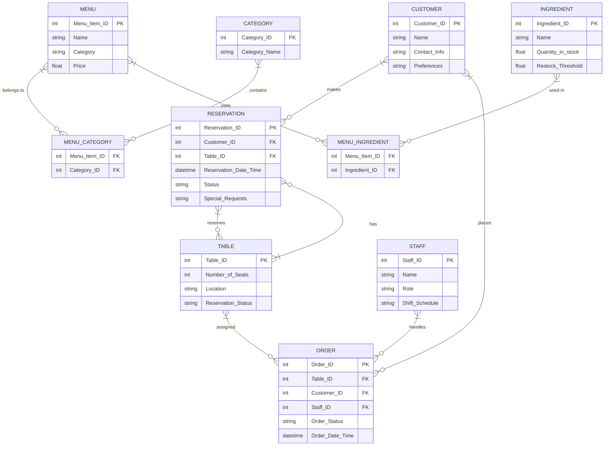

```txt
Client Request:
"I run a restaurant, and I need a system to manage tables, customers, orders, and the staff. For tables, I need details like the number of seats, location, and reservation status. For customers, I need to track their names, contact details, and preferences (e.g., vegetarian, non-vegetarian).
Orders should be linked to both customers and tables, and I also want to store which staff member (e.g., waiter) handled the order. For the menu, I’d like to manage categories (e.g., Appetizers, Main Course) and ingredients for each menu item. This will help us track inventory for ingredients and know when to restock. Can you also add reports to show staff performance, most ordered dishes, and reservations by date?"

```

### **Client Request Analysis: Restaurant Management System**

---

### **1. Introduction:**

The client, a restaurant owner, requires a system to efficiently manage restaurant operations, including table management, customer details, orders, staff performance, and inventory. The system should allow the tracking of reservations, orders, and menu items, as well as manage staff performance and inventory for ingredients.

---

### **2. Business Requirements:**

#### **2.1 Table Management:**

- **Table Details:** The system must store information about restaurant tables, including:
  - **Number of Seats** (capacity of each table)
  - **Location** (e.g., indoor, outdoor, near the window)
  - **Reservation Status** (whether the table is reserved or available)
- **Table Availability:** The system should be able to check and update table availability in real-time based on reservations and orders.

#### **2.2 Customer Management:**

- **Customer Details:** The system should store customer information, including:
  - **Name**
  - **Contact Information** (e.g., phone number, email)
  - **Preferences** (e.g., vegetarian, non-vegetarian, allergies, seating preferences)
- **Order Linkage:** Each order should be linked to a specific customer to track their preferences, repeat orders, and loyalty.

#### **2.3 Order Management:**

- **Order Tracking:** The system must track orders linked to both customers and tables. The order details should include:
  - **Table Number**
  - **Customer Name**
  - **Items Ordered**
  - **Quantity**
  - **Staff Member Handling the Order** (e.g., waiter)
- **Order Status:** The system should allow the updating of order statuses (e.g., pending, in progress, served).

#### **2.4 Staff Management:**

- **Staff Details:** The system should store information about the restaurant staff, including:
  - **Name**
  - **Role** (e.g., waiter, chef, manager)
  - **Shift Details** (working hours, shifts)
- **Staff Performance:** The system should track which staff member handled which orders and generate reports based on staff performance.

#### **2.5 Menu Management:**

- **Menu Categories:** The system must allow categorization of menu items, including:
  - **Categories** (e.g., Appetizers, Main Course, Desserts, Beverages)
  - **Menu Items** (e.g., specific dishes under each category)
  - **Ingredients** (for each menu item)
- **Inventory Tracking:** The system should track the ingredients for each menu item, allowing the restaurant to know when ingredients need to be restocked.

#### **2.6 Reservation Management:**

- **Reservations:** The system should allow customers to make reservations and store reservation details, including:
  - **Customer Name**
  - **Reservation Date and Time**
  - **Table Assigned**
  - **Special Requests** (e.g., birthday celebration, window seat)
- **Reservation Status:** The system should track whether reservations are confirmed, pending, or canceled.

---

### **3. Functional Requirements:**

- **CRUD Operations:** The system must allow users to Create, Read, Update, and Delete:
  - Table records (number of seats, location, reservation status)
  - Customer records (name, contact details, preferences)
  - Order records (linked to table, customer, staff)
  - Menu items and categories (name, price, ingredients)
  - Staff records (name, role, shift schedule)
  - Reservation details (customer name, date, table, special requests)
- **Order Management:** The system should allow orders to be linked to specific tables and customers, with real-time updates on order status.
- **Inventory Management:** The system should track the quantity of ingredients used for each menu item and alert when ingredients need to be restocked.
- **Staff Performance Reports:** The system should generate reports on staff performance, including the number of orders handled and average order handling time.
- **Most Ordered Dishes Report:** The system should provide insights into the most popular dishes, helping the restaurant optimize its menu and inventory.
- **Reservation Reports:** The system should allow the generation of reports based on reservations by date, time, and table.

---

### **4. Data Modeling (ERD):**

- **Customers Table:** Stores customer details including ID, name, contact information, and preferences.
- **Tables Table:** Stores table details including ID, number of seats, location, and reservation status.
- **Orders Table:** Tracks orders with order ID, table ID, customer ID, staff member ID, items ordered, and order status.
- **Menu Table:** Stores menu items with details like ID, name, category, price, and ingredients.
- **Ingredients Table:** Stores ingredients used in menu items, tracking quantities and restocking needs.
- **Staff Table:** Stores staff member details including ID, name, role, and shift schedule.
- **Reservations Table:** Tracks reservations with customer ID, table ID, reservation date and time, and status.

---

### **5. Non-Functional Requirements:**

- **Performance:** The system must handle simultaneous orders, table reservations, and staff management without affecting performance, especially during peak hours.
- **Security:** Sensitive customer information (name, contact details) should be protected. Access control should be in place for staff roles (e.g., waiters, managers).
- **Scalability:** The system should be scalable as the restaurant grows, accommodating more tables, staff, and customers.
- **Usability:** The system should have an intuitive interface for staff to manage tables, orders, and reservations quickly during busy service times.

---

### **6. User Stories and Use Cases:**

- **User Story 1:** As a **customer**, I want to make a reservation for a table so I can secure a spot at the restaurant on my preferred date and time.
- **User Story 2:** As a **waiter**, I want to link orders to the correct table and customer so I can manage the service and ensure accurate billing.
- **User Story 3:** As a **restaurant manager**, I want to track the performance of each staff member, so I can optimize service and address any performance issues.
- **User Story 4:** As a **chef**, I want to see which ingredients are being used for orders, so I can manage kitchen resources efficiently.

- **Use Case:** **Table Reservation:** A customer makes a reservation for a specific table. The system checks table availability, confirms the reservation, and stores details like the customer’s preferences and special requests.

---

### **7. Risk Assessment:**

- **Data Security:** Customer information, especially contact details, needs to be stored securely to prevent unauthorized access.
- **System Downtime:** Any downtime during peak hours can disrupt restaurant operations, so reliable hosting and backup solutions must be in place.
- **Staff Training:** Proper training for staff will be required to ensure they can efficiently manage the system, particularly during busy hours.

---

### **8. Final Deliverables:**

- **Business Requirements Document (BRD):** Detailed documentation outlining system requirements for managing tables, customers, orders, staff, and reservations.
- **Functional Specification Document (FSD):** Description of system features, including order management, staff performance tracking, and inventory management.
- **Entity-Relationship Diagram (ERD):** Visual representation of the database schema.
- **User Interface Designs:** Wireframes or mockups of the system interface for restaurant staff, including waiters, chefs, and managers.
- **Test Cases:** Comprehensive tests for functionalities like order tracking, reservation management, and inventory updates.

---

Here’s a structured ERD for the **Restaurant Management System** based on the provided requirements:

### **Entities and Relationships:**

1. **Customers Table**
   - **Attributes**: Customer_ID (PK), Name, Contact_Info (phone, email), Preferences (vegetarian, allergies, seating preferences)
2. **Tables Table**
   - **Attributes**: Table_ID (PK), Number_of_Seats, Location (indoor, outdoor), Reservation_Status (available, reserved)
   - **Relationships**: A table can be reserved by many customers over time (1-to-many with Reservations).
3. **Orders Table**
   - **Attributes**: Order_ID (PK), Table_ID (FK), Customer_ID (FK), Staff_ID (FK), Order_Status (pending, in progress, served), Order_Date_Time
   - **Relationships**: An order belongs to one customer and one table but can be managed by multiple staff members (1-to-many with Staff).
   - **Linkage**: Orders are linked to both tables and customers.
4. **Menu Table**

   - **Attributes**: Menu_Item_ID (PK), Name, Category (e.g., Appetizer, Main Course, Desserts), Price
   - **Relationships**: A menu item can belong to one or many categories (many-to-many with Categories via a join table).

5. **Ingredients Table**

   - **Attributes**: Ingredient_ID (PK), Name, Quantity_in_stock, Restock_Threshold
   - **Relationships**: A menu item may use many ingredients (many-to-many with Menu via a join table).

6. **Staff Table**
   - **Attributes**: Staff_ID (PK), Name, Role (waiter, chef, manager), Shift_Schedule
   - **Relationships**: A staff member can handle multiple orders (1-to-many with Orders).
7. **Reservations Table**
   - **Attributes**: Reservation_ID (PK), Customer_ID (FK), Table_ID (FK), Reservation_Date_Time, Status (confirmed, pending, canceled), Special_Requests
   - **Relationships**: A reservation is linked to one customer and one table (many-to-one relationship with both Customers and Tables).

### **Corner Cases Considerations:**

1. **Table Overlap**: A table may only have one reservation at a time, preventing double bookings.
2. **Ingredient Stock Management**: Ingredients need to be tracked dynamically, considering cases when an ingredient is used up during a meal period. Alerts should trigger when inventory goes below the restock threshold.

3. **Staff Schedule Conflicts**: A staff member should not be assigned to multiple orders during the same shift, preventing scheduling conflicts.

4. **Customer Preferences**: If a customer has preferences (e.g., vegetarian or non-vegetarian), the system should filter menu items based on these preferences.

5. **Order Status Tracking**: Orders should track multiple statuses, from "pending" to "served," and support updates in real-time.

6. **Reservation Conflicts**: Ensure that no two reservations are allowed for the same table during the same time slot. Consider no-shows and cancellations impacting the availability.

---

### **Relationships Overview**:

- **Customers** can have multiple **Reservations** and **Orders**.
- **Tables** are linked to **Reservations** and **Orders**.
- **Staff** handle **Orders**, and their performance can be tracked.
- **Menu** items and **Ingredients** are linked, and the system must handle ingredient shortages dynamically.
- **Orders** are placed by **Customers**, processed by **Staff**, and assigned to **Tables**.

---


