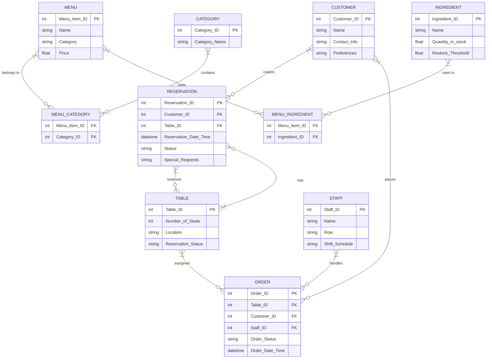

```txt
Client Request:
"I run a restaurant, and I need a system to manage tables, customers, orders, and the staff. For tables, I need details like the number of seats, location, and reservation status. For customers, I need to track their names, contact details, and preferences (e.g., vegetarian, non-vegetarian).
Orders should be linked to both customers and tables, and I also want to store which staff member (e.g., waiter) handled the order. For the menu, I’d like to manage categories (e.g., Appetizers, Main Course) and ingredients for each menu item. This will help us track inventory for ingredients and know when to restock. Can you also add reports to show staff performance, most ordered dishes, and reservations by date?"

```

### **Client Request Analysis: Restaurant Management System**

---

### **1. Introduction:**

The client, a restaurant owner, requires a system to efficiently manage restaurant operations, including table management, customer details, orders, staff performance, and inventory. The system should allow the tracking of reservations, orders, and menu items, as well as manage staff performance and inventory for ingredients.

---

### **2. Business Requirements:**

#### **2.1 Table Management:**

- **Table Details:** The system must store information about restaurant tables, including:
  - **Number of Seats** (capacity of each table)
  - **Location** (e.g., indoor, outdoor, near the window)
  - **Reservation Status** (whether the table is reserved or available)
- **Table Availability:** The system should be able to check and update table availability in real-time based on reservations and orders.

#### **2.2 Customer Management:**

- **Customer Details:** The system should store customer information, including:
  - **Name**
  - **Contact Information** (e.g., phone number, email)
  - **Preferences** (e.g., vegetarian, non-vegetarian, allergies, seating preferences)
- **Order Linkage:** Each order should be linked to a specific customer to track their preferences, repeat orders, and loyalty.

#### **2.3 Order Management:**

- **Order Tracking:** The system must track orders linked to both customers and tables. The order details should include:
  - **Table Number**
  - **Customer Name**
  - **Items Ordered**
  - **Quantity**
  - **Staff Member Handling the Order** (e.g., waiter)
- **Order Status:** The system should allow the updating of order statuses (e.g., pending, in progress, served).

#### **2.4 Staff Management:**

- **Staff Details:** The system should store information about the restaurant staff, including:
  - **Name**
  - **Role** (e.g., waiter, chef, manager)
  - **Shift Details** (working hours, shifts)
- **Staff Performance:** The system should track which staff member handled which orders and generate reports based on staff performance.

#### **2.5 Menu Management:**

- **Menu Categories:** The system must allow categorization of menu items, including:
  - **Categories** (e.g., Appetizers, Main Course, Desserts, Beverages)
  - **Menu Items** (e.g., specific dishes under each category)
  - **Ingredients** (for each menu item)
- **Inventory Tracking:** The system should track the ingredients for each menu item, allowing the restaurant to know when ingredients need to be restocked.

#### **2.6 Reservation Management:**

- **Reservations:** The system should allow customers to make reservations and store reservation details, including:
  - **Customer Name**
  - **Reservation Date and Time**
  - **Table Assigned**
  - **Special Requests** (e.g., birthday celebration, window seat)
- **Reservation Status:** The system should track whether reservations are confirmed, pending, or canceled.

---

### **3. Functional Requirements:**

- **CRUD Operations:** The system must allow users to Create, Read, Update, and Delete:
  - Table records (number of seats, location, reservation status)
  - Customer records (name, contact details, preferences)
  - Order records (linked to table, customer, staff)
  - Menu items and categories (name, price, ingredients)
  - Staff records (name, role, shift schedule)
  - Reservation details (customer name, date, table, special requests)
- **Order Management:** The system should allow orders to be linked to specific tables and customers, with real-time updates on order status.
- **Inventory Management:** The system should track the quantity of ingredients used for each menu item and alert when ingredients need to be restocked.
- **Staff Performance Reports:** The system should generate reports on staff performance, including the number of orders handled and average order handling time.
- **Most Ordered Dishes Report:** The system should provide insights into the most popular dishes, helping the restaurant optimize its menu and inventory.
- **Reservation Reports:** The system should allow the generation of reports based on reservations by date, time, and table.

---

### **4. Data Modeling (ERD):**

- **Customers Table:** Stores customer details including ID, name, contact information, and preferences.
- **Tables Table:** Stores table details including ID, number of seats, location, and reservation status.
- **Orders Table:** Tracks orders with order ID, table ID, customer ID, staff member ID, items ordered, and order status.
- **Menu Table:** Stores menu items with details like ID, name, category, price, and ingredients.
- **Ingredients Table:** Stores ingredients used in menu items, tracking quantities and restocking needs.
- **Staff Table:** Stores staff member details including ID, name, role, and shift schedule.
- **Reservations Table:** Tracks reservations with customer ID, table ID, reservation date and time, and status.

---

### **5. Non-Functional Requirements:**

- **Performance:** The system must handle simultaneous orders, table reservations, and staff management without affecting performance, especially during peak hours.
- **Security:** Sensitive customer information (name, contact details) should be protected. Access control should be in place for staff roles (e.g., waiters, managers).
- **Scalability:** The system should be scalable as the restaurant grows, accommodating more tables, staff, and customers.
- **Usability:** The system should have an intuitive interface for staff to manage tables, orders, and reservations quickly during busy service times.

---

### **6. User Stories and Use Cases:**

- **User Story 1:** As a **customer**, I want to make a reservation for a table so I can secure a spot at the restaurant on my preferred date and time.
- **User Story 2:** As a **waiter**, I want to link orders to the correct table and customer so I can manage the service and ensure accurate billing.
- **User Story 3:** As a **restaurant manager**, I want to track the performance of each staff member, so I can optimize service and address any performance issues.
- **User Story 4:** As a **chef**, I want to see which ingredients are being used for orders, so I can manage kitchen resources efficiently.

- **Use Case:** **Table Reservation:** A customer makes a reservation for a specific table. The system checks table availability, confirms the reservation, and stores details like the customer’s preferences and special requests.

---

### **7. Risk Assessment:**

- **Data Security:** Customer information, especially contact details, needs to be stored securely to prevent unauthorized access.
- **System Downtime:** Any downtime during peak hours can disrupt restaurant operations, so reliable hosting and backup solutions must be in place.
- **Staff Training:** Proper training for staff will be required to ensure they can efficiently manage the system, particularly during busy hours.

---

### **8. Final Deliverables:**

- **Business Requirements Document (BRD):** Detailed documentation outlining system requirements for managing tables, customers, orders, staff, and reservations.
- **Functional Specification Document (FSD):** Description of system features, including order management, staff performance tracking, and inventory management.
- **Entity-Relationship Diagram (ERD):** Visual representation of the database schema.
- **User Interface Designs:** Wireframes or mockups of the system interface for restaurant staff, including waiters, chefs, and managers.
- **Test Cases:** Comprehensive tests for functionalities like order tracking, reservation management, and inventory updates.

---

Here’s a structured ERD for the **Restaurant Management System** based on the provided requirements:

### **Entities and Relationships:**

1. **Customers Table**
   - **Attributes**: Customer_ID (PK), Name, Contact_Info (phone, email), Preferences (vegetarian, allergies, seating preferences)
2. **Tables Table**
   - **Attributes**: Table_ID (PK), Number_of_Seats, Location (indoor, outdoor), Reservation_Status (available, reserved)
   - **Relationships**: A table can be reserved by many customers over time (1-to-many with Reservations).
3. **Orders Table**
   - **Attributes**: Order_ID (PK), Table_ID (FK), Customer_ID (FK), Staff_ID (FK), Order_Status (pending, in progress, served), Order_Date_Time
   - **Relationships**: An order belongs to one customer and one table but can be managed by multiple staff members (1-to-many with Staff).
   - **Linkage**: Orders are linked to both tables and customers.
4. **Menu Table**

   - **Attributes**: Menu_Item_ID (PK), Name, Category (e.g., Appetizer, Main Course, Desserts), Price
   - **Relationships**: A menu item can belong to one or many categories (many-to-many with Categories via a join table).

5. **Ingredients Table**

   - **Attributes**: Ingredient_ID (PK), Name, Quantity_in_stock, Restock_Threshold
   - **Relationships**: A menu item may use many ingredients (many-to-many with Menu via a join table).

6. **Staff Table**
   - **Attributes**: Staff_ID (PK), Name, Role (waiter, chef, manager), Shift_Schedule
   - **Relationships**: A staff member can handle multiple orders (1-to-many with Orders).
7. **Reservations Table**
   - **Attributes**: Reservation_ID (PK), Customer_ID (FK), Table_ID (FK), Reservation_Date_Time, Status (confirmed, pending, canceled), Special_Requests
   - **Relationships**: A reservation is linked to one customer and one table (many-to-one relationship with both Customers and Tables).

### **Corner Cases Considerations:**

1. **Table Overlap**: A table may only have one reservation at a time, preventing double bookings.
2. **Ingredient Stock Management**: Ingredients need to be tracked dynamically, considering cases when an ingredient is used up during a meal period. Alerts should trigger when inventory goes below the restock threshold.

3. **Staff Schedule Conflicts**: A staff member should not be assigned to multiple orders during the same shift, preventing scheduling conflicts.

4. **Customer Preferences**: If a customer has preferences (e.g., vegetarian or non-vegetarian), the system should filter menu items based on these preferences.

5. **Order Status Tracking**: Orders should track multiple statuses, from "pending" to "served," and support updates in real-time.

6. **Reservation Conflicts**: Ensure that no two reservations are allowed for the same table during the same time slot. Consider no-shows and cancellations impacting the availability.

---

### **Relationships Overview**:

- **Customers** can have multiple **Reservations** and **Orders**.
- **Tables** are linked to **Reservations** and **Orders**.
- **Staff** handle **Orders**, and their performance can be tracked.
- **Menu** items and **Ingredients** are linked, and the system must handle ingredient shortages dynamically.
- **Orders** are placed by **Customers**, processed by **Staff**, and assigned to **Tables**.

---



---

### SQL Queries for Restaurant Management System

Based on the provided ERD, I will define the necessary SQL queries for creating tables, handling relationships, and addressing the corner cases.

---

### 1. **Table Creation Queries**

#### **Customers Table**

```sql
CREATE TABLE Customers (
    Customer_ID INT PRIMARY KEY,
    Name VARCHAR(255),
    Contact_Info VARCHAR(255),  -- Store both phone and email as a single field or separate fields
    Preferences VARCHAR(255)    -- Store preferences like vegetarian, allergies, seating preferences
);
```

#### **Tables Table**

```sql
CREATE TABLE Tables (
    Table_ID INT PRIMARY KEY,
    Number_of_Seats INT,
    Location ENUM('indoor', 'outdoor'),
    Reservation_Status ENUM('available', 'reserved')
);
```

#### **Orders Table**

```sql
CREATE TABLE Orders (
    Order_ID INT PRIMARY KEY,
    Table_ID INT,
    Customer_ID INT,
    Staff_ID INT,
    Order_Status ENUM('pending', 'in progress', 'served'),
    Order_Date_Time DATETIME,
    FOREIGN KEY (Table_ID) REFERENCES Tables(Table_ID),
    FOREIGN KEY (Customer_ID) REFERENCES Customers(Customer_ID),
    FOREIGN KEY (Staff_ID) REFERENCES Staff(Staff_ID)
);
```

#### **Menu Table**

```sql
CREATE TABLE Menu (
    Menu_Item_ID INT PRIMARY KEY,
    Name VARCHAR(255),
    Category VARCHAR(255),   -- E.g., Appetizer, Main Course, Desserts
    Price DECIMAL(10, 2)
);
```

#### **Ingredients Table**

```sql
CREATE TABLE Ingredients (
    Ingredient_ID INT PRIMARY KEY,
    Name VARCHAR(255),
    Quantity_in_stock INT,
    Restock_Threshold INT
);
```

#### **Staff Table**

```sql
CREATE TABLE Staff (
    Staff_ID INT PRIMARY KEY,
    Name VARCHAR(255),
    Role ENUM('waiter', 'chef', 'manager'),
    Shift_Schedule TEXT
);
```

#### **Reservations Table**

```sql
CREATE TABLE Reservations (
    Reservation_ID INT PRIMARY KEY,
    Customer_ID INT,
    Table_ID INT,
    Reservation_Date_Time DATETIME,
    Status ENUM('confirmed', 'pending', 'canceled'),
    Special_Requests TEXT,
    FOREIGN KEY (Customer_ID) REFERENCES Customers(Customer_ID),
    FOREIGN KEY (Table_ID) REFERENCES Tables(Table_ID)
);
```

#### **Join Table for Menu Items and Categories**

Since a menu item can belong to multiple categories, we need a many-to-many relationship between `Menu` and `Categories`. Assuming `Category` is a separate table (not defined in the original ERD, but inferred from the context), here's how to structure it.

```sql
CREATE TABLE Categories (
    Category_ID INT PRIMARY KEY,
    Category_Name VARCHAR(255)
);

CREATE TABLE Menu_Categories (
    Menu_Item_ID INT,
    Category_ID INT,
    PRIMARY KEY (Menu_Item_ID, Category_ID),
    FOREIGN KEY (Menu_Item_ID) REFERENCES Menu(Menu_Item_ID),
    FOREIGN KEY (Category_ID) REFERENCES Categories(Category_ID)
);
```

#### **Join Table for Menu Items and Ingredients**

Since a menu item may use many ingredients, here's the many-to-many relationship between `Menu` and `Ingredients`.

```sql
CREATE TABLE Menu_Ingredients (
    Menu_Item_ID INT,
    Ingredient_ID INT,
    Quantity_used INT,
    PRIMARY KEY (Menu_Item_ID, Ingredient_ID),
    FOREIGN KEY (Menu_Item_ID) REFERENCES Menu(Menu_Item_ID),
    FOREIGN KEY (Ingredient_ID) REFERENCES Ingredients(Ingredient_ID)
);
```

---

### 2. **Corner Case Handling**

#### **1. Table Overlap (Preventing Double Booking)**

To ensure that no table is reserved for more than one customer at the same time, we can check if a table is already reserved for a given time slot.

```sql
-- Check if a table is available at a specific time slot
SELECT * FROM Reservations
WHERE Table_ID = 1
  AND Reservation_Date_Time = '2024-12-15 19:00:00'
  AND Status = 'confirmed';
-- If no rows are returned, the table is available for booking.
```

#### **2. Ingredient Stock Management**

When an order is placed, the ingredients used in the ordered menu items should be deducted from the stock. If the stock goes below the restock threshold, an alert should be triggered.

```sql
-- Deduct ingredient stock for each menu item in an order
UPDATE Ingredients
SET Quantity_in_stock = Quantity_in_stock - 2  -- Assuming 2 units of the ingredient are used
WHERE Ingredient_ID = 101;

-- Check if any ingredients need restocking
SELECT * FROM Ingredients
WHERE Quantity_in_stock <= Restock_Threshold;
```

#### **3. Staff Schedule Conflicts**

To prevent assigning a staff member to multiple orders during the same shift, you can check if the staff member is already handling another order during the same time.

```sql
-- Check for schedule conflicts for a staff member
SELECT * FROM Orders
WHERE Staff_ID = 5
  AND Order_Date_Time BETWEEN '2024-12-15 18:00:00' AND '2024-12-15 21:00:00';
-- If no rows are returned, the staff member is available.
```

#### **4. Customer Preferences (Menu Filtering)**

When a customer has preferences (e.g., vegetarian or allergies), the system can filter the menu to show only relevant items.

```sql
-- Example: Filtering the menu based on vegetarian preference
SELECT * FROM Menu
WHERE Category = 'Main Course'
  AND Name NOT LIKE '%meat%'   -- Exclude non-vegetarian items
  AND Price < 20.00;           -- Example additional filter based on price
```

#### **5. Order Status Tracking**

To track multiple statuses for orders (e.g., from "pending" to "served"), update the order status at each step. Here's how to update the status:

```sql
-- Update the order status as it progresses
UPDATE Orders
SET Order_Status = 'served'
WHERE Order_ID = 1001;
```

#### **6. Reservation Conflicts**

Ensure that no two reservations overlap for the same table. The reservation table already handles this, but here's how to check for conflicts.

```sql
-- Check if a table is already reserved for a specific time
SELECT * FROM Reservations
WHERE Table_ID = 3
  AND Reservation_Date_Time = '2024-12-15 20:00:00'
  AND Status = 'confirmed';
-- If no rows are returned, the table is available for booking.
```

---

### 3. **Handling Ingredient Shortages and Alerts**

#### **Ingredient Shortage Alert**

This query can be used to monitor ingredients that are running low and need to be restocked.

```sql
-- Get a list of ingredients that are below the restock threshold
SELECT Ingredient_ID, Name, Quantity_in_stock
FROM Ingredients
WHERE Quantity_in_stock <= Restock_Threshold;
```

#### **Dynamic Ingredient Usage During Orders**

For each order, ingredients used in the menu items should be deducted, and alerts should trigger if any ingredient is running low.

```sql
-- Example: Deduct ingredients when an order is placed
UPDATE Ingredients
SET Quantity_in_stock = Quantity_in_stock - 1
WHERE Ingredient_ID = 1   -- Assuming Ingredient_ID = 1 is used in the order
AND Quantity_in_stock > 0;

-- Alert if stock goes below the threshold
SELECT * FROM Ingredients
WHERE Quantity_in_stock <= Restock_Threshold;
```

---

## OOP Representation:

---

## 1. Data Models

### 1.1 Table

Represents a physical table in the restaurant:

```csharp
public class RestaurantTable
{
    public int Id { get; set; }
    public int NumberOfSeats { get; set; }
    public string Location { get; set; }     // e.g., "Indoor", "Outdoor", "Near Window"
    public bool IsReserved { get; set; }     // indicates if the table is currently reserved

    public RestaurantTable(int id, int seats, string location)
    {
        Id = id;
        NumberOfSeats = seats;
        Location = location;
        IsReserved = false;
    }

    public override string ToString()
    {
        return $"Table #{Id}, Seats: {NumberOfSeats}, Location: {Location}, Reserved: {IsReserved}";
    }
}
```

### 1.2 Customer

Stores customer details:

```csharp
public class Customer
{
    public int Id { get; set; }
    public string Name { get; set; }
    public string ContactInfo { get; set; }    // e.g., phone number, email
    public string Preferences { get; set; }    // e.g., "Vegetarian", "Allergic to nuts"

    public Customer(int id, string name, string contactInfo, string preferences)
    {
        Id = id;
        Name = name;
        ContactInfo = contactInfo;
        Preferences = preferences;
    }

    public override string ToString()
    {
        return $"{Name} (ID: {Id}), Contact: {ContactInfo}";
    }
}
```

### 1.3 Staff

Represents employees at the restaurant:

```csharp
public class Staff
{
    public int Id { get; set; }
    public string Name { get; set; }
    public string Role { get; set; }          // e.g., "Waiter", "Chef", "Manager"
    public string ShiftDetails { get; set; }  // e.g., "9AM - 5PM"

    // Performance tracking: how many orders handled, etc.
    public int OrdersHandled { get; set; } = 0;

    public Staff(int id, string name, string role, string shiftDetails)
    {
        Id = id;
        Name = name;
        Role = role;
        ShiftDetails = shiftDetails;
    }

    public override string ToString()
    {
        return $"{Name} (ID: {Id}, {Role}), Shift: {ShiftDetails}";
    }
}
```

### 1.4 Menu Categories and Items

We’ll have a `Category` (e.g., “Appetizers”, “Main Course”) and each category has multiple `MenuItem` entries.

```csharp
public class Category
{
    public int Id { get; set; }
    public string Name { get; set; }           // e.g., "Appetizers", "Main Course"
    public List<MenuItem> MenuItems { get; set; } = new List<MenuItem>();

    public Category(int id, string name)
    {
        Id = id;
        Name = name;
    }

    public override string ToString()
    {
        return $"{Name} (Category ID: {Id})";
    }
}
```

### 1.5 Ingredients and Inventory

Each `MenuItem` references a list of `Ingredient`s. The system tracks the quantities to know when to restock.

```csharp
public class Ingredient
{
    public int Id { get; set; }
    public string Name { get; set; }     // e.g., "Tomato", "Cheese"
    public double Quantity { get; set; } // e.g., 10.5 units (could be grams, pounds, etc.)

    public Ingredient(int id, string name, double quantity)
    {
        Id = id;
        Name = name;
        Quantity = quantity;
    }

    public override string ToString()
    {
        return $"{Name} (ID: {Id}), Qty: {Quantity}";
    }
}
```

### 1.6 MenuItem

Represents a dish/drink on the menu and tracks the ingredients used:

```csharp
public class MenuItem
{
    public int Id { get; set; }
    public string Name { get; set; }     // e.g., "Cheeseburger", "Margherita Pizza"
    public decimal Price { get; set; }
    public List<Ingredient> Ingredients { get; set; } = new List<Ingredient>();

    // Each menu item belongs to exactly one category (e.g., "Main Course")
    public Category Category { get; set; }

    public MenuItem(int id, string name, decimal price, Category category)
    {
        Id = id;
        Name = name;
        Price = price;
        Category = category;
    }

    public override string ToString()
    {
        return $"{Name} (ID: {Id}), Price: {Price:C}, Category: {Category.Name}";
    }
}
```

### 1.7 Order

Represents a single order. It ties together:

- The `RestaurantTable` (table where the order is placed)
- The `Customer` who placed it
- The `Staff` member handling it (e.g., waiter)
- Order items (which menu items, in what quantity)
- Status (pending, in progress, served)

```csharp
public class Order
{
    public int Id { get; set; }
    public RestaurantTable Table { get; set; }
    public Customer Customer { get; set; }
    public Staff HandledBy { get; set; }
    public string Status { get; set; } // e.g., "Pending", "In Progress", "Served"

    // A list of items in the form (MenuItem, quantity)
    public List<(MenuItem item, int quantity)> OrderItems { get; set; }
        = new List<(MenuItem item, int quantity)>();

    public DateTime CreatedAt { get; set; }

    public Order(int id, RestaurantTable table, Customer customer, Staff handledBy)
    {
        Id = id;
        Table = table;
        Customer = customer;
        HandledBy = handledBy;
        Status = "Pending";
        CreatedAt = DateTime.Now;
    }

    public decimal CalculateTotal()
    {
        return OrderItems.Sum(oi => oi.item.Price * oi.quantity);
    }

    public override string ToString()
    {
        return $"Order #{Id}, Table #{Table.Id}, Customer: {Customer.Name}, Staff: {HandledBy.Name}, Status: {Status}";
    }
}
```

### 1.8 Reservation

Manages table reservations:

```csharp
public class Reservation
{
    public int Id { get; set; }
    public Customer Customer { get; set; }
    public RestaurantTable Table { get; set; }
    public DateTime ReservationTime { get; set; }
    public string SpecialRequests { get; set; } // e.g. "Birthday celebration", "Window seat"
    public string Status { get; set; }          // e.g., "Confirmed", "Pending", "Cancelled"

    public Reservation(int id, Customer customer, RestaurantTable table, DateTime time)
    {
        Id = id;
        Customer = customer;
        Table = table;
        ReservationTime = time;
        Status = "Pending";
    }

    public override string ToString()
    {
        return $"Reservation #{Id}, Table #{Table.Id}, Customer: {Customer.Name}, Time: {ReservationTime}, Status: {Status}";
    }
}
```

---

## 2. Repositories (In-Memory)

We’ll define a generic `IRepository<T>` interface for CRUD operations, then create **in-memory** repositories for each entity.

```csharp
public interface IRepository<T>
{
    void Add(T entity);
    T GetById(int id);
    IEnumerable<T> GetAll();
    void Update(T entity);
    void Delete(int id);
}
```

Below is a sample repository. Others follow the same pattern:

```csharp
public class GenericRepository<T> : IRepository<T>
{
    private readonly List<T> _items = new List<T>();

    public void Add(T entity)
    {
        _items.Add(entity);
    }

    public T GetById(int id)
    {
        // This uses reflection to get a property named "Id" from T.
        // In a production scenario, you'd likely do something more robust.
        return _items.FirstOrDefault(x =>
            (int)x.GetType().GetProperty("Id").GetValue(x) == id
        );
    }

    public IEnumerable<T> GetAll()
    {
        return _items;
    }

    public void Update(T entity)
    {
        var idValue = (int)entity.GetType().GetProperty("Id").GetValue(entity);
        var existing = GetById(idValue);
        if (existing != null)
        {
            _items.Remove(existing);
            _items.Add(entity);
        }
    }

    public void Delete(int id)
    {
        var existing = GetById(id);
        if (existing != null) _items.Remove(existing);
    }
}
```

_(You can either create a `GenericRepository<T>` for each entity or create separate repositories like `OrderRepository`, `StaffRepository`, etc.)_

---

## 3. Core Service: RestaurantService

This service orchestrates the main functionality:

- **Reservations**
- **Orders** (placing and updating)
- **Inventory** updates (ingredient usage)
- **Reporting** (staff performance, most ordered dishes, reservation stats)

```csharp
public class RestaurantService
{
    private readonly IRepository<RestaurantTable> _tableRepo;
    private readonly IRepository<Customer> _customerRepo;
    private readonly IRepository<Staff> _staffRepo;
    private readonly IRepository<MenuItem> _menuItemRepo;
    private readonly IRepository<Order> _orderRepo;
    private readonly IRepository<Reservation> _reservationRepo;
    private readonly IRepository<Category> _categoryRepo;

    public RestaurantService(
        IRepository<RestaurantTable> tableRepo,
        IRepository<Customer> customerRepo,
        IRepository<Staff> staffRepo,
        IRepository<MenuItem> menuItemRepo,
        IRepository<Order> orderRepo,
        IRepository<Reservation> reservationRepo,
        IRepository<Category> categoryRepo)
    {
        _tableRepo = tableRepo;
        _customerRepo = customerRepo;
        _staffRepo = staffRepo;
        _menuItemRepo = menuItemRepo;
        _orderRepo = orderRepo;
        _reservationRepo = reservationRepo;
        _categoryRepo = categoryRepo;
    }

    // ------------------------------
    // Reservation Management
    // ------------------------------

    public Reservation MakeReservation(int customerId, int tableId, DateTime reservationTime, string specialRequests)
    {
        var customer = _customerRepo.GetById(customerId);
        if (customer == null) throw new Exception("Customer not found.");

        var table = _tableRepo.GetById(tableId);
        if (table == null) throw new Exception("Table not found.");
        if (table.IsReserved) throw new Exception($"Table #{table.Id} is already reserved at that time.");

        // Basic check: if the requested time is soon, you might consider more advanced logic, but we’ll keep it simple.
        var newResId = GenerateReservationId();
        var reservation = new Reservation(newResId, customer, table, reservationTime)
        {
            SpecialRequests = specialRequests,
            Status = "Confirmed"
        };

        table.IsReserved = true;
        _tableRepo.Update(table);

        _reservationRepo.Add(reservation);
        Console.WriteLine($"Reservation created: {reservation}");
        return reservation;
    }

    public void CancelReservation(int reservationId)
    {
        var reservation = _reservationRepo.GetById(reservationId);
        if (reservation == null) throw new Exception("Reservation not found.");

        reservation.Status = "Cancelled";
        _reservationRepo.Update(reservation);

        // Make the table available again
        var table = reservation.Table;
        if (table != null)
        {
            table.IsReserved = false;
            _tableRepo.Update(table);
        }

        Console.WriteLine($"Reservation #{reservationId} cancelled.");
    }

    // ------------------------------
    // Order Management
    // ------------------------------

    public Order PlaceOrder(int tableId, int customerId, int staffId, List<(int menuItemId, int quantity)> items)
    {
        var table = _tableRepo.GetById(tableId);
        if (table == null) throw new Exception("Table not found.");

        var customer = _customerRepo.GetById(customerId);
        if (customer == null) throw new Exception("Customer not found.");

        var staff = _staffRepo.GetById(staffId);
        if (staff == null) throw new Exception("Staff not found.");

        var order = new Order(GenerateOrderId(), table, customer, staff);
        foreach (var (menuItemId, quantity) in items)
        {
            var menuItem = _menuItemRepo.GetById(menuItemId);
            if (menuItem == null) throw new Exception($"Menu item #{menuItemId} not found.");

            order.OrderItems.Add((menuItem, quantity));
            // (Optionally: adjust inventory usage of the ingredients)
        }

        _orderRepo.Add(order);

        // Increase staff’s OrdersHandled
        staff.OrdersHandled++;
        _staffRepo.Update(staff);

        Console.WriteLine($"Order placed: {order}");
        return order;
    }

    public void UpdateOrderStatus(int orderId, string newStatus)
    {
        var order = _orderRepo.GetById(orderId);
        if (order == null) throw new Exception("Order not found.");

        order.Status = newStatus;
        _orderRepo.Update(order);

        Console.WriteLine($"Order #{orderId} status updated to {newStatus}.");
    }

    // ------------------------------
    // Reporting
    // ------------------------------

    // 1) Staff Performance
    public IEnumerable<Staff> GetStaffPerformance()
    {
        // Sort staff by OrdersHandled descending (most to fewest)
        return _staffRepo.GetAll().OrderByDescending(s => s.OrdersHandled);
    }

    // 2) Most Ordered Dishes
    public List<(MenuItem menuItem, int totalQuantity)> GetMostOrderedDishes(int topN = 5)
    {
        var allOrders = _orderRepo.GetAll();
        var dishCount = new Dictionary<MenuItem, int>();

        foreach (var order in allOrders)
        {
            foreach (var (menuItem, qty) in order.OrderItems)
            {
                if (!dishCount.ContainsKey(menuItem))
                {
                    dishCount[menuItem] = 0;
                }
                dishCount[menuItem] += qty;
            }
        }

        return dishCount
            .OrderByDescending(dc => dc.Value)
            .Take(topN)
            .Select(kv => (kv.Key, kv.Value))
            .ToList();
    }

    // 3) Reservation Reports
    public IEnumerable<Reservation> GetReservationsByDate(DateTime date)
    {
        return _reservationRepo.GetAll()
            .Where(r => r.ReservationTime.Date == date.Date);
    }

    public IEnumerable<Reservation> GetReservationsByStatus(string status)
    {
        return _reservationRepo.GetAll()
            .Where(r => r.Status.Equals(status, StringComparison.OrdinalIgnoreCase));
    }

    // ------------------------------
    // Helper ID Generators
    // ------------------------------

    private int GenerateReservationId()
    {
        return new Random().Next(1000, 9999);
    }

    private int GenerateOrderId()
    {
        return new Random().Next(10000, 99999);
    }
}
```

---

## 4. Demonstration / Usage

```csharp
public class Program
{
    public static void Main()
    {
        // Create in-memory repositories
        var tableRepo = new GenericRepository<RestaurantTable>();
        var customerRepo = new GenericRepository<Customer>();
        var staffRepo = new GenericRepository<Staff>();
        var menuItemRepo = new GenericRepository<MenuItem>();
        var orderRepo = new GenericRepository<Order>();
        var reservationRepo = new GenericRepository<Reservation>();
        var categoryRepo = new GenericRepository<Category>();

        // Create the RestaurantService
        var restaurantService = new RestaurantService(
            tableRepo, customerRepo, staffRepo, menuItemRepo, orderRepo, reservationRepo, categoryRepo
        );

        // Seed data
        SeedData(tableRepo, customerRepo, staffRepo, menuItemRepo, categoryRepo);

        // 1) Make a reservation
        var reservation = restaurantService.MakeReservation(
            customerId: 1,
            tableId: 10,
            reservationTime: DateTime.Today.AddHours(18),
            specialRequests: "Window seat if possible"
        );

        // 2) Place an order
        var order = restaurantService.PlaceOrder(
            tableId: 10,
            customerId: 1,
            staffId: 101,
            items: new List<(int menuItemId, int quantity)>
            {
                (1001, 2), // e.g., 2 x "Cheeseburger"
                (1002, 1)  // 1 x "Garden Salad"
            }
        );

        // 3) Update order status
        restaurantService.UpdateOrderStatus(order.Id, "In Progress");

        // 4) Check staff performance
        Console.WriteLine("\n--- Staff Performance ---");
        var performance = restaurantService.GetStaffPerformance();
        foreach (var staff in performance)
        {
            Console.WriteLine($"{staff.Name} handled {staff.OrdersHandled} orders.");
        }

        // 5) Find most-ordered dishes
        Console.WriteLine("\n--- Most Ordered Dishes ---");
        var topDishes = restaurantService.GetMostOrderedDishes();
        foreach (var (dish, qty) in topDishes)
        {
            Console.WriteLine($"{dish.Name} - Ordered {qty} time(s).");
        }

        // 6) Reservation Report
        Console.WriteLine("\n--- Reservations Today ---");
        var todaysReservations = restaurantService.GetReservationsByDate(DateTime.Today);
        foreach (var res in todaysReservations)
        {
            Console.WriteLine(res);
        }

        // 7) Cancel a reservation
        restaurantService.CancelReservation(reservation.Id);
    }

    private static void SeedData(
        IRepository<RestaurantTable> tableRepo,
        IRepository<Customer> customerRepo,
        IRepository<Staff> staffRepo,
        IRepository<MenuItem> menuItemRepo,
        IRepository<Category> categoryRepo
    )
    {
        // Tables
        var table1 = new RestaurantTable(10, 4, "Indoor");
        var table2 = new RestaurantTable(11, 2, "Outdoor");
        tableRepo.Add(table1);
        tableRepo.Add(table2);

        // Customers
        var cust1 = new Customer(1, "Alice Johnson", "555-1234", "Vegetarian");
        var cust2 = new Customer(2, "Bob Smith", "555-5678", "No peanuts");
        customerRepo.Add(cust1);
        customerRepo.Add(cust2);

        // Staff
        var waiter1 = new Staff(101, "John Waiter", "Waiter", "9AM-5PM");
        var chef1 = new Staff(102, "Chef Maria", "Chef", "10AM-6PM");
        staffRepo.Add(waiter1);
        staffRepo.Add(chef1);

        // Categories
        var catMainCourse = new Category(201, "Main Course");
        var catSalad = new Category(202, "Salad");
        categoryRepo.Add(catMainCourse);
        categoryRepo.Add(catSalad);

        // Menu Items
        var menuItem1 = new MenuItem(1001, "Cheeseburger", 8.99m, catMainCourse);
        var menuItem2 = new MenuItem(1002, "Garden Salad", 5.49m, catSalad);

        // Link items to categories
        catMainCourse.MenuItems.Add(menuItem1);
        catSalad.MenuItems.Add(menuItem2);

        menuItemRepo.Add(menuItem1);
        menuItemRepo.Add(menuItem2);
    }
}
```

### Explanation

1. **Seeding Data**:
   - We create two tables (#10, #11), two customers (Alice, Bob), two staff members (John Waiter, Chef Maria), two categories (Main Course, Salad), and two menu items (Cheeseburger, Garden Salad).
2. **Make a Reservation**:
   - Customer #1 (Alice) reserves Table #10 at 6 PM today.
3. **Place an Order**:
   - For the same table (#10) and customer (#1), handled by staff #101 (John Waiter). Includes 2 x Cheeseburgers and 1 x Garden Salad.
4. **Update Order Status**:
   - Set the order to “In Progress.”
5. **Staff Performance**:
   - We output the staff sorted by `OrdersHandled` (descending).
6. **Most Ordered Dishes**:
   - We gather the totals from all orders and show the top requested dishes.
7. **Reservation Report**:
   - We list all reservations for today (there should be at least the one we just created).
8. **Cancel a Reservation**:
   - We cancel the reservation and free up the table.

---

## Final Thoughts

- **Data Modeling**:
  - `RestaurantTable`, `Customer`, `Staff`, `Category`, `MenuItem`, `Order`, and `Reservation` classes represent the core domain entities.
- **Relationships**:
  - **One-to-Many**: A `Category` has many `MenuItem`s, a `Staff` can handle many `Order`s, etc.
  - **Order** references a **Table**, **Customer**, and **Staff**.
  - **Reservation** references a **Table** and a **Customer**.
- **Business Logic**:
  - The `RestaurantService` orchestrates reservations, orders, status updates, and provides reporting logic (staff performance, most ordered dishes, reservation queries).
- **Scalability**:
  - You can easily integrate a real database (e.g., Entity Framework) or add new features (e.g., advanced inventory tracking, loyalty programs) while preserving this OOP domain model.

---
