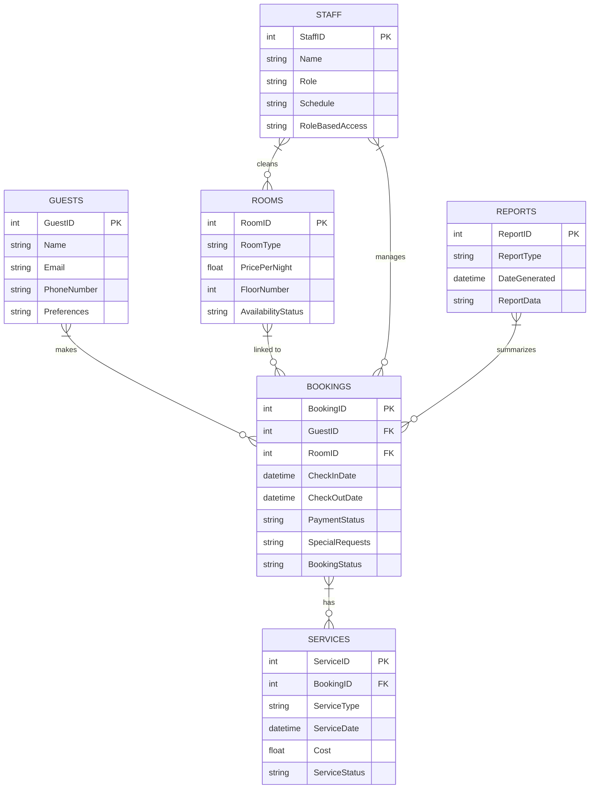

```txt
Client Request:
"I own a hotel, and I need a system for managing guests, rooms, bookings, and additional services. Guests will have details like name, contact information, preferences, and booking history. Rooms will include details like room type, price per night, floor number, and availability.
Bookings should include check-in and check-out dates, payment status, and any special requests. Some bookings will include additional services like room service, spa appointments, or tours, so I need to track these separately. I’d also like to manage staff details, including their roles (e.g., housekeeping, receptionist) and schedules. Can you generate reports on room occupancy, revenue by service, and guest preferences?"

```

### **Client Request Analysis: Hotel Management System**

---

### **1. Introduction:**

The client, a hotel owner, requires a comprehensive system to manage various aspects of hotel operations. The system should help with guest management, room bookings, additional services (e.g., room service, spa), staff management, and reporting. The goal is to track guests, room availability, services provided, and generate reports for better decision-making.

---

### **2. Business Requirements:**

#### **2.1 Guest Management:**

- **Guest Details:** The system must store and manage guest information, including:
  - **Name**
  - **Contact Information** (e.g., email, phone number)
  - **Preferences** (e.g., room preferences, special requests)
  - **Booking History** (track past bookings and stay details)
- **Booking History:** Track the guest’s previous stays, services used, and any preferences noted for future visits.

#### **2.2 Room Management:**

- **Room Details:** The system must store information about rooms, including:
  - **Room Type** (e.g., Single, Double, Suite)
  - **Price per Night**
  - **Floor Number**
  - **Availability** (show whether a room is available or booked)
- **Room Availability:** Real-time updates on room availability based on bookings.

#### **2.3 Booking Management:**

- **Booking Details:** The system should manage bookings with details like:
  - **Check-in and Check-out Dates**
  - **Payment Status** (e.g., paid, pending)
  - **Special Requests** (e.g., late check-in, extra bedding)
- **Booking Status:** The system should update the status of bookings (confirmed, canceled, completed).

#### **2.4 Additional Services:**

- **Services Tracking:** Track additional services requested by guests during their stay, such as:
  - **Room Service** (e.g., food, drinks)
  - **Spa Appointments**
  - **Tour Bookings**
- **Service Details:** Store information about each service, including type, status, date, and cost.
- **Service Availability:** Track the availability of services like spa appointments or tours, ensuring no over-booking.

#### **2.5 Staff Management:**

- **Staff Details:** The system must store information on hotel staff, including:
  - **Name**
  - **Role** (e.g., Housekeeping, Receptionist, Manager)
  - **Schedule** (working hours, shifts)
- **Role-Based Access:** Different staff roles should have appropriate access to system features based on their responsibilities (e.g., receptionists can manage bookings, housekeeping can track room status).

#### **2.6 Reporting:**

- **Room Occupancy Report:** The system should generate reports on room occupancy, showing the current status of rooms and booking trends over time.
- **Revenue by Service Report:** Track revenue generated by each service, such as room service, spa, and tours.
- **Guest Preferences Report:** Generate reports on recurring guest preferences to help personalize future stays.

---

### **3. Functional Requirements:**

- **CRUD Operations:** The system should allow users to Create, Read, Update, and Delete:
  - Guest records (name, contact info, preferences)
  - Room records (type, price, availability)
  - Booking records (check-in/check-out dates, payment status)
  - Service records (type, date, price)
  - Staff records (name, role, schedule)
- **Booking Management:** Ability to create, modify, and cancel bookings. Track check-in/check-out dates and special requests.
- **Additional Services Tracking:** Ability to link services to specific bookings and guests, showing which services were used and their cost.
- **Staff Schedule Management:** Allow staff schedules to be created and updated based on shifts and roles.
- **Reports Generation:** Enable real-time generation of:
  - **Room Occupancy Reports**
  - **Revenue by Service Reports**
  - **Guest Preferences Reports**

---

### **4. Data Modeling (ERD):**

- **Guests Table:** Stores guest details such as name, contact information, and preferences.
- **Rooms Table:** Stores room details, including room type, price per night, floor number, and availability.
- **Bookings Table:** Stores booking details, including check-in/check-out dates, payment status, special requests, and linked guest ID.
- **Services Table:** Stores services provided to guests, including type (e.g., room service, spa), date, cost, and linked booking ID.
- **Staff Table:** Stores staff member details, including name, role, and work schedule.
- **Reports Table:** A virtual table or a set of queries to track occupancy rates, revenue by service, and guest preferences over time.

---

### **5. Non-Functional Requirements:**

- **Performance:** The system should efficiently handle bookings and service tracking in real-time, especially during peak times.
- **Security:** The system must ensure that guest data, especially sensitive information like contact details and payment status, is securely stored and protected.
- **Scalability:** The system should be able to scale as the hotel grows, supporting more rooms, services, and staff.
- **Usability:** The system must have an intuitive user interface that makes it easy for front desk staff and other hotel personnel to manage bookings, guests, and services.
- **Data Integrity:** Ensure the system maintains accurate and consistent data across all modules, especially in real-time updates on room availability and service bookings.

---

### **6. User Stories and Use Cases:**

- **User Story 1:** As a **guest**, I want to make a booking for a room and specify any special requests so that my stay is comfortable and tailored to my needs.
- **User Story 2:** As a **receptionist**, I want to manage bookings and check-in guests, ensuring that room availability is accurately reflected and that guests' special requests are noted.
- **User Story 3:** As a **housekeeper**, I want to see a list of rooms that need cleaning and their status (occupied or available) so that I can efficiently manage room turnover.
- **User Story 4:** As a **hotel manager**, I want to generate revenue reports by service type, allowing me to evaluate which services are most profitable.

- **Use Case:** **Booking Management:** A guest makes a booking for a room, with details like check-in and check-out dates, payment status, and any special requests. The system checks room availability, updates the booking status, and generates a report for tracking occupancy rates.

---

### **7. Risk Assessment:**

- **Data Security:** Protecting guest details and payment status is critical. The system should comply with relevant data protection regulations (e.g., GDPR).
- **System Downtime:** Any downtime, especially during high booking periods, can disrupt hotel operations. Ensure the system is hosted on a reliable platform with proper backup measures.
- **Staff Training:** Adequate training for staff is essential to ensure smooth usage, especially when managing bookings and handling guest requests.

---

### **8. Final Deliverables:**

- **Business Requirements Document (BRD):** A detailed document outlining system features and functionalities for managing guests, rooms, bookings, services, and staff.
- **Functional Specification Document (FSD):** A description of system features, including booking and service tracking, staff management, and report generation.
- **Entity-Relationship Diagram (ERD):** A visual representation of the database schema.
- **User Interface Designs:** Mockups of the system interface, focusing on ease of use for hotel staff, such as receptionists, housekeepers, and managers.
- **Test Cases:** Detailed test scenarios covering functionalities like booking management, room availability updates, and service tracking.

---

Based on the client’s requirements, here’s a structured ERD for the Hotel Management System, covering key aspects of the system and potential corner cases.

### ERD Overview:

1. **Guests Table**:

   - `GuestID` (PK)
   - `Name`
   - `Email`
   - `PhoneNumber`
   - `Preferences`
   - `BookingHistory` (One-to-Many with Bookings)

2. **Rooms Table**:

   - `RoomID` (PK)
   - `RoomType` (Single, Double, Suite)
   - `PricePerNight`
   - `FloorNumber`
   - `AvailabilityStatus` (Available, Booked)
   - `BookingID` (FK from Bookings)

3. **Bookings Table**:

   - `BookingID` (PK)
   - `GuestID` (FK from Guests)
   - `RoomID` (FK from Rooms)
   - `CheckInDate`
   - `CheckOutDate`
   - `PaymentStatus` (Paid, Pending)
   - `SpecialRequests`
   - `BookingStatus` (Confirmed, Canceled, Completed)

4. **Services Table**:

   - `ServiceID` (PK)
   - `BookingID` (FK from Bookings)
   - `ServiceType` (Room Service, Spa, Tour)
   - `ServiceDate`
   - `Cost`
   - `ServiceStatus` (Pending, Completed, Canceled)

5. **Staff Table**:

   - `StaffID` (PK)
   - `Name`
   - `Role` (Housekeeping, Receptionist, Manager)
   - `Schedule`
   - `RoleBasedAccess` (Admin, User, etc.)

6. **Reports Table** (Virtual / Derived Data):
   - `ReportID` (PK)
   - `ReportType` (Occupancy, Revenue, Guest Preferences)
   - `DateGenerated`
   - `ReportData` (Summary Data for respective reports)

### Key Relationships:

- **Guests ↔ Bookings**: One guest can have multiple bookings.
- **Rooms ↔ Bookings**: One room can be linked to many bookings (historical).
- **Bookings ↔ Services**: One booking can have multiple services linked to it.
- **Rooms ↔ Staff**: Indirect connection for room cleaning tasks (assigned by housekeeping).
- **Staff ↔ Bookings**: Staff can be responsible for managing bookings (via receptionist role).

### Corner Case Considerations:

1. **Room Availability**: Ensure the system handles room overbooking gracefully by checking availability before confirming bookings.
2. **Multiple Bookings**: Handle guest re-booking in different seasons or events with tracking of booking history and preferences.
3. **Service Availability**: Ensure that services like spa or tours aren’t overbooked by tracking availability and limiting the number of bookings for each service type.
4. **Cancellation Handling**: Ensure that canceled bookings reflect the room as available, and all linked services are also marked as canceled.
5. **Role-Based Access**: Different staff roles must have distinct access levels, so the system must handle dynamic permissions based on roles (e.g., receptionists can manage bookings, housekeepers can manage room statuses).

### Final Notes:

- The **Reports Table** could be built as a set of virtual queries or derived data, depending on how the system generates reports.
- The **Staff Schedule** should be robust to accommodate multiple shift systems and role-based permissions.

---



---

### SQL Queries for Hotel Management System

Based on the provided ERD, I'll write the SQL queries for table creation, relationships, and corner cases handling.

---

### 1. **Table Creation Queries**

#### **Guests Table**

```sql
CREATE TABLE Guests (
    GuestID INT PRIMARY KEY,
    Name VARCHAR(255),
    Email VARCHAR(255) UNIQUE,
    PhoneNumber VARCHAR(20),
    Preferences TEXT,
    BookingHistory TEXT -- This can be a derived field or join-based if needed later
);
```

#### **Rooms Table**

```sql
CREATE TABLE Rooms (
    RoomID INT PRIMARY KEY,
    RoomType ENUM('Single', 'Double', 'Suite'),
    PricePerNight DECIMAL(10, 2),
    FloorNumber INT,
    AvailabilityStatus ENUM('Available', 'Booked'),
    BookingID INT, -- Link to Bookings for historical purposes (foreign key)
    FOREIGN KEY (BookingID) REFERENCES Bookings(BookingID)
);
```

#### **Bookings Table**

```sql
CREATE TABLE Bookings (
    BookingID INT PRIMARY KEY,
    GuestID INT,
    RoomID INT,
    CheckInDate DATETIME,
    CheckOutDate DATETIME,
    PaymentStatus ENUM('Paid', 'Pending'),
    SpecialRequests TEXT,
    BookingStatus ENUM('Confirmed', 'Canceled', 'Completed'),
    FOREIGN KEY (GuestID) REFERENCES Guests(GuestID),
    FOREIGN KEY (RoomID) REFERENCES Rooms(RoomID)
);
```

#### **Services Table**

```sql
CREATE TABLE Services (
    ServiceID INT PRIMARY KEY,
    BookingID INT,
    ServiceType ENUM('Room Service', 'Spa', 'Tour'),
    ServiceDate DATETIME,
    Cost DECIMAL(10, 2),
    ServiceStatus ENUM('Pending', 'Completed', 'Canceled'),
    FOREIGN KEY (BookingID) REFERENCES Bookings(BookingID)
);
```

#### **Staff Table**

```sql
CREATE TABLE Staff (
    StaffID INT PRIMARY KEY,
    Name VARCHAR(255),
    Role ENUM('Housekeeping', 'Receptionist', 'Manager'),
    Schedule TEXT,
    RoleBasedAccess ENUM('Admin', 'User')
);
```

#### **Reports Table (Virtual/Dervied Data)**

Reports will be generated using SQL queries or stored procedures depending on the system's reporting tools. This table could store metadata for generated reports.

```sql
CREATE TABLE Reports (
    ReportID INT PRIMARY KEY,
    ReportType ENUM('Occupancy', 'Revenue', 'Guest Preferences'),
    DateGenerated DATETIME,
    ReportData TEXT -- Stores a summary of the report data
);
```

---

### 2. **Handling Corner Cases**

#### **1. Room Availability (Preventing Overbooking)**

To prevent overbooking, we need to check if a room is available at the desired time. A booking can only be confirmed if the room is available for the check-in and check-out dates.

```sql
-- Check room availability before confirming a booking
SELECT * FROM Rooms
WHERE RoomID = 101
  AND AvailabilityStatus = 'Available'
  AND RoomID NOT IN (
    SELECT RoomID FROM Bookings
    WHERE (CheckInDate BETWEEN '2024-12-15' AND '2024-12-18')
      OR (CheckOutDate BETWEEN '2024-12-15' AND '2024-12-18')
  );
-- If no rows are returned, the room is not available
```

#### **2. Handling Multiple Bookings for the Same Guest**

When a guest books a room multiple times, we need to ensure that their booking history is updated properly.

```sql
-- Insert a new booking and update the guest’s booking history (if needed)
INSERT INTO Bookings (GuestID, RoomID, CheckInDate, CheckOutDate, PaymentStatus, SpecialRequests, BookingStatus)
VALUES (1, 101, '2024-12-15 14:00:00', '2024-12-18 11:00:00', 'Pending', 'Non-smoking', 'Confirmed');

-- Optionally, you can store guest booking history in a separate log or column.
-- For instance, you can append new booking data to a booking history field, or store it in a separate table.
UPDATE Guests
SET BookingHistory = CONCAT(BookingHistory, ', BookingID: ', LAST_INSERT_ID())
WHERE GuestID = 1;
```

#### **3. Service Availability (Preventing Overbooking of Services)**

To handle service availability, we must ensure that services like "Spa" or "Tour" do not exceed capacity. Assuming there's a capacity field for each service type:

```sql
-- Check availability for a service before adding it to a booking
SELECT * FROM Services
WHERE ServiceType = 'Spa'
  AND ServiceDate = '2024-12-16 10:00:00'
  AND (SELECT COUNT(*) FROM Services WHERE ServiceType = 'Spa' AND ServiceDate = '2024-12-16 10:00:00') < 5; -- Assume max 5 services can be booked at this time
-- If no rows are returned, the service can be booked
```

#### **4. Handling Cancellations**

When a booking is canceled, the room should be marked as available, and any associated services should also be canceled. Here's how to handle cancellations:

```sql
-- Mark the room as available when the booking is canceled
UPDATE Rooms
SET AvailabilityStatus = 'Available'
WHERE RoomID IN (SELECT RoomID FROM Bookings WHERE BookingID = 101);

-- Mark services as canceled when the booking is canceled
UPDATE Services
SET ServiceStatus = 'Canceled'
WHERE BookingID = 101;

-- Update the booking status
UPDATE Bookings
SET BookingStatus = 'Canceled'
WHERE BookingID = 101;
```

#### **5. Role-Based Access (Handling Staff Permissions)**

To ensure that staff have different access levels based on their roles, you can query the staff table to filter access according to the role. For example:

```sql
-- Example: Only managers or admins can view certain reports
SELECT * FROM Reports
WHERE ReportType = 'Revenue'
  AND EXISTS (SELECT 1 FROM Staff WHERE StaffID = 1 AND Role = 'Manager' AND RoleBasedAccess = 'Admin');
-- If the staff member has the correct role, the report will be retrieved
```

---

### 3. **Reporting Queries**

#### **Occupancy Report**

To generate an occupancy report, you would typically query the `Bookings` and `Rooms` tables to calculate the occupancy rate for each room or for the entire hotel.

```sql
-- Example: Generate an occupancy report for a specific date range
SELECT r.RoomType, COUNT(b.BookingID) AS BookedRooms, COUNT(r.RoomID) AS TotalRooms,
       (COUNT(b.BookingID) / COUNT(r.RoomID)) * 100 AS OccupancyRate
FROM Rooms r
LEFT JOIN Bookings b ON r.RoomID = b.RoomID
WHERE b.CheckInDate BETWEEN '2024-12-01' AND '2024-12-31'
GROUP BY r.RoomType;
```

#### **Revenue Report**

To generate a revenue report based on bookings, you can sum the `PricePerNight` of rooms booked during a given period.

```sql
-- Example: Generate a revenue report for a specific date range
SELECT SUM(r.PricePerNight * DATEDIFF(b.CheckOutDate, b.CheckInDate)) AS TotalRevenue
FROM Rooms r
JOIN Bookings b ON r.RoomID = b.RoomID
WHERE b.CheckInDate BETWEEN '2024-12-01' AND '2024-12-31'
  AND b.BookingStatus = 'Completed';
```

---

### Final Notes:

- Ensure that **foreign key constraints** are properly defined to maintain data integrity between tables.
- **Triggers or Stored Procedures** can be used to automate tasks like updating availability, generating reports, or handling cancellations and overbookings.
- **Indexes** should be created on frequently queried fields (e.g., `BookingID`, `GuestID`, `RoomID`, etc.) to optimize query performance.

---
