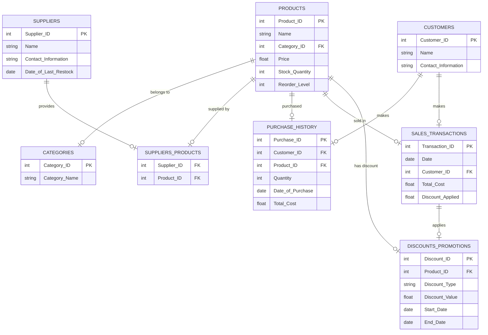

```txt
Client Request:
"I run a store, and I need to keep track of inventory, suppliers, and sales. Each product will have details like name, category, price, stock quantity, and reorder level. Products will be supplied by multiple suppliers, and I need their details like name, contact information, and the date of the last restock.
We also have customers who make purchases, so I’d like to track their details and purchase history. Sales transactions should include the date, products purchased, quantities, and total cost. Can you also include a feature to track discounts or promotions for specific products? Finally, I’d like reports on top-selling products, low-stock items, and supplier performance."

```

### **Client Request Analysis: Store Inventory, Supplier, and Sales Management System**

---

### **1. Introduction:**

The client, a store owner, requires a comprehensive system to manage inventory, suppliers, sales, and customer information. The system should facilitate tracking of products, their categories, pricing, stock levels, and reorder points. Additionally, it must handle supplier details, customer purchases, sales transactions, discounts/promotions, and generate essential reports to aid in decision-making and operational efficiency.

---

### **2. Business Requirements:**

#### **2.1 Inventory Management:**

- **Product Details:** The system must store detailed information about each product, including:
  - **Name**
  - **Category** (e.g., Electronics, Groceries, Apparel)
  - **Price**
  - **Stock Quantity**
  - **Reorder Level** (minimum stock before reordering is necessary)
- **Stock Tracking:** Real-time tracking of stock levels to ensure adequate inventory and prevent stockouts or overstocking.
- **Reorder Alerts:** Automated alerts when stock quantities reach the reorder level to prompt timely restocking.

#### **2.2 Supplier Management:**

- **Supplier Details:** The system should maintain comprehensive information about suppliers, including:
  - **Name**
  - **Contact Information** (phone number, email, address)
  - **Date of Last Restock** (to monitor supply frequency and reliability)
- **Supplier-Product Relationship:** Support for a **many-to-many** relationship where each product can have multiple suppliers and each supplier can supply multiple products.

#### **2.3 Customer Management:**

- **Customer Details:** The system must store customer information, including:
  - **Name**
  - **Contact Information** (phone number, email, address)
  - **Purchase History** (records of past purchases for personalized service and marketing)
- **Loyalty Programs:** (Optional) Track customer loyalty points or rewards based on purchase history.

#### **2.4 Sales Management:**

- **Sales Transactions:** Each sale should capture:
  - **Date of Purchase**
  - **Products Purchased**
  - **Quantities**
  - **Total Cost**
- **Discounts and Promotions:** Ability to apply and track discounts or promotional offers on specific products or during specific periods.

#### **2.5 Reporting:**

- **Top-Selling Products:** Identify and analyze best-performing products based on sales volume or revenue.
- **Low-Stock Items:** Monitor products that are low in stock to prioritize restocking.
- **Supplier Performance:** Evaluate suppliers based on criteria such as delivery timeliness, product quality, and frequency of restocks.

---

### **3. Functional Requirements:**

- **CRUD Operations:** The system must allow users to Create, Read, Update, and Delete:
  - **Products:** Manage product details, categories, pricing, stock levels, and reorder points.
  - **Suppliers:** Manage supplier information and their associated products.
  - **Customers:** Manage customer profiles and track purchase history.
  - **Sales Transactions:** Record and manage sales data, including discounts and promotions.
- **Inventory Management:**
  - **Real-Time Stock Updates:** Automatically update stock levels upon sales or restocking.
  - **Reorder Alerts:** Generate notifications when stock reaches reorder levels.
- **Supplier Management:**
  - **Supplier-Product Linking:** Associate multiple suppliers with each product.
  - **Restock Tracking:** Log dates of last restocks for each supplier-product pair.
- **Customer Management:**
  - **Purchase History Tracking:** Maintain detailed records of each customer's past purchases.
  - **Preference Management:** (Optional) Track customer preferences for targeted marketing.
- **Sales Management:**
  - **Discount/Promotion Handling:** Apply discounts or promotions to specific products or orders and track their usage.
- **Reporting:**
  - **Generate Reports:** Create reports on top-selling products, low-stock items, and supplier performance with filtering options (e.g., date ranges).
  - **Export Options:** Allow exporting reports in various formats (e.g., PDF, Excel).

---

### **4. Data Modeling (ERD):**

- **Products Table:**
  - **Fields:** Product ID, Name, Category ID, Price, Stock Quantity, Reorder Level.
- **Categories Table:**
  - **Fields:** Category ID, Category Name.
- **Suppliers Table:**
  - **Fields:** Supplier ID, Name, Contact Information, Date of Last Restock.
- **Suppliers_Products Table:**
  - **Fields:** Supplier ID, Product ID (to establish a many-to-many relationship).
- **Customers Table:**
  - **Fields:** Customer ID, Name, Contact Information.
- **Purchase_History Table:**
  - **Fields:** Purchase ID, Customer ID, Product ID, Quantity, Date of Purchase, Total Cost.
- **Sales_Transactions Table:**
  - **Fields:** Transaction ID, Date, Customer ID, Total Cost, Discount Applied.
- **Discounts_Promotions Table:**
  - **Fields:** Discount ID, Product ID, Discount Type, Discount Value, Start Date, End Date.
- **Reports Table:**
  - **Virtual/Table Queries:** For generating top-selling products, low-stock items, and supplier performance.

---

### **5. Non-Functional Requirements:**

- **Performance:**
  - The system should handle a large number of products, suppliers, customers, and transactions without performance degradation.
  - Quick response times for inventory updates and report generation.
- **Security:**
  - Protect sensitive data such as customer contact information and sales transactions.
  - Implement role-based access control to restrict functionalities based on user roles (e.g., admin, sales staff).
- **Scalability:**
  - Ability to scale with the growth of the store, accommodating more products, suppliers, and customers.
- **Usability:**
  - Intuitive user interface for ease of use by staff with varying technical expertise.
  - Mobile-friendly design (optional) for access on tablets or smartphones.
- **Data Integrity:**
  - Ensure accurate and consistent data across all modules, especially in inventory and sales tracking.
- **Backup and Recovery:**
  - Regular data backups and a robust recovery plan to prevent data loss.

---

### **6. User Stories and Use Cases:**

- **User Story 1:** As a **store manager**, I want to add new products with their details and assign multiple suppliers, so that I can manage inventory effectively.
- **User Story 2:** As a **sales associate**, I want to record sales transactions, including applied discounts, so that I can track daily revenue accurately.
- **User Story 3:** As a **warehouse staff member**, I want to receive alerts when stock levels are low, so that I can reorder products in a timely manner.
- **User Story 4:** As a **business analyst**, I want to generate reports on top-selling products and supplier performance, so that I can make informed purchasing and marketing decisions.
- **Use Case:** **Process a Sale:** A customer selects products to purchase. The sales associate records the sale, applies any applicable discounts, updates the stock levels, and generates a sales transaction record. The system updates inventory and logs the purchase in the customer's purchase history.

---

### **7. Risk Assessment:**

- **Data Security Risks:** Unauthorized access to sensitive customer and sales data could lead to data breaches. Mitigation includes implementing strong authentication mechanisms and encryption.
- **System Downtime:** Downtime can disrupt sales and inventory management. Mitigation involves using reliable hosting services and implementing failover strategies.
- **Data Integrity Issues:** Inaccurate inventory or sales data can lead to operational inefficiencies. Mitigation includes implementing validation checks and regular audits.
- **Scalability Challenges:** As the store grows, the system may face performance issues if not designed to scale. Mitigation involves choosing scalable technologies and architecture.
- **User Adoption:** Staff may resist adopting the new system, leading to underutilization. Mitigation includes comprehensive training and creating user-friendly interfaces.

---

### **8. Final Deliverables:**

- **Business Requirements Document (BRD):** Detailed documentation outlining all business needs, system functionalities, and constraints for inventory, supplier, and sales management.
- **Functional Specification Document (FSD):** Comprehensive guide detailing system features, workflows, user roles, and interactions.
- **Entity-Relationship Diagram (ERD):** Visual representation of the database structure, illustrating entities and their relationships.
- **Wireframes/UI Designs:** Mockups of the user interface for different user roles, focusing on ease of navigation and efficiency in task execution.
- **Test Cases:** Detailed test scenarios and scripts to validate each system functionality, ensuring reliability and performance.
- **Training Materials:** Guides and tutorials to help staff understand and effectively use the new system.

---

### ERD for Store Inventory, Supplier, and Sales Management System

#### **Entities and Relationships**

1. **Products**  
   Fields:

   - Product_ID (PK)
   - Name
   - Category_ID (FK)
   - Price
   - Stock_Quantity
   - Reorder*Level  
     \_Relationships*:
   - **Product Category**: A product belongs to a category (1:1 relationship with Categories).
   - **Supplier-Product**: Many-to-many relationship with Suppliers (through Suppliers_Products table).
   - **Sales Transaction**: A product can appear in multiple sales transactions.

2. **Categories**  
   Fields:

   - Category_ID (PK)
   - Category*Name  
     \_Relationships*:
   - **Products**: One category can have many products (1:many relationship with Products).

3. **Suppliers**  
   Fields:

   - Supplier_ID (PK)
   - Name
   - Contact_Information
   - Date*of_Last_Restock  
     \_Relationships*:
   - **Supplier-Product**: Many-to-many relationship with Products (through Suppliers_Products table).
   - **Purchase History**: Suppliers provide products to customers via sales transactions.

4. **Suppliers_Products**  
   Fields:

   - Supplier_ID (FK)
   - Product*ID (FK)  
     \_Relationships*:
   - **Suppliers**: A product can be supplied by multiple suppliers (many-to-many relationship with Suppliers).
   - **Products**: A supplier can provide multiple products (many-to-many relationship with Products).

5. **Customers**  
   Fields:

   - Customer_ID (PK)
   - Name
   - Contact*Information  
     \_Relationships*:
   - **Purchase History**: A customer can make multiple purchases (1:many relationship with Purchase_History).
   - **Sales Transactions**: A customer can make multiple sales transactions (1:many relationship with Sales_Transactions).

6. **Purchase History**  
   Fields:

   - Purchase_ID (PK)
   - Customer_ID (FK)
   - Product_ID (FK)
   - Quantity
   - Date_of_Purchase
   - Total*Cost  
     \_Relationships*:
   - **Customer**: Each purchase record links to one customer (many-to-one relationship with Customers).
   - **Product**: Each purchase record links to one product (many-to-one relationship with Products).

7. **Sales Transactions**  
   Fields:

   - Transaction_ID (PK)
   - Date
   - Customer_ID (FK)
   - Total_Cost
   - Discount*Applied  
     \_Relationships*:
   - **Customer**: A sale is associated with one customer (many-to-one relationship with Customers).
   - **Products**: Each sale can include multiple products (many-to-many relationship, modeled by a junction table or line item).
   - **Discounts/Promotions**: Discounts applied during the transaction are tracked.

8. **Discounts/Promotions**  
   Fields:

   - Discount_ID (PK)
   - Product_ID (FK)
   - Discount_Type
   - Discount_Value
   - Start_Date
   - End*Date  
     \_Relationships*:
   - **Product**: A discount is applied to a specific product (many-to-one relationship with Products).
   - **Sales Transactions**: Discounts can be applied to sales transactions.

9. **Reports** (Virtual or Query-Driven)  
   _Relationships_:
   - **Products**: Reports can pull data from products, like sales volume, top-selling products, and low-stock items.
   - **Sales Transactions**: Reports pull data on revenue and discounts.

#### **Key Relationships and Corner Cases**

- **Products-Suppliers**: Many-to-many relationship ensures flexibility in product sourcing from multiple suppliers.
- **Sales Transactions**: Tracks product-level sales with discounts. If a product is discounted, it’s tracked in the Sales_Transactions table.
- **Reorder Alerts**: Stock quantities are monitored in real-time, triggering reorder notifications.
- **Purchase History**: Provides detailed tracking of customer purchases for personalized service.
- **Supplier Restocks**: Logs are maintained to track when suppliers last restocked, ensuring timely supply chain management.

#### **ERD Diagram Overview** (Entities and their relationships):

- **Products** (PK: Product_ID) ↔ **Categories** (PK: Category_ID)
- **Suppliers** (PK: Supplier_ID) ↔ **Suppliers_Products** ↔ **Products** (FK: Product_ID)
- **Customers** (PK: Customer_ID) ↔ **Purchase History** ↔ **Products** (FK: Product_ID)
- **Sales Transactions** (PK: Transaction_ID) ↔ **Customers** (FK: Customer_ID)
- **Discounts/Promotions** (PK: Discount_ID) ↔ **Products** (FK: Product_ID) ↔ **Sales Transactions**
- **Reports** (Query-Driven from Products, Sales Transactions, Suppliers)

---



---

### SQL Queries for Store Inventory, Supplier, and Sales Management System

Below are the SQL queries based on your ERD and relationships. These queries include table creation, handling relationships, and managing corner cases.

---

### 1. **Table Creation Queries**

#### **Products Table**

```sql
CREATE TABLE Products (
    Product_ID INT PRIMARY KEY,
    Name VARCHAR(255),
    Category_ID INT,
    Price DECIMAL(10, 2),
    Stock_Quantity INT,
    ReorderLevel INT,
    FOREIGN KEY (Category_ID) REFERENCES Categories(Category_ID)
);
```

#### **Categories Table**

```sql
CREATE TABLE Categories (
    Category_ID INT PRIMARY KEY,
    CategoryName VARCHAR(255)
);
```

#### **Suppliers Table**

```sql
CREATE TABLE Suppliers (
    Supplier_ID INT PRIMARY KEY,
    Name VARCHAR(255),
    Contact_Information TEXT,
    Dateof_Last_Restock DATE
);
```

#### **Suppliers_Products Table (Many-to-Many Relationship)**

```sql
CREATE TABLE Suppliers_Products (
    Supplier_ID INT,
    Product_ID INT,
    PRIMARY KEY (Supplier_ID, Product_ID),
    FOREIGN KEY (Supplier_ID) REFERENCES Suppliers(Supplier_ID),
    FOREIGN KEY (Product_ID) REFERENCES Products(Product_ID)
);
```

#### **Customers Table**

```sql
CREATE TABLE Customers (
    Customer_ID INT PRIMARY KEY,
    Name VARCHAR(255),
    Contact_Information TEXT
);
```

#### **Purchase History Table (Links Customers and Products)**

```sql
CREATE TABLE Purchase_History (
    Purchase_ID INT PRIMARY KEY,
    Customer_ID INT,
    Product_ID INT,
    Quantity INT,
    Date_of_Purchase DATE,
    TotalCost DECIMAL(10, 2),
    FOREIGN KEY (Customer_ID) REFERENCES Customers(Customer_ID),
    FOREIGN KEY (Product_ID) REFERENCES Products(Product_ID)
);
```

#### **Sales Transactions Table**

```sql
CREATE TABLE Sales_Transactions (
    Transaction_ID INT PRIMARY KEY,
    Date DATE,
    Customer_ID INT,
    Total_Cost DECIMAL(10, 2),
    DiscountApplied DECIMAL(10, 2),
    FOREIGN KEY (Customer_ID) REFERENCES Customers(Customer_ID)
);
```

#### **Discounts/Promotions Table**

```sql
CREATE TABLE Discounts (
    Discount_ID INT PRIMARY KEY,
    Product_ID INT,
    Discount_Type VARCHAR(50),
    Discount_Value DECIMAL(10, 2),
    Start_Date DATE,
    End_Date DATE,
    FOREIGN KEY (Product_ID) REFERENCES Products(Product_ID)
);
```

#### **Reports Table (Query-Driven, for storing metadata)**

```sql
CREATE TABLE Reports (
    ReportID INT PRIMARY KEY,
    ReportType VARCHAR(50),
    DateGenerated DATE,
    ReportData TEXT
);
```

---

### 2. **Handling Corner Cases**

#### **1. Room Availability and Stock Alerts**

To track stock levels and trigger alerts for products that fall below the reorder level:

```sql
-- Check products below reorder level
SELECT Product_ID, Name, Stock_Quantity, ReorderLevel
FROM Products
WHERE Stock_Quantity <= ReorderLevel;
```

#### **2. Handling Many-to-Many Relationships (Suppliers and Products)**

Inserting or querying a product-supplier relationship:

```sql
-- Insert a relationship between a product and a supplier
INSERT INTO Suppliers_Products (Supplier_ID, Product_ID)
VALUES (1, 101);

-- Query all products supplied by a specific supplier
SELECT p.Name
FROM Products p
JOIN Suppliers_Products sp ON p.Product_ID = sp.Product_ID
WHERE sp.Supplier_ID = 1;
```

#### **3. Handling Sales Transactions and Discounts**

Tracking sales transactions and applying discounts to products:

```sql
-- Insert a sale transaction for a customer
INSERT INTO Sales_Transactions (Transaction_ID, Date, Customer_ID, Total_Cost, DiscountApplied)
VALUES (1, '2024-12-05', 2, 500.00, 50.00);

-- Apply discounts to products during sales transaction
UPDATE Sales_Transactions
SET Total_Cost = Total_Cost - DiscountApplied
WHERE Transaction_ID = 1;

-- Query sales transactions including discounts
SELECT st.Transaction_ID, st.Total_Cost, st.DiscountApplied, p.Name
FROM Sales_Transactions st
JOIN Purchase_History ph ON st.Transaction_ID = ph.Purchase_ID
JOIN Products p ON ph.Product_ID = p.Product_ID
WHERE st.Transaction_ID = 1;
```

#### **4. Handling Purchase History for Customers**

Tracking customer purchase history:

```sql
-- Query the purchase history of a customer
SELECT ph.Purchase_ID, p.Name, ph.Quantity, ph.TotalCost, ph.Date_of_Purchase
FROM Purchase_History ph
JOIN Products p ON ph.Product_ID = p.Product_ID
WHERE ph.Customer_ID = 2;

-- Calculate total purchases for a customer
SELECT SUM(ph.TotalCost) AS TotalSpent
FROM Purchase_History ph
WHERE ph.Customer_ID = 2;
```

#### **5. Supplier Restock Management**

Tracking the last restock date and ensuring timely supply chain management:

```sql
-- Query suppliers and the products they provide
SELECT s.Name, p.Name, sp.Supplier_ID, sp.Product_ID
FROM Suppliers s
JOIN Suppliers_Products sp ON s.Supplier_ID = sp.Supplier_ID
JOIN Products p ON sp.Product_ID = p.Product_ID
WHERE s.Dateof_Last_Restock < '2024-11-01';

-- Update the restock date after a supplier delivers products
UPDATE Suppliers
SET Dateof_Last_Restock = '2024-12-01'
WHERE Supplier_ID = 1;
```

---

### 3. **Report Generation Queries**

These reports can be generated dynamically using SQL, or stored in the `Reports` table.

#### **Product Sales Report (Top-Selling Products)**

```sql
SELECT p.Name, SUM(ph.Quantity) AS TotalSold
FROM Products p
JOIN Purchase_History ph ON p.Product_ID = ph.Product_ID
GROUP BY p.Name
ORDER BY TotalSold DESC;
```

#### **Revenue Report**

```sql
SELECT SUM(Total_Cost) AS TotalRevenue
FROM Sales_Transactions;
```

#### **Stock Alert Report (Low-Stock Products)**

```sql
SELECT p.Name, p.Stock_Quantity, p.ReorderLevel
FROM Products p
WHERE p.Stock_Quantity <= p.ReorderLevel;
```

#### **Discount Report**

```sql
SELECT p.Name, d.Discount_Value, d.Start_Date, d.End_Date
FROM Discounts d
JOIN Products p ON d.Product_ID = p.Product_ID;
```

---
