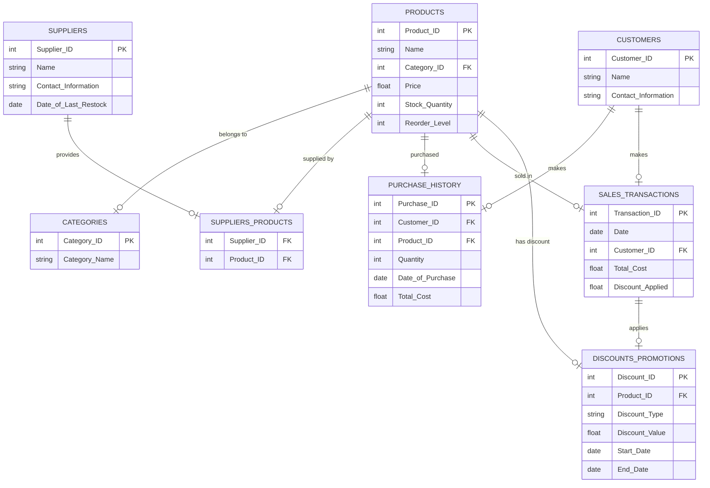

```txt
Client Request:
"I organize events, and I need a system to manage everything. Each event will have details like name, date, location, capacity, and associated sponsors. I need to track participants with their names, contact details, and payment status. Participants should also be able to register for multiple events, and I’d like to manage team registrations for group activities.
Events might also have guest speakers, so I need their profiles with names, topics, and schedules. For venues, I’d like to track their capacity, booking status, and facilities available. Can you also include reports on revenue by event, participation trends, and sponsor contributions?"

```

### **Client Request Analysis: Event Management System**

---

### **1. Introduction:**

The client is organizing events and requires a robust system to manage various aspects of event planning and execution. The system should enable the tracking of event details, participants, sponsors, team registrations, guest speakers, and venue information. Additionally, the client seeks reporting features to analyze revenue, participation trends, and sponsor contributions.

---

### **2. Business Requirements:**

#### **2.1 Event Management:**

- **Event Details:** The system should store and manage comprehensive details for each event, including:
  - **Name**
  - **Date**
  - **Location**
  - **Capacity** (maximum number of participants)
  - **Sponsors** (multiple sponsors linked to each event)
- **Event Registration:** Allow participants to register for one or more events and manage their registration status.

#### **2.2 Participant Management:**

- **Participant Details:** The system must capture the following for each participant:
  - **Name**
  - **Contact Information** (email, phone number)
  - **Payment Status** (paid, pending, etc.)
- **Multiple Event Registration:** Participants should be able to register for multiple events and view their participation history.
- **Team Registrations:** Support for team-based registrations for group activities, where a single registration can include multiple participants under a single team name.

#### **2.3 Guest Speaker Management:**

- **Speaker Profiles:** Track guest speakers for each event, including:
  - **Name**
  - **Topic(s)**
  - **Schedule** (timeslots for each speaker during the event)

#### **2.4 Venue Management:**

- **Venue Details:** The system should store information on venues, including:
  - **Venue Name**
  - **Capacity** (maximum number of people it can host)
  - **Booking Status** (whether the venue is available or booked for a specific date)
  - **Facilities Available** (e.g., projectors, microphones, etc.)

#### **2.5 Sponsor Management:**

- **Sponsor Details:** Store sponsor information such as:
  - **Name**
  - **Contribution Amount** (financial or in-kind)
  - **Sponsorship Type** (e.g., gold, silver, etc.)
  - **Linked Event(s)** (which event(s) the sponsor is associated with)

#### **2.6 Reporting:**

- **Event Revenue Report:** Track and report revenue generated by each event, considering ticket sales, sponsorships, and additional services.
- **Participation Trends:** Analyze registration data to identify trends in participation (e.g., peak registration times, popular events).
- **Sponsor Contributions Report:** Provide reports on sponsor contributions, tracking the financial support or services provided by each sponsor for each event.

---

### **3. Functional Requirements:**

- **CRUD Operations:** The system must allow users to Create, Read, Update, and Delete:
  - **Events:** Manage event details, registration status, and associated sponsors.
  - **Participants:** Add or update participant details and track their payment status.
  - **Speakers:** Manage guest speaker profiles, including topics and schedules.
  - **Venues:** Manage venue details and booking status.
  - **Sponsors:** Link sponsors to events and track their contributions.
- **Event Registration:**
  - **Multiple Events per Participant:** Enable participants to register for multiple events.
  - **Team Registration:** Allow participants to register as part of a team for group activities.
- **Payment Tracking:** Monitor the payment status of participants and generate alerts for unpaid registrations.
- **Venue Booking:** Ensure venues are booked and available for the specified dates and events.
- **Report Generation:** Enable the creation of reports on event revenue, participation trends, and sponsor contributions, with options to filter by event, date range, or sponsor.

---

### **4. Data Modeling (ERD):**

- **Events Table:**
  - **Fields:** Event ID, Name, Date, Location, Capacity, Sponsor ID (foreign key).
- **Participants Table:**
  - **Fields:** Participant ID, Name, Contact Information, Payment Status.
- **Registrations Table:**
  - **Fields:** Registration ID, Participant ID, Event ID, Payment Status, Team ID (for team registrations).
- **Teams Table:**
  - **Fields:** Team ID, Team Name, Participant IDs (linked to participants for team registrations).
- **Speakers Table:**
  - **Fields:** Speaker ID, Name, Topic(s), Schedule, Event ID (foreign key).
- **Venues Table:**
  - **Fields:** Venue ID, Name, Capacity, Facilities, Booking Status, Event ID (foreign key).
- **Sponsors Table:**
  - **Fields:** Sponsor ID, Name, Contribution Amount, Sponsorship Type.
- **Event_Sponsors Table (Many-to-Many relationship):**
  - **Fields:** Event ID, Sponsor ID, Contribution Amount.

---

### **5. Non-Functional Requirements:**

- **Performance:**
  - The system should be capable of handling large numbers of participants, events, and reports without significant delays.
- **Security:**
  - Sensitive data like participant contact information and payment status should be encrypted and secured.
  - Role-based access control for event organizers, administrators, and other users.
- **Scalability:**
  - The system should be able to scale as more events, participants, and sponsors are added.
- **Usability:**
  - Intuitive interface for event managers to easily track registrations, bookings, and sponsor information.
  - Simple registration process for participants.
- **Data Integrity:**
  - Ensuring accurate tracking of registrations, payments, and venue bookings without duplication or errors.
- **Backup and Recovery:**
  - Regular data backups and a robust recovery plan to prevent data loss in case of a failure.

---

### **6. User Stories and Use Cases:**

- **User Story 1:** As an **event organizer**, I want to create and manage events with all necessary details, so I can efficiently plan and track them.
- **User Story 2:** As a **participant**, I want to register for multiple events and track my payment status, so I can ensure my spot is reserved.
- **User Story 3:** As a **sponsor**, I want to link my contributions to specific events and track my sponsorship status and benefits.
- **User Story 4:** As a **guest speaker**, I want to manage my profile, topics, and schedule to ensure I’m prepared for my speaking engagement.
- **Use Case:** **Event Registration:** A participant registers for an event, providing their contact information and payment status. If the event has a team activity, the participant can also register as part of a team. The system records the registration and payment status, linking the participant to the event.

---

### **7. Risk Assessment:**

- **Data Security Risks:** Unauthorized access to sensitive participant and payment data. Mitigation includes strong encryption and access controls.
- **System Downtime:** Unavailability of the system during event registration periods or events. Mitigation involves using reliable hosting services and implementing failover strategies.
- **Data Integrity:** Incorrect participant registration or payment status can disrupt event planning. Mitigation involves validation checks and regular data audits.
- **User Adoption:** Event staff may face challenges in using the system. Mitigation includes training materials and intuitive design.
- **Payment Processing Issues:** Delays or errors in payment processing can cause registration issues. Mitigation includes integrating with a reliable payment gateway and implementing payment status notifications.

---

### **8. Final Deliverables:**

- **Business Requirements Document (BRD):** Comprehensive documentation of the system’s business needs and functionalities, including event, participant, and sponsor management.
- **Functional Specification Document (FSD):** Detailed breakdown of the system's features, including workflows for event registration, speaker management, and sponsor tracking.
- **Entity-Relationship Diagram (ERD):** Visual representation of the system's database structure, including all tables and relationships.
- **Wireframes/UI Designs:** Mockups of the user interface for event organizers, participants, and sponsors, focusing on ease of navigation and functionality.
- **Test Cases:** Defined test scenarios and scripts to ensure all functionalities, such as registration, payment tracking, and reporting, work correctly.
- **Training Materials:** Guides to help event organizers and participants use the system effectively, including FAQs and troubleshooting tips.

---

Based on the provided requirements, here's an ERD that accommodates the core components and their relationships, including detailed information and corner cases:

---

### **ERD Design for Event Management System**

#### **Entities:**

1. **Events Table:**

   - Event ID (PK)
   - Name
   - Date
   - Location
   - Capacity
   - Sponsor ID (FK - from Event_Sponsors)

2. **Participants Table:**

   - Participant ID (PK)
   - Name
   - Contact Information (email, phone)
   - Payment Status (paid, pending, etc.)

3. **Registrations Table:**

   - Registration ID (PK)
   - Participant ID (FK - from Participants)
   - Event ID (FK - from Events)
   - Payment Status
   - Team ID (FK - from Teams, optional for team registration)

4. **Teams Table:**

   - Team ID (PK)
   - Team Name
   - Participant IDs (FK - multiple references to Participants via Registrations)

5. **Speakers Table:**

   - Speaker ID (PK)
   - Name
   - Topic(s)
   - Schedule (timeslot)
   - Event ID (FK - from Events)

6. **Venues Table:**

   - Venue ID (PK)
   - Name
   - Capacity
   - Facilities
   - Booking Status (available/booked)
   - Event ID (FK - from Events)

7. **Sponsors Table:**

   - Sponsor ID (PK)
   - Name
   - Contribution Amount
   - Sponsorship Type (gold, silver, etc.)

8. **Event_Sponsors Table (Many-to-Many relationship):**
   - Event ID (FK - from Events)
   - Sponsor ID (FK - from Sponsors)
   - Contribution Amount

#### **Relationships:**

1. **Events ↔ Sponsors:**

   - One-to-many relationship between `Events` and `Event_Sponsors` through the `Event_Sponsors` table, which connects events to multiple sponsors.
   - A single sponsor can contribute to multiple events, and each event can have multiple sponsors.

2. **Participants ↔ Events:**

   - Many-to-many relationship between `Participants` and `Events` through the `Registrations` table, allowing participants to register for multiple events.
   - Payment status is tracked for each event registration.

3. **Participants ↔ Teams:**

   - A participant can belong to a single team via the `Registrations` table, supporting group/team registrations.
   - Teams are a group of participants registered for an event.

4. **Events ↔ Speakers:**

   - One-to-many relationship, where an event can have multiple guest speakers, and each speaker is linked to one event.
   - The `Speakers` table also includes details about the topics and timeslots of each speaker.

5. **Events ↔ Venues:**

   - One-to-one relationship between `Events` and `Venues`, ensuring that each event is associated with a specific venue.
   - A venue can host one or more events, but the system checks the `Booking Status` to ensure it is available.

6. **Event ↔ Registrations ↔ Participants:**
   - A participant may register for multiple events, which is managed through the `Registrations` table.
   - The registration status and team involvement are tracked here, and payment status for each registration is linked.

#### **Corner Cases and Considerations:**

1. **Multiple Events per Participant:**

   - The `Registrations` table allows multiple entries for a single participant for different events, with each having a distinct payment status.
   - This helps handle corner cases such as participants who register and pay for different events at varying times.

2. **Team-Based Registrations:**

   - If a participant registers for a team activity, the system must ensure that all participants under a team name are registered for the same event.
   - The `Team ID` field in the `Registrations` table ensures proper linking of participants to teams.

3. **Booking Conflicts in Venues:**

   - The `Venues` table manages the availability of each venue, and if the venue is already booked for another event, a conflict arises.
   - This can be tracked via the `Booking Status` field, which ensures that no double bookings occur.

4. **Sponsor Contributions:**

   - The `Event_Sponsors` table ensures that sponsors can contribute to multiple events, and the contribution amount is specific to each event-sponsor pair.
   - This allows detailed tracking of each sponsor's support.

5. **Payment Status Tracking:**

   - Payment status is tracked both at the participant level and at the registration level for each event. Unpaid participants should be flagged for follow-up.
   - Alerts or reports can be generated for unpaid registrations.

6. **Event Revenue Report:**
   - For generating reports, the system should consider ticket sales, sponsor contributions, and additional services (like catering or merchandising) associated with each event.
   - The report will need to aggregate data from the `Registrations`, `Event_Sponsors`, and possibly a `Revenue` table (if more details on services are included).

---



---

### SQL Queries for Event Management System

Below are the SQL queries for managing the **Event Management System** based on the given ERD and relationships.

---

### 1. **Table Creation Queries**

#### **Events Table**

```sql
CREATE TABLE Events (
    Event_ID INT PRIMARY KEY,
    Name VARCHAR(255),
    Date DATE,
    Location VARCHAR(255),
    Capacity INT,
    Sponsor_ID INT,
    FOREIGN KEY (Sponsor_ID) REFERENCES Sponsors(Sponsor_ID)
);
```

#### **Participants Table**

```sql
CREATE TABLE Participants (
    Participant_ID INT PRIMARY KEY,
    Name VARCHAR(255),
    Contact_Information VARCHAR(255),
    Payment_Status VARCHAR(50)  -- 'paid', 'pending', etc.
);
```

#### **Registrations Table**

```sql
CREATE TABLE Registrations (
    Registration_ID INT PRIMARY KEY,
    Participant_ID INT,
    Event_ID INT,
    Payment_Status VARCHAR(50),
    Team_ID INT,  -- FK to Teams table (optional)
    FOREIGN KEY (Participant_ID) REFERENCES Participants(Participant_ID),
    FOREIGN KEY (Event_ID) REFERENCES Events(Event_ID),
    FOREIGN KEY (Team_ID) REFERENCES Teams(Team_ID)
);
```

#### **Teams Table**

```sql
CREATE TABLE Teams (
    Team_ID INT PRIMARY KEY,
    Team_Name VARCHAR(255)
);
```

#### **Speakers Table**

```sql
CREATE TABLE Speakers (
    Speaker_ID INT PRIMARY KEY,
    Name VARCHAR(255),
    Topics TEXT,  -- Topics that the speaker will present
    Schedule VARCHAR(255),  -- Timeslot for the speaker
    Event_ID INT,
    FOREIGN KEY (Event_ID) REFERENCES Events(Event_ID)
);
```

#### **Venues Table**

```sql
CREATE TABLE Venues (
    Venue_ID INT PRIMARY KEY,
    Name VARCHAR(255),
    Capacity INT,
    Facilities TEXT,  -- Facilities available at the venue (e.g., A/C, Wi-Fi)
    Booking_Status VARCHAR(50),  -- 'available', 'booked'
    Event_ID INT,  -- FK to Events table
    FOREIGN KEY (Event_ID) REFERENCES Events(Event_ID)
);
```

#### **Sponsors Table**

```sql
CREATE TABLE Sponsors (
    Sponsor_ID INT PRIMARY KEY,
    Name VARCHAR(255),
    Contribution_Amount DECIMAL(10, 2),
    Sponsorship_Type VARCHAR(50)  -- 'gold', 'silver', etc.
);
```

#### **Event_Sponsors Table (Many-to-Many Relationship)**

```sql
CREATE TABLE Event_Sponsors (
    Event_ID INT,
    Sponsor_ID INT,
    Contribution_Amount DECIMAL(10, 2),
    PRIMARY KEY (Event_ID, Sponsor_ID),
    FOREIGN KEY (Event_ID) REFERENCES Events(Event_ID),
    FOREIGN KEY (Sponsor_ID) REFERENCES Sponsors(Sponsor_ID)
);
```

---

### 2. **Handling Corner Cases**

#### **1. Multiple Events per Participant**

Querying participants who have registered for multiple events:

```sql
-- Query participants who have registered for more than one event
SELECT p.Name, COUNT(r.Event_ID) AS Registered_Events
FROM Participants p
JOIN Registrations r ON p.Participant_ID = r.Participant_ID
GROUP BY p.Participant_ID
HAVING COUNT(r.Event_ID) > 1;
```

#### **2. Team-Based Registrations**

Ensuring that all participants in a team are registered for the same event:

```sql
-- Query to check if all team members are registered for the same event
SELECT t.Team_Name, e.Name AS Event_Name
FROM Teams t
JOIN Registrations r ON t.Team_ID = r.Team_ID
JOIN Events e ON r.Event_ID = e.Event_ID
GROUP BY t.Team_Name, e.Name
HAVING COUNT(DISTINCT r.Event_ID) = 1;  -- Ensure all team members are registered for one event
```

#### **3. Booking Conflicts in Venues**

Checking for booking conflicts in venues (i.e., ensuring a venue isn't double-booked):

```sql
-- Check if the venue is booked for the selected date/time
SELECT v.Name AS Venue_Name, e.Name AS Event_Name, e.Date
FROM Venues v
JOIN Events e ON v.Event_ID = e.Event_ID
WHERE v.Booking_Status = 'booked' AND e.Date = '2024-12-15';  -- Replace with the desired date
```

#### **4. Sponsor Contributions**

Tracking the contribution of each sponsor for each event:

```sql
-- Get the contribution of each sponsor for a specific event
SELECT s.Name AS Sponsor_Name, es.Contribution_Amount, e.Name AS Event_Name
FROM Event_Sponsors es
JOIN Sponsors s ON es.Sponsor_ID = s.Sponsor_ID
JOIN Events e ON es.Event_ID = e.Event_ID
WHERE e.Event_ID = 101;  -- Replace with the desired Event_ID
```

#### **5. Payment Status Tracking**

Checking the payment status of participants for a specific event:

```sql
-- Track the payment status of all participants for a specific event
SELECT p.Name, r.Payment_Status
FROM Participants p
JOIN Registrations r ON p.Participant_ID = r.Participant_ID
WHERE r.Event_ID = 101;  -- Replace with the desired Event_ID
```

#### **6. Event Revenue Report**

Generating an event revenue report that aggregates ticket sales and sponsor contributions:

```sql
-- Event revenue report (aggregate ticket sales + sponsor contributions)
SELECT e.Name AS Event_Name,
       SUM(CASE WHEN r.Payment_Status = 'paid' THEN 50 ELSE 0 END) AS Ticket_Sales,  -- Assuming each ticket is $50
       SUM(es.Contribution_Amount) AS Sponsor_Contributions,
       (SUM(CASE WHEN r.Payment_Status = 'paid' THEN 50 ELSE 0 END) + SUM(es.Contribution_Amount)) AS Total_Revenue
FROM Events e
LEFT JOIN Registrations r ON e.Event_ID = r.Event_ID
LEFT JOIN Event_Sponsors es ON e.Event_ID = es.Event_ID
GROUP BY e.Event_ID;
```

---

### 3. **Reporting and Monitoring**

#### **1. Report for Upcoming Events**

Query to retrieve upcoming events:

```sql
-- Upcoming events (events scheduled after today)
SELECT Name, Date, Location, Capacity
FROM Events
WHERE Date > CURDATE();
```

#### **2. Event Attendance**

Calculating attendance for each event (i.e., how many participants are registered for each event):

```sql
-- Calculate attendance for each event
SELECT e.Name AS Event_Name, COUNT(r.Participant_ID) AS Registered_Participants
FROM Events e
LEFT JOIN Registrations r ON e.Event_ID = r.Event_ID
GROUP BY e.Event_ID;
```

---

## OOP Representaion:

---

## 1. Data Models

### 1.1 Event

Stores details about each event (name, date, location, capacity, etc.).

- Can have **many** sponsors (many-to-many).
- Has **many** participants via registrations.

```csharp
public class Event
{
    public int Id { get; set; }
    public string Name { get; set; }
    public DateTime EventDate { get; set; }
    public string Location { get; set; }
    public int Capacity { get; set; }

    // Many-to-many with sponsors
    public List<Sponsor> Sponsors { get; set; } = new List<Sponsor>();

    // The total revenue can come from participant registrations + sponsor contributions.
    public decimal TotalRevenue { get; set; }

    public Event(int id, string name, DateTime eventDate, string location, int capacity)
    {
        Id = id;
        Name = name;
        EventDate = eventDate;
        Location = location;
        Capacity = capacity;
        TotalRevenue = 0m;
    }

    public override string ToString()
    {
        return $"{Name} (ID: {Id}), Date: {EventDate.ToShortDateString()}, Location: {Location}, Capacity: {Capacity}";
    }
}
```

### 1.2 Participant

Captures participant details (name, contact info, payment status, etc.).

- A participant can register for multiple events (handled through a `Registration` record).

```csharp
public class Participant
{
    public int Id { get; set; }
    public string Name { get; set; }
    public string ContactInfo { get; set; }
    public string PaymentStatus { get; set; }   // e.g., "Paid", "Pending"

    public Participant(int id, string name, string contactInfo)
    {
        Id = id;
        Name = name;
        ContactInfo = contactInfo;
        PaymentStatus = "Pending";
    }

    public override string ToString()
    {
        return $"{Name} (ID: {Id}), Contact: {ContactInfo}, Payment: {PaymentStatus}";
    }
}
```

### 1.3 Registration

A `Registration` links a `Participant` to an `Event`.

- Supports team registration (optional). If `TeamId != null`, it implies a team-based registration.

```csharp
public class Registration
{
    public int Id { get; set; }
    public Participant Participant { get; set; }
    public Event Event { get; set; }
    public string RegistrationStatus { get; set; }  // e.g., "Confirmed", "Cancelled"
    public int? TeamId { get; set; }               // for team-based registrations
    public decimal FeePaid { get; set; }

    public Registration(int id, Participant participant, Event e)
    {
        Id = id;
        Participant = participant;
        Event = e;
        RegistrationStatus = "Confirmed";
        FeePaid = 0m;
    }

    public override string ToString()
    {
        return $"Registration #{Id}: {Participant.Name} -> {Event.Name}, TeamID: {TeamId}, Status: {RegistrationStatus}";
    }
}
```

### 1.4 Team

For team-based registrations, a `Team` can have multiple participants.

- Could store a separate list of participant IDs.
- Alternatively, each `Registration` references the same `TeamId`.

```csharp
public class Team
{
    public int Id { get; set; }
    public string TeamName { get; set; }

    // For demonstration, we can store participant references:
    public List<Participant> TeamMembers { get; set; } = new List<Participant>();

    public Team(int id, string teamName)
    {
        Id = id;
        TeamName = teamName;
    }

    public override string ToString()
    {
        return $"{TeamName} (Team ID: {Id}), Members: {TeamMembers.Count}";
    }
}
```

### 1.5 Speaker

Each event can have **many** speakers (one-to-many). A speaker has a topic and schedule.

- If a speaker can speak at multiple events, you could turn this into a many-to-many. For simplicity, we’ll assume each speaker is associated with a single event in this example.

```csharp
public class Speaker
{
    public int Id { get; set; }
    public string Name { get; set; }
    public string Topic { get; set; }
    public DateTime ScheduledTime { get; set; }
    public Event AssociatedEvent { get; set; }

    public Speaker(int id, string name, string topic, DateTime scheduledTime, Event associatedEvent)
    {
        Id = id;
        Name = name;
        Topic = topic;
        ScheduledTime = scheduledTime;
        AssociatedEvent = associatedEvent;
    }

    public override string ToString()
    {
        return $"{Name} (ID: {Id}), Topic: {Topic}, Time: {ScheduledTime.ToShortTimeString()}, Event: {AssociatedEvent.Name}";
    }
}
```

### 1.6 Venue

A `Venue` has a name, capacity, booking status, facilities, etc.

- If a venue can host **one** event at a time, store a direct reference to the event or event ID.

```csharp
public class Venue
{
    public int Id { get; set; }
    public string VenueName { get; set; }
    public int Capacity { get; set; }
    public bool IsBooked { get; set; }
    public string Facilities { get; set; }    // e.g., "Projectors, Microphones, Wi-Fi"
    public Event BookedEvent { get; set; }    // The event currently occupying this venue (if any)

    public Venue(int id, string venueName, int capacity, string facilities)
    {
        Id = id;
        VenueName = venueName;
        Capacity = capacity;
        Facilities = facilities;
        IsBooked = false;
    }

    public override string ToString()
    {
        return $"{VenueName} (ID: {Id}), Capacity: {Capacity}, Booked: {IsBooked}, Facilities: {Facilities}";
    }
}
```

### 1.7 Sponsor

A sponsor can sponsor multiple events (many-to-many).

- We can store a list of events or store sponsor contributions in a bridging entity. For simplicity, we’ll keep a list of `Event`s.

```csharp
public class Sponsor
{
    public int Id { get; set; }
    public string Name { get; set; }
    public decimal ContributionAmount { get; set; }
    public string SponsorshipType { get; set; }   // e.g., "Gold", "Silver", "Bronze"

    // Many-to-many: A sponsor can support multiple events
    public List<Event> SponsoredEvents { get; set; } = new List<Event>();

    public Sponsor(int id, string name, decimal contributionAmount, string sponsorshipType)
    {
        Id = id;
        Name = name;
        ContributionAmount = contributionAmount;
        SponsorshipType = sponsorshipType;
    }

    public override string ToString()
    {
        return $"{Name} (ID: {Id}), Contribution: {ContributionAmount:C}, Type: {SponsorshipType}";
    }
}
```

---

## 2. Repositories (In-Memory)

We’ll define a generic `IRepository<T>` interface for CRUD operations, then create a `GenericRepository<T>` for each entity. In a production system, you’d use a database with EF or similar.

```csharp
public interface IRepository<T>
{
    void Add(T entity);
    T GetById(int id);
    IEnumerable<T> GetAll();
    void Update(T entity);
    void Delete(int id);
}

public class GenericRepository<T> : IRepository<T>
{
    private readonly List<T> _items = new List<T>();

    public void Add(T entity) => _items.Add(entity);

    public T GetById(int id)
    {
        return _items.FirstOrDefault(x =>
            (int)x.GetType().GetProperty("Id").GetValue(x) == id
        );
    }

    public IEnumerable<T> GetAll() => _items;

    public void Update(T entity)
    {
        var entityId = (int)entity.GetType().GetProperty("Id").GetValue(entity);
        var existing = GetById(entityId);
        if (existing != null)
        {
            _items.Remove(existing);
            _items.Add(entity);
        }
    }

    public void Delete(int id)
    {
        var existing = GetById(id);
        if (existing != null) _items.Remove(existing);
    }
}
```

---

## 3. Core Service: `EventManagementService`

This service handles:

- **Event CRUD**
- **Venue booking**
- **Participant registration** (including team support)
- **Sponsorship** linking
- **Reporting** (event revenue, participation trends, sponsor contributions)

```csharp
public class EventManagementService
{
    private readonly IRepository<Event> _eventRepo;
    private readonly IRepository<Participant> _participantRepo;
    private readonly IRepository<Registration> _registrationRepo;
    private readonly IRepository<Team> _teamRepo;
    private readonly IRepository<Speaker> _speakerRepo;
    private readonly IRepository<Venue> _venueRepo;
    private readonly IRepository<Sponsor> _sponsorRepo;

    public EventManagementService(
        IRepository<Event> eventRepo,
        IRepository<Participant> participantRepo,
        IRepository<Registration> registrationRepo,
        IRepository<Team> teamRepo,
        IRepository<Speaker> speakerRepo,
        IRepository<Venue> venueRepo,
        IRepository<Sponsor> sponsorRepo)
    {
        _eventRepo = eventRepo;
        _participantRepo = participantRepo;
        _registrationRepo = registrationRepo;
        _teamRepo = teamRepo;
        _speakerRepo = speakerRepo;
        _venueRepo = venueRepo;
        _sponsorRepo = sponsorRepo;
    }

    // ------------------------------
    // Event Management
    // ------------------------------

    public Event CreateEvent(string name, DateTime date, string location, int capacity)
    {
        var newId = GenerateEventId();
        var ev = new Event(newId, name, date, location, capacity);
        _eventRepo.Add(ev);

        Console.WriteLine($"Created {ev}");
        return ev;
    }

    public void UpdateEvent(Event ev)
    {
        _eventRepo.Update(ev);
        Console.WriteLine($"Event #{ev.Id} updated.");
    }

    public void DeleteEvent(int eventId)
    {
        _eventRepo.Delete(eventId);
        Console.WriteLine($"Event #{eventId} deleted.");
    }

    // ------------------------------
    // Venue Booking
    // ------------------------------

    public void BookVenueForEvent(int venueId, int eventId)
    {
        var venue = _venueRepo.GetById(venueId);
        var ev = _eventRepo.GetById(eventId);
        if (venue == null || ev == null) throw new Exception("Venue or event not found.");

        if (venue.IsBooked)
            throw new Exception("Venue is already booked.");

        // Simple capacity check
        if (ev.Capacity > venue.Capacity)
            throw new Exception("Cannot book venue: capacity too small for this event.");

        venue.IsBooked = true;
        venue.BookedEvent = ev;
        _venueRepo.Update(venue);

        Console.WriteLine($"Venue '{venue.VenueName}' booked for event '{ev.Name}'.");
    }

    public void ReleaseVenue(int venueId)
    {
        var venue = _venueRepo.GetById(venueId);
        if (venue == null) throw new Exception("Venue not found.");

        venue.IsBooked = false;
        venue.BookedEvent = null;
        _venueRepo.Update(venue);

        Console.WriteLine($"Venue #{venueId} is now free.");
    }

    // ------------------------------
    // Participant & Registration
    // ------------------------------

    public Participant RegisterParticipant(string name, string contactInfo)
    {
        var newId = GenerateParticipantId();
        var participant = new Participant(newId, name, contactInfo);
        _participantRepo.Add(participant);

        Console.WriteLine($"Created {participant}");
        return participant;
    }

    public Registration RegisterForEvent(int participantId, int eventId, decimal fee, int? teamId = null)
    {
        var participant = _participantRepo.GetById(participantId);
        var ev = _eventRepo.GetById(eventId);
        if (participant == null || ev == null) throw new Exception("Participant or event not found.");

        // Simple capacity check
        var regCount = _registrationRepo.GetAll().Count(r => r.Event.Id == ev.Id && r.RegistrationStatus == "Confirmed");
        if (regCount >= ev.Capacity)
            throw new Exception("Event capacity reached, cannot register more participants.");

        var newRegId = GenerateRegistrationId();
        var registration = new Registration(newRegId, participant, ev)
        {
            FeePaid = fee,
            TeamId = teamId
        };

        _registrationRepo.Add(registration);
        participant.PaymentStatus = fee > 0 ? "Paid" : participant.PaymentStatus;
        _participantRepo.Update(participant);

        // Update event revenue
        ev.TotalRevenue += fee;
        _eventRepo.Update(ev);

        Console.WriteLine($"Registered {participant.Name} for event '{ev.Name}'. Registration #{registration.Id}.");
        return registration;
    }

    public void CancelRegistration(int registrationId)
    {
        var reg = _registrationRepo.GetById(registrationId);
        if (reg == null) throw new Exception("Registration not found.");

        reg.RegistrationStatus = "Cancelled";
        _registrationRepo.Update(reg);

        Console.WriteLine($"Registration #{registrationId} cancelled.");
    }

    // ------------------------------
    // Teams
    // ------------------------------

    public Team CreateTeam(string teamName, List<int> participantIds)
    {
        var newTeamId = GenerateTeamId();
        var team = new Team(newTeamId, teamName);

        foreach (var pid in participantIds)
        {
            var participant = _participantRepo.GetById(pid);
            if (participant != null)
            {
                team.TeamMembers.Add(participant);
            }
        }

        _teamRepo.Add(team);
        Console.WriteLine($"Team '{teamName}' created with ID #{team.Id}.");
        return team;
    }

    // ------------------------------
    // Speakers
    // ------------------------------

    public Speaker AddSpeakerToEvent(int eventId, string speakerName, string topic, DateTime schedule)
    {
        var ev = _eventRepo.GetById(eventId);
        if (ev == null) throw new Exception("Event not found.");

        var newId = GenerateSpeakerId();
        var speaker = new Speaker(newId, speakerName, topic, schedule, ev);
        _speakerRepo.Add(speaker);

        Console.WriteLine($"Speaker '{speaker.Name}' added to event '{ev.Name}'.");
        return speaker;
    }

    // ------------------------------
    // Sponsors
    // ------------------------------

    public void AddSponsorToEvent(int sponsorId, int eventId)
    {
        var sponsor = _sponsorRepo.GetById(sponsorId);
        var ev = _eventRepo.GetById(eventId);
        if (sponsor == null || ev == null) throw new Exception("Sponsor or event not found.");

        // Link sponsor <-> event (many-to-many)
        if (!sponsor.SponsoredEvents.Contains(ev))
            sponsor.SponsoredEvents.Add(ev);

        if (!ev.Sponsors.Contains(sponsor))
            ev.Sponsors.Add(sponsor);

        // Increase event’s revenue by sponsor’s contribution
        ev.TotalRevenue += sponsor.ContributionAmount;
        _eventRepo.Update(ev);

        _sponsorRepo.Update(sponsor);

        Console.WriteLine($"Sponsor '{sponsor.Name}' added to event '{ev.Name}'.");
    }

    // ------------------------------
    // Reporting
    // ------------------------------

    public void PrintEventRevenue(int eventId)
    {
        var ev = _eventRepo.GetById(eventId);
        if (ev == null) throw new Exception("Event not found.");
        Console.WriteLine($"Event '{ev.Name}' revenue: {ev.TotalRevenue:C}");
    }

    public void PrintParticipationTrends()
    {
        // For demonstration, we can show total registrations per event
        Console.WriteLine("--- Participation Trends ---");
        var allEvents = _eventRepo.GetAll();
        foreach (var ev in allEvents)
        {
            var regCount = _registrationRepo.GetAll().Count(r => r.Event.Id == ev.Id && r.RegistrationStatus == "Confirmed");
            Console.WriteLine($"Event '{ev.Name}': {regCount} participant(s) confirmed.");
        }
    }

    public void PrintSponsorContributions()
    {
        Console.WriteLine("--- Sponsor Contributions ---");
        foreach (var sponsor in _sponsorRepo.GetAll())
        {
            Console.WriteLine($"{sponsor.Name} contributed {sponsor.ContributionAmount:C} ({sponsor.SponsorshipType}) to {sponsor.SponsoredEvents.Count} event(s).");
        }
    }

    // ------------------------------
    // ID Generators
    // ------------------------------

    private int GenerateEventId() => new Random().Next(100, 999);
    private int GenerateParticipantId() => new Random().Next(1000, 9999);
    private int GenerateRegistrationId() => new Random().Next(10000, 99999);
    private int GenerateTeamId() => new Random().Next(200, 299);
    private int GenerateSpeakerId() => new Random().Next(300, 399);
}
```

---

## 4. Demonstration / Usage

```csharp
public class Program
{
    public static void Main()
    {
        // Create in-memory repositories
        var eventRepo = new GenericRepository<Event>();
        var participantRepo = new GenericRepository<Participant>();
        var registrationRepo = new GenericRepository<Registration>();
        var teamRepo = new GenericRepository<Team>();
        var speakerRepo = new GenericRepository<Speaker>();
        var venueRepo = new GenericRepository<Venue>();
        var sponsorRepo = new GenericRepository<Sponsor>();

        // Create the service
        var eventService = new EventManagementService(
            eventRepo,
            participantRepo,
            registrationRepo,
            teamRepo,
            speakerRepo,
            venueRepo,
            sponsorRepo
        );

        // 1) Seed initial data
        SeedData(eventRepo, participantRepo, venueRepo, sponsorRepo);

        // 2) Book a venue for an event
        eventService.BookVenueForEvent(venueId: 10, eventId: 101);

        // 3) Register participants
        var newParticipant = eventService.RegisterParticipant("Alice Johnson", "alice@example.com");
        eventService.RegisterForEvent(newParticipant.Id, eventId: 101, fee: 99.99m);

        // 4) Create a team and do a team registration
        var team = eventService.CreateTeam("Team Alpha", new List<int> { newParticipant.Id });
        var secondParticipant = eventService.RegisterParticipant("Bob Smith", "bob@example.com");
        team.TeamMembers.Add(secondParticipant);
        // Register Bob under the same team as well
        eventService.RegisterForEvent(secondParticipant.Id, eventId: 101, fee: 99.99m, teamId: team.Id);

        // 5) Add a guest speaker
        eventService.AddSpeakerToEvent(eventId: 101, speakerName: "Dr. Jones", topic: "Future of Tech", schedule: DateTime.Now.AddHours(2));

        // 6) Add a sponsor to the event
        eventService.AddSponsorToEvent(sponsorId: 1, eventId: 101);

        // 7) Generate some reports
        eventService.PrintEventRevenue(eventId: 101);
        eventService.PrintParticipationTrends();
        eventService.PrintSponsorContributions();

        // 8) Release the venue after the event
        eventService.ReleaseVenue(venueId: 10);
    }

    private static void SeedData(IRepository<Event> eventRepo, IRepository<Participant> participantRepo, IRepository<Venue> venueRepo, IRepository<Sponsor> sponsorRepo)
    {
        // Events
        var ev1 = new Event(101, "Tech Conference 2024", new DateTime(2024, 5, 20), "New York", capacity: 100);
        var ev2 = new Event(102, "Music Festival 2024", new DateTime(2024, 7, 10), "Los Angeles", capacity: 200);
        eventRepo.Add(ev1);
        eventRepo.Add(ev2);

        // Participants
        var p1 = new Participant(1001, "John Doe", "john@example.com");
        participantRepo.Add(p1);

        // Venues
        var v1 = new Venue(10, "Grand Hall NYC", 150, "Projectors, Speakers, Wi-Fi");
        var v2 = new Venue(11, "LA Open Grounds", 300, "Stage, Lights, Sound System");
        venueRepo.Add(v1);
        venueRepo.Add(v2);

        // Sponsors
        var s1 = new Sponsor(1, "TechCorp", 5000m, "Gold");
        var s2 = new Sponsor(2, "MusicWorld Inc.", 3000m, "Silver");
        sponsorRepo.Add(s1);
        sponsorRepo.Add(s2);
    }
}
```

### Explanation of the Flow

1. **Seeding**
   - Two events (`Tech Conference 2024`, `Music Festival 2024`)
   - One participant (`John Doe`), two venues (`Grand Hall NYC`, `LA Open Grounds`), and two sponsors (`TechCorp`, `MusicWorld Inc.`).
2. **Book a Venue**
   - We book `Grand Hall NYC` (venue ID 10) for event ID 101 (`Tech Conference 2024`). Checks capacity, marks venue as booked.
3. **Register Participant**
   - Creates a new participant (`Alice Johnson`) and registers her for event #101 with a fee of $99.99.
4. **Team Registration**
   - Creates `Team Alpha` with `Alice` as an initial member. Adds `Bob Smith` to the team, then registers Bob for the same event #101 under the team ID.
5. **Add a Guest Speaker**
   - `Dr. Jones` is added to event #101 with a topic and schedule.
6. **Add a Sponsor**
   - `TechCorp` (sponsor ID #1) sponsors event #101. The event’s total revenue goes up by $5,000.
7. **Generate Reports**
   - Prints event revenue for event #101, overall participation trends for all events, and sponsor contributions across events.
8. **Release the Venue**
   - After the event is done, the venue is freed up for future bookings.

---

## Final Thoughts

- **Data Modeling**:
  - **Event** <-> **Sponsor**: many-to-many.
  - **Event** <-> **Participant**: many-to-many, represented by the `Registration` table/class.
  - **Team** <-> **Participant**: one-to-many (a team has multiple participants, each participant references a `TeamId` in the registration, if needed).
  - **Event** <-> **Speaker**: one-to-many (each event can have multiple speakers).
  - **Venue** <-> **Event**: one-to-one at a time (the venue can be booked by only one event).
- **Business Logic**:
  - Encapsulated in `EventManagementService`: booking venues, registering participants, creating teams, linking sponsors, generating reports.
- **Reporting**:
  - Basic samples for event revenue, participation trends (registrations count), sponsor contributions.

---
