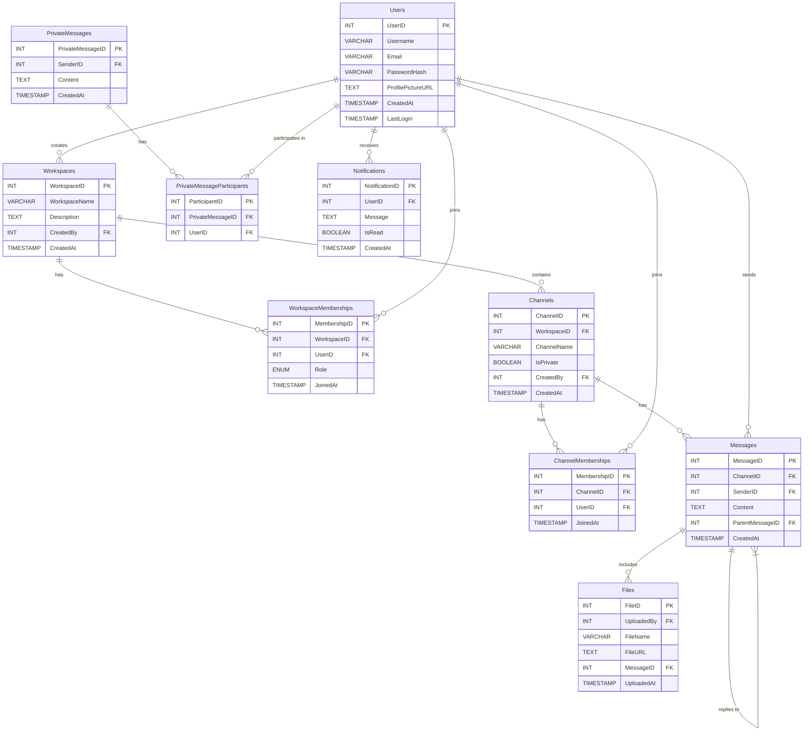

## Database Design for Slack-Like Communication Platform

```sql
-- Users Table: Stores user information
CREATE TABLE Users (
UserID SERIAL PRIMARY KEY,
Username VARCHAR(50) NOT NULL UNIQUE,
Email VARCHAR(100) NOT NULL UNIQUE,
PasswordHash VARCHAR(255) NOT NULL,
ProfilePictureURL TEXT,
CreatedAt TIMESTAMP DEFAULT CURRENT_TIMESTAMP,
LastLogin TIMESTAMP
);

-- Workspaces Table: Stores workspace information
CREATE TABLE Workspaces (
WorkspaceID SERIAL PRIMARY KEY,
WorkspaceName VARCHAR(100) NOT NULL,
Description TEXT,
CreatedBy INT NOT NULL REFERENCES Users(UserID) ON DELETE CASCADE,
CreatedAt TIMESTAMP DEFAULT CURRENT_TIMESTAMP
);

-- Workspace Memberships Table: Associates users with workspaces
CREATE TABLE WorkspaceMemberships (
MembershipID SERIAL PRIMARY KEY,
WorkspaceID INT NOT NULL REFERENCES Workspaces(WorkspaceID) ON DELETE CASCADE,
UserID INT NOT NULL REFERENCES Users(UserID) ON DELETE CASCADE,
Role ENUM('Admin', 'Member') DEFAULT 'Member',
JoinedAt TIMESTAMP DEFAULT CURRENT_TIMESTAMP
);

-- Channels Table: Stores channel information within workspaces
CREATE TABLE Channels (
ChannelID SERIAL PRIMARY KEY,
WorkspaceID INT NOT NULL REFERENCES Workspaces(WorkspaceID) ON DELETE CASCADE,
ChannelName VARCHAR(100) NOT NULL,
IsPrivate BOOLEAN DEFAULT FALSE,
CreatedBy INT NOT NULL REFERENCES Users(UserID) ON DELETE CASCADE,
CreatedAt TIMESTAMP DEFAULT CURRENT_TIMESTAMP
);

-- Channel Memberships Table: Associates users with private channels
CREATE TABLE ChannelMemberships (
MembershipID SERIAL PRIMARY KEY,
ChannelID INT NOT NULL REFERENCES Channels(ChannelID) ON DELETE CASCADE,
UserID INT NOT NULL REFERENCES Users(UserID) ON DELETE CASCADE,
JoinedAt TIMESTAMP DEFAULT CURRENT_TIMESTAMP
);

-- Messages Table: Stores messages in channels
CREATE TABLE Messages (
MessageID SERIAL PRIMARY KEY,
ChannelID INT NOT NULL REFERENCES Channels(ChannelID) ON DELETE CASCADE,
SenderID INT NOT NULL REFERENCES Users(UserID) ON DELETE CASCADE,
Content TEXT NOT NULL,
ParentMessageID INT REFERENCES Messages(MessageID) ON DELETE CASCADE,
CreatedAt TIMESTAMP DEFAULT CURRENT_TIMESTAMP
);

-- Private Messages Table: Stores private one-on-one and group messages
CREATE TABLE PrivateMessages (
PrivateMessageID SERIAL PRIMARY KEY,
SenderID INT NOT NULL REFERENCES Users(UserID) ON DELETE CASCADE,
Content TEXT NOT NULL,
CreatedAt TIMESTAMP DEFAULT CURRENT_TIMESTAMP
);

-- Private Message Participants Table: Associates users with private messages
CREATE TABLE PrivateMessageParticipants (
ParticipantID SERIAL PRIMARY KEY,
PrivateMessageID INT NOT NULL REFERENCES PrivateMessages(PrivateMessageID) ON DELETE CASCADE,
UserID INT NOT NULL REFERENCES Users(UserID) ON DELETE CASCADE
);

-- Files Table: Stores file metadata and associates files with messages
CREATE TABLE Files (
FileID SERIAL PRIMARY KEY,
UploadedBy INT NOT NULL REFERENCES Users(UserID) ON DELETE CASCADE,
FileName VARCHAR(255) NOT NULL,
FileURL TEXT NOT NULL,
MessageID INT REFERENCES Messages(MessageID) ON DELETE CASCADE,
UploadedAt TIMESTAMP DEFAULT CURRENT_TIMESTAMP
);

-- Notifications Table: Tracks user notifications
CREATE TABLE Notifications (
NotificationID SERIAL PRIMARY KEY,
UserID INT NOT NULL REFERENCES Users(UserID) ON DELETE CASCADE,
Message TEXT NOT NULL,
IsRead BOOLEAN DEFAULT FALSE,
CreatedAt TIMESTAMP DEFAULT CURRENT_TIMESTAMP
);
```

## ERD in Mermaid Syntax


