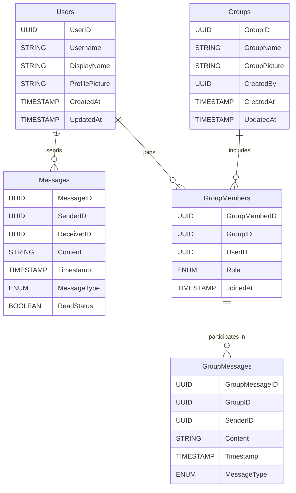

# Business Requirements Document (BRD)

## Project Title: Messaging Application Development

### Document Version: 1.0

### Date: [Insert Date]

### Prepared By: [Your Name/Organization]

---

## 1. Executive Summary

The purpose of this document is to outline the business requirements for the development of a messaging application, similar to WhatsApp. The application will enable users to communicate with others who have joined the app through one-on-one chats or groups. Additionally, group creators will have the capability to manage group member roles.

---

## 2. Business Objectives

- **Provide a seamless communication platform:** Enable users to chat with others in real-time.
- **Facilitate group communication:** Allow users to create and manage groups to enhance collaboration and connectivity.
- **Empower group creators:** Grant group creators the ability to manage roles within the group effectively.

---

## 3. Scope of Work

### 3.1 In Scope

1. **One-on-One Messaging**

   - Users can view a list of other registered users.
   - Users can select a contact to initiate a chat.
   - Real-time messaging with text support.

2. **Group Creation and Management**

   - Users can create a new group and add other registered users.
   - Users can assign roles (Admin or Member) to group participants.
   - Group creators can update roles as needed.

3. **User Roles in Groups**

   - Admins: Manage the group by adding/removing members and assigning roles.
   - Members: Participate in group chats without administrative privileges.

4. **Basic User Authentication**
   - Users register and log in using an email address or username.
   - Basic profile setup (e.g., name, profile picture).

### 3.2 Out of Scope

- Video or voice calling features.
- Advanced media sharing (e.g., documents, location sharing).
- Integration with external platforms.

---

## 4. Stakeholders

- **Client:** [Client Name/Organization]
- **End Users:** General audience with smartphones seeking a messaging platform.
- **Development Team:** Responsible for building the application.
- **Product Manager:** Oversees the development and ensures alignment with client goals.

---

## 5. Functional Requirements

### 5.1 One-on-One Messaging

- Users can view a searchable and scrollable list of other registered users.
- Users can initiate a chat by selecting a user.
- Chat messages are delivered in real-time with read/delivery status.

### 5.2 Group Messaging

- Users can create a group by selecting other registered users.
- Users can name the group and set a group picture.
- Group chats support real-time messaging among participants.

### 5.3 Role Management

- The group creator is assigned as the default Admin.
- The group Admin can:
  - Promote members to Admins.
  - Demote Admins to Members.
  - Remove members from the group.
- Members can only participate in chats without additional privileges.

### 5.4 User Authentication and Profile

- Users register and log in using an email or username.
- Users can set up a profile with:
  - Display name
  - Profile picture

---

## 6. Non-Functional Requirements

- **Performance:** The app should support real-time messaging with minimal latency.
- **Scalability:** The app must handle a large number of users concurrently.
- **Security:** All data should be encrypted during transmission.
- **Usability:** The interface must be intuitive and user-friendly.
- **Compatibility:** The app should be compatible with iOS and Android devices.

---

## 7. User Stories

### 7.1 One-on-One Messaging

- **As a user**, I want to select a contact from the list of registered users so that I can start chatting with them.
- **As a user**, I want to see the delivery status of my messages to know if they were sent and read.

### 7.2 Group Messaging

- **As a user**, I want to create a group with selected registered users so that I can chat with multiple people simultaneously.
- **As a group creator**, I want to assign roles to members so that I can manage the group effectively.
- **As a user**, I want to send messages in the group so that I can communicate with all members.

---

## 8. Assumptions

- All users register with an email or username.
- Users can see all other registered users within the app.
- The client will provide branding and design specifications if needed.

---

## 9. Constraints

- The app must adhere to platform guidelines for both iOS and Android.
- Development must be completed within the agreed timeline and budget.

---

## 10. Dependencies

- Hosting and backend infrastructure for real-time messaging.

---

## 11. Acceptance Criteria

- The app allows users to log in using an email or username.
- Users can view a list of registered users and initiate chats.
- Users can create and manage groups with role assignments.
- Messages are delivered in real-time with delivery and read status indicators.

---

## 12. Timeline and Milestones

1. Requirements Gathering: [Insert Date]
2. Design Phase: [Insert Date]
3. Development Phase: [Insert Date]
4. Testing and QA: [Insert Date]
5. Launch: [Insert Date]

---

## 13. Appendix

- Glossary of Terms
- References to similar applications for inspiration (e.g., WhatsApp).

---

## 14. Technical Design Addendum

### 14.1 Data Modeling

#### Entities:

1. **Users**

   - Attributes: UserID (Primary Key), Username, DisplayName, ProfilePicture, CreatedAt, UpdatedAt

2. **Messages**

   - Attributes: MessageID (Primary Key), SenderID (Foreign Key), ReceiverID (Foreign Key), Content, Timestamp, MessageType (Text/Image/etc.), ReadStatus

3. **Groups**

   - Attributes: GroupID (Primary Key), GroupName, GroupPicture, CreatedBy (Foreign Key), CreatedAt, UpdatedAt

4. **GroupMembers**

   - Attributes: GroupMemberID (Primary Key), GroupID (Foreign Key), UserID (Foreign Key), Role (Admin/Member), JoinedAt

5. **GroupMessages**
   - Attributes: GroupMessageID (Primary Key), GroupID (Foreign Key), SenderID (Foreign Key), Content, Timestamp, MessageType (Text/Image/etc.)

### 14.2 ERD Representation



---

## SQL:

```sql
-- SQL Queries for Messaging Application

-- Create Tables
CREATE TABLE Users (
    UserID UUID PRIMARY KEY,
    Username VARCHAR(255) NOT NULL,
    DisplayName VARCHAR(255),
    ProfilePicture TEXT,
    CreatedAt TIMESTAMP DEFAULT CURRENT_TIMESTAMP,
    UpdatedAt TIMESTAMP DEFAULT CURRENT_TIMESTAMP
);

CREATE TABLE Messages (
    MessageID UUID PRIMARY KEY,
    SenderID UUID NOT NULL,
    ReceiverID UUID NOT NULL,
    Content TEXT NOT NULL,
    Timestamp TIMESTAMP DEFAULT CURRENT_TIMESTAMP,
    MessageType VARCHAR(50) DEFAULT 'Text',
    ReadStatus BOOLEAN DEFAULT FALSE,
    FOREIGN KEY (SenderID) REFERENCES Users(UserID),
    FOREIGN KEY (ReceiverID) REFERENCES Users(UserID)
);

CREATE TABLE Groups (
    GroupID UUID PRIMARY KEY,
    GroupName VARCHAR(255) NOT NULL,
    GroupPicture TEXT,
    CreatedBy UUID NOT NULL,
    CreatedAt TIMESTAMP DEFAULT CURRENT_TIMESTAMP,
    UpdatedAt TIMESTAMP DEFAULT CURRENT_TIMESTAMP,
    FOREIGN KEY (CreatedBy) REFERENCES Users(UserID)
);

CREATE TABLE GroupMembers (
    GroupMemberID UUID PRIMARY KEY,
    GroupID UUID NOT NULL,
    UserID UUID NOT NULL,
    Role VARCHAR(50) DEFAULT 'Member',
    JoinedAt TIMESTAMP DEFAULT CURRENT_TIMESTAMP,
    FOREIGN KEY (GroupID) REFERENCES Groups(GroupID),
    FOREIGN KEY (UserID) REFERENCES Users(UserID)
);

CREATE TABLE GroupMessages (
    GroupMessageID UUID PRIMARY KEY,
    GroupID UUID NOT NULL,
    SenderID UUID NOT NULL,
    Content TEXT NOT NULL,
    Timestamp TIMESTAMP DEFAULT CURRENT_TIMESTAMP,
    MessageType VARCHAR(50) DEFAULT 'Text',
    FOREIGN KEY (GroupID) REFERENCES Groups(GroupID),
    FOREIGN KEY (SenderID) REFERENCES Users(UserID)
);

-- Insert Sample Data
INSERT INTO Users (UserID, Username, DisplayName) VALUES
    (gen_random_uuid(), 'john_doe', 'John Doe'),
    (gen_random_uuid(), 'jane_smith', 'Jane Smith');

-- Query to Add a New User
INSERT INTO Users (UserID, Username, DisplayName, ProfilePicture)
VALUES (gen_random_uuid(), 'new_user', 'New User', 'https://example.com/profile.jpg');

-- Query to Send a Private Message
INSERT INTO Messages (MessageID, SenderID, ReceiverID, Content, MessageType)
VALUES (gen_random_uuid(), 'user1-uuid', 'user2-uuid', 'Hello there!', 'Text');

-- Query to Create a New Group
INSERT INTO Groups (GroupID, GroupName, GroupPicture, CreatedBy)
VALUES (gen_random_uuid(), 'Project Team', 'https://example.com/group.jpg', 'user1-uuid');

-- Query to Add Members to a Group
INSERT INTO GroupMembers (GroupMemberID, GroupID, UserID, Role)
VALUES
    (gen_random_uuid(), 'group1-uuid', 'user1-uuid', 'Admin'),
    (gen_random_uuid(), 'group1-uuid', 'user2-uuid', 'Member');

-- Query to Send a Group Message
INSERT INTO GroupMessages (GroupMessageID, GroupID, SenderID, Content, MessageType)
VALUES
    (gen_random_uuid(), 'group1-uuid', 'user1-uuid', 'Welcome to the group!', 'Text');

-- Query to Fetch All Messages Between Two Users
SELECT *
FROM Messages
WHERE (SenderID = 'user1-uuid' AND ReceiverID = 'user2-uuid')
   OR (SenderID = 'user2-uuid' AND ReceiverID = 'user1-uuid')
ORDER BY Timestamp;

-- Query to Fetch All Members of a Group
SELECT u.UserID, u.Username, u.DisplayName, gm.Role
FROM GroupMembers gm
JOIN Users u ON gm.UserID = u.UserID
WHERE gm.GroupID = 'group1-uuid';

-- Query to Fetch All Messages in a Group
SELECT gm.GroupMessageID, gm.Content, gm.Timestamp, u.Username AS Sender
FROM GroupMessages gm
JOIN Users u ON gm.SenderID = u.UserID
WHERE gm.GroupID = 'group1-uuid'
ORDER BY gm.Timestamp;

-- Query to Promote a Member to Admin
UPDATE GroupMembers
SET Role = 'Admin'
WHERE GroupID = 'group1-uuid' AND UserID = 'user2-uuid';

-- Query to Remove a Member from a Group
DELETE FROM GroupMembers
WHERE GroupID = 'group1-uuid' AND UserID = 'user2-uuid';

-- Query to Delete a Group Message
DELETE FROM GroupMessages
WHERE GroupMessageID = 'message1-uuid';

```

---

## OOP C#:

```csharp
// C# Object-Oriented Implementation for Messaging Application

using System;
using System.Collections.Generic;

namespace MessagingApp
{
    // User class
    public class User
    {
        public Guid UserID { get; set; } = Guid.NewGuid();
        public string Username { get; set; }
        public string DisplayName { get; set; }
        public string ProfilePicture { get; set; }
        public DateTime CreatedAt { get; set; } = DateTime.UtcNow;
        public DateTime UpdatedAt { get; set; } = DateTime.UtcNow;

        public List<Message> Messages { get; set; } = new List<Message>();
        public List<GroupMember> GroupMemberships { get; set; } = new List<GroupMember>();
    }

    // Message class
    public class Message
    {
        public Guid MessageID { get; set; } = Guid.NewGuid();
        public User Sender { get; set; }
        public User Receiver { get; set; }
        public string Content { get; set; }
        public DateTime Timestamp { get; set; } = DateTime.UtcNow;
        public string MessageType { get; set; } // e.g., Text, Image
        public bool ReadStatus { get; set; } = false;
    }

    // Group class
    public class Group
    {
        public Guid GroupID { get; set; } = Guid.NewGuid();
        public string GroupName { get; set; }
        public string GroupPicture { get; set; }
        public User CreatedBy { get; set; }
        public DateTime CreatedAt { get; set; } = DateTime.UtcNow;
        public DateTime UpdatedAt { get; set; } = DateTime.UtcNow;

        public List<GroupMember> Members { get; set; } = new List<GroupMember>();
        public List<GroupMessage> GroupMessages { get; set; } = new List<GroupMessage>();
    }

    // GroupMember class
    public class GroupMember
    {
        public Guid GroupMemberID { get; set; } = Guid.NewGuid();
        public Group Group { get; set; }
        public User User { get; set; }
        public string Role { get; set; } = "Member"; // Admin or Member
        public DateTime JoinedAt { get; set; } = DateTime.UtcNow;
    }

    // GroupMessage class
    public class GroupMessage
    {
        public Guid GroupMessageID { get; set; } = Guid.NewGuid();
        public Group Group { get; set; }
        public User Sender { get; set; }
        public string Content { get; set; }
        public DateTime Timestamp { get; set; } = DateTime.UtcNow;
        public string MessageType { get; set; } // e.g., Text, Image
    }

    // Example usage
    class Program
    {
        static void Main(string[] args)
        {
            // Creating users
            User user1 = new User { Username = "john_doe", DisplayName = "John Doe" };
            User user2 = new User { Username = "jane_smith", DisplayName = "Jane Smith" };

            // Creating a message
            Message message = new Message
            {
                Sender = user1,
                Receiver = user2,
                Content = "Hello, Jane!",
                MessageType = "Text"
            };

            user1.Messages.Add(message);
            user2.Messages.Add(message);

            // Creating a group
            Group group = new Group { GroupName = "Project Team", CreatedBy = user1 };

            // Adding members to the group
            GroupMember member1 = new GroupMember { Group = group, User = user1, Role = "Admin" };
            GroupMember member2 = new GroupMember { Group = group, User = user2, Role = "Member" };

            group.Members.Add(member1);
            group.Members.Add(member2);

            // Sending a group message
            GroupMessage groupMessage = new GroupMessage
            {
                Group = group,
                Sender = user1,
                Content = "Welcome to the group!",
                MessageType = "Text"
            };

            group.GroupMessages.Add(groupMessage);

            Console.WriteLine("Messaging app simulation complete.");
        }
    }
}

```

---

### SignalR code

```csharp
// C# Implementation of WebSockets for Messaging Application using SignalR

using Microsoft.AspNetCore.SignalR;
using System;
using System.Collections.Concurrent;
using System.Threading.Tasks;

namespace MessagingApp
{
    // Hub for managing real-time communication
    public class ChatHub : Hub
    {
        private static readonly ConcurrentDictionary<string, string> UserConnections = new ConcurrentDictionary<string, string>();

        // Method to connect a user
        public override async Task OnConnectedAsync()
        {
            var userId = Context.User?.Identity?.Name ?? Context.ConnectionId;
            UserConnections[Context.ConnectionId] = userId;
            await Clients.All.SendAsync("UserConnected", userId);
            await base.OnConnectedAsync();
        }

        // Method to disconnect a user
        public override async Task OnDisconnectedAsync(Exception? exception)
        {
            if (UserConnections.TryRemove(Context.ConnectionId, out var userId))
            {
                await Clients.All.SendAsync("UserDisconnected", userId);
            }
            await base.OnDisconnectedAsync(exception);
        }

        // Sending a private message
        public async Task SendMessageToUser(string targetUserId, string message)
        {
            var connectionId = GetConnectionIdByUserId(targetUserId);
            if (connectionId != null)
            {
                await Clients.Client(connectionId).SendAsync("ReceiveMessage", Context.User?.Identity?.Name, message);
            }
        }

        // Sending a group message
        public async Task SendMessageToGroup(string groupName, string message)
        {
            await Clients.Group(groupName).SendAsync("ReceiveGroupMessage", Context.User?.Identity?.Name, message);
        }

        // Joining a group
        public async Task JoinGroup(string groupName)
        {
            await Groups.AddToGroupAsync(Context.ConnectionId, groupName);
            await Clients.Group(groupName).SendAsync("UserJoinedGroup", Context.User?.Identity?.Name);
        }

        // Leaving a group
        public async Task LeaveGroup(string groupName)
        {
            await Groups.RemoveFromGroupAsync(Context.ConnectionId, groupName);
            await Clients.Group(groupName).SendAsync("UserLeftGroup", Context.User?.Identity?.Name);
        }

        // Helper method to get connection ID by user ID
        private string? GetConnectionIdByUserId(string userId)
        {
            foreach (var connection in UserConnections)
            {
                if (connection.Value == userId)
                {
                    return connection.Key;
                }
            }
            return null;
        }
    }

    // Startup Configuration
    public class Startup
    {
        public void ConfigureServices(IServiceCollection services)
        {
            services.AddSignalR();
        }

        public void Configure(IApplicationBuilder app, IWebHostEnvironment env)
        {
            if (env.IsDevelopment())
            {
                app.UseDeveloperExceptionPage();
            }

            app.UseRouting();

            app.UseEndpoints(endpoints =>
            {
                endpoints.MapHub<ChatHub>("/chatHub");
            });
        }
    }
}

// Client-side SignalR example (JavaScript):
// const connection = new signalR.HubConnectionBuilder()
//     .withUrl("/chatHub")
//     .build();

// connection.on("ReceiveMessage", (user, message) => {
//     console.log(`${user}: ${message}`);
// });

// connection.start().then(() => {
//     connection.invoke("SendMessageToUser", "targetUserId", "Hello World!");
// });

```

---

## Typescript OOP:

```typescript
// TypeScript Object-Oriented Implementation for Messaging Application

class User {
  userID: string;
  username: string;
  displayName: string;
  profilePicture: string;
  createdAt: Date;
  updatedAt: Date;

  messages: Message[] = [];
  groupMemberships: GroupMember[] = [];

  constructor(
    username: string,
    displayName: string,
    profilePicture: string = ""
  ) {
    this.userID = this.generateUUID();
    this.username = username;
    this.displayName = displayName;
    this.profilePicture = profilePicture;
    this.createdAt = new Date();
    this.updatedAt = new Date();
  }

  private generateUUID(): string {
    return (
      Math.random().toString(36).substring(2, 15) +
      Math.random().toString(36).substring(2, 15)
    );
  }
}

class Message {
  messageID: string;
  sender: User;
  receiver: User;
  content: string;
  timestamp: Date;
  messageType: string; // e.g., "Text", "Image"
  readStatus: boolean;

  constructor(
    sender: User,
    receiver: User,
    content: string,
    messageType: string = "Text"
  ) {
    this.messageID = this.generateUUID();
    this.sender = sender;
    this.receiver = receiver;
    this.content = content;
    this.timestamp = new Date();
    this.messageType = messageType;
    this.readStatus = false;
  }

  private generateUUID(): string {
    return (
      Math.random().toString(36).substring(2, 15) +
      Math.random().toString(36).substring(2, 15)
    );
  }
}

class Group {
  groupID: string;
  groupName: string;
  groupPicture: string;
  createdBy: User;
  createdAt: Date;
  updatedAt: Date;

  members: GroupMember[] = [];
  groupMessages: GroupMessage[] = [];

  constructor(groupName: string, createdBy: User, groupPicture: string = "") {
    this.groupID = this.generateUUID();
    this.groupName = groupName;
    this.groupPicture = groupPicture;
    this.createdBy = createdBy;
    this.createdAt = new Date();
    this.updatedAt = new Date();
  }

  private generateUUID(): string {
    return (
      Math.random().toString(36).substring(2, 15) +
      Math.random().toString(36).substring(2, 15)
    );
  }
}

class GroupMember {
  groupMemberID: string;
  group: Group;
  user: User;
  role: string; // e.g., "Admin" or "Member"
  joinedAt: Date;

  constructor(group: Group, user: User, role: string = "Member") {
    this.groupMemberID = this.generateUUID();
    this.group = group;
    this.user = user;
    this.role = role;
    this.joinedAt = new Date();
  }

  private generateUUID(): string {
    return (
      Math.random().toString(36).substring(2, 15) +
      Math.random().toString(36).substring(2, 15)
    );
  }
}

class GroupMessage {
  groupMessageID: string;
  group: Group;
  sender: User;
  content: string;
  timestamp: Date;
  messageType: string; // e.g., "Text", "Image"

  constructor(
    group: Group,
    sender: User,
    content: string,
    messageType: string = "Text"
  ) {
    this.groupMessageID = this.generateUUID();
    this.group = group;
    this.sender = sender;
    this.content = content;
    this.timestamp = new Date();
    this.messageType = messageType;
  }

  private generateUUID(): string {
    return (
      Math.random().toString(36).substring(2, 15) +
      Math.random().toString(36).substring(2, 15)
    );
  }
}

// Example usage
const user1 = new User("john_doe", "John Doe");
const user2 = new User("jane_smith", "Jane Smith");

const message = new Message(user1, user2, "Hello, Jane!");
user1.messages.push(message);
user2.messages.push(message);

const group = new Group("Project Team", user1);
const member1 = new GroupMember(group, user1, "Admin");
const member2 = new GroupMember(group, user2);

group.members.push(member1);
group.members.push(member2);

const groupMessage = new GroupMessage(group, user1, "Welcome to the group!");
group.groupMessages.push(groupMessage);

console.log("Messaging app simulation complete.");
```

### Socket.IO

```typescript
// Socket.IO Service Implementation in Node.js with Express and TypeScript

import { Server as HTTPServer } from "http";
import { Server, Socket } from "socket.io";

interface UserConnection {
  userId: string;
  socketId: string;
}

class SocketService {
  private io: Server;
  private userConnections: Map<string, string> = new Map(); // Map<userId, socketId>

  constructor(server: HTTPServer) {
    this.io = new Server(server, {
      cors: {
        origin: "*", // Adjust to your frontend's domain
        methods: ["GET", "POST"],
      },
    });

    this.initialize();
  }

  private initialize(): void {
    this.io.on("connection", (socket: Socket) => {
      console.log(`Socket connected: ${socket.id}`);

      // Handle user joining
      socket.on("user:join", (userId: string) => {
        this.userConnections.set(userId, socket.id);
        socket.broadcast.emit("user:connected", userId);
        console.log(`User joined: ${userId}`);
      });

      // Handle private messages
      socket.on(
        "message:private",
        (data: { senderId: string; receiverId: string; message: string }) => {
          const receiverSocketId = this.userConnections.get(data.receiverId);
          if (receiverSocketId) {
            this.io.to(receiverSocketId).emit("message:private", {
              senderId: data.senderId,
              message: data.message,
            });
          }
        }
      );

      // Handle group messages
      socket.on(
        "message:group",
        (data: { groupId: string; senderId: string; message: string }) => {
          this.io.to(data.groupId).emit("message:group", {
            senderId: data.senderId,
            message: data.message,
          });
        }
      );

      // Handle joining a group
      socket.on("group:join", (groupId: string) => {
        socket.join(groupId);
        socket.to(groupId).emit("group:userJoined", { userId: socket.id });
        console.log(`Socket ${socket.id} joined group ${groupId}`);
      });

      // Handle leaving a group
      socket.on("group:leave", (groupId: string) => {
        socket.leave(groupId);
        socket.to(groupId).emit("group:userLeft", { userId: socket.id });
        console.log(`Socket ${socket.id} left group ${groupId}`);
      });

      // Handle disconnection
      socket.on("disconnect", () => {
        const userId = Array.from(this.userConnections.entries()).find(
          ([, socketId]) => socketId === socket.id
        )?.[0];

        if (userId) {
          this.userConnections.delete(userId);
          socket.broadcast.emit("user:disconnected", userId);
        }
        console.log(`Socket disconnected: ${socket.id}`);
      });
    });
  }

  public getIO(): Server {
    return this.io;
  }
}

export default SocketService;

// Example usage
// import express from "express";
// import { createServer } from "http";
// import SocketService from "./SocketService";

// const app = express();
// const server = createServer(app);
// const socketService = new SocketService(server);

// app.get("/", (req, res) => {
//     res.send("Socket.IO server running!");
// });

// server.listen(3000, () => {
//     console.log("Server is running on port 3000");
// });
```
